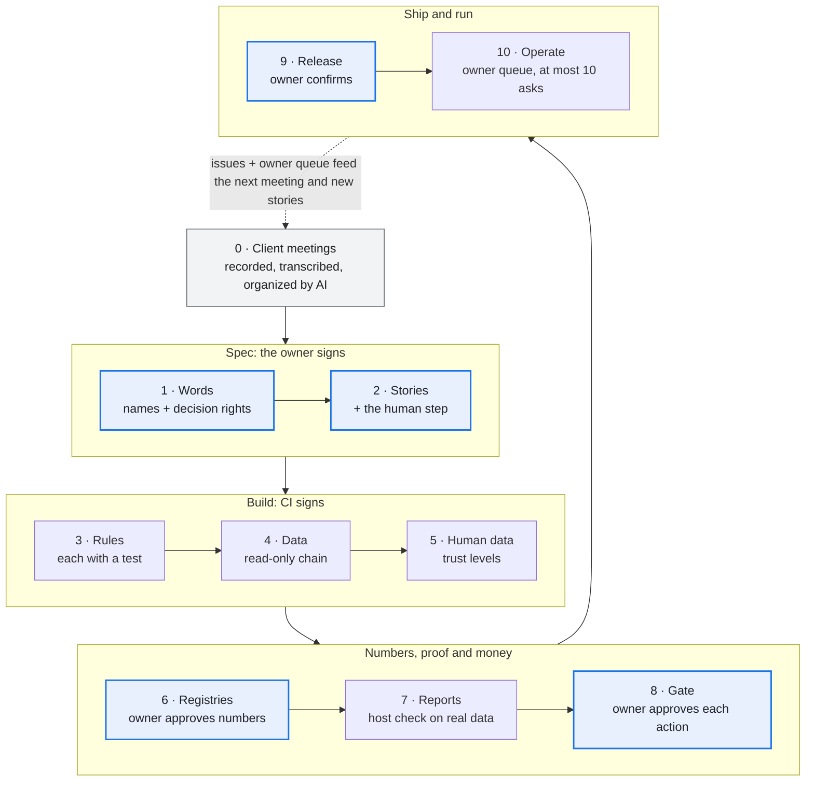
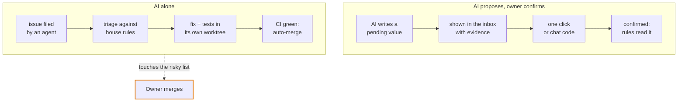
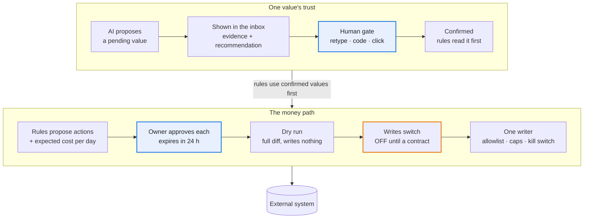

# Agent Harness Playbook

How to build an **agent harness** — a small, tested tool an AI agent operates for a business owner — from the first client meeting to a system running in production, with the human in the loop at the right places and nowhere else.

Distilled from an eight-day build of an advertising harness (read-only data pulls, reports, a guarded write path, a web console and a remote host agent): about 850 commits, and about 180 merge requests in the last four days. Most lessons below are something that project paid for. Some come from harnesses built after it (a short-video ad harness, a KOL harness, a RedNote harness), some from a harness that ported the same code from the same source project (an SEO harness), and some from Anthropic's published guidance; each says so, and a lesson seen only once or not yet proven says so. Building for another channel? Start at [the reuse map](docs/channels.md#reusing-the-harness-for-other-channels). What every harness must keep, however it is written, and a check you can run against one: [conformance/INVARIANTS.md](conformance/INVARIANTS.md).

This repository is the parent of every harness: a shared kit each harness vendors, the build workflow, templates, an owner console and a host adapter. A harness adds only its channel: its pulls, reports, registries and the hooks the kit calls. The details live in [docs/](docs/); this page is the overview.

---

## The pipeline at a glance

A new harness starts from recorded client meetings and goes through ten stages. The owner signs only five gates: **meaning, stories, numbers, money, release**. Everything else is signed by a machine: CI tests, or a host check after install.

What runs in production feeds back as issues and at most ten owner asks, which shape the next meeting.

---

## Who decides what

Write these three lanes into the repository on day one, not into an agent's memory.

**Always the owner:** meaning · numbers · money · the client contract · risky merges · release.

**The risky list:** the human gate, the write path, contract removals or renames, owner files, threshold values and human-data tables. A fix that touches it waits for the owner's merge. Paid data calls and widening what may be written count only when the owner types them in chat. Template: [`templates/decision-rights.md`](templates/decision-rights.md).

---

## Trust lives in the data, not in the prompt

Every value carries its **state**, pending or confirmed, and apart from it its **source**: the AI, the client's form, the owner (a meeting, once intake runs). Only a human raises trust, and the proof is bound to exactly what was shown.

Anyone may lower a value's trust again; only a human raises it.

Approve is the last human act before money moves. There is no second confirm at execute: it would only train rubber-stamping. Say plainly that the gate guards against accidents; the login is the real security boundary.

---

## What the kit guarantees

Each guarantee is code in [`kit/`](kit/) with a test that fails when it breaks ([kit/README.md](kit/README.md) has the full table, and what each guard paid for).

- **A person confirms exactly what was shown.** The gate is a retype at the terminal or a relayed one-time code bound to the subject; there is no bypass flag. ([`kit/human.py`](kit/human.py))
- **Human data is never lost.** Client facts and decisions are pending until a person confirms them, keep a history of every change, and live in tables that are never dropped, migrated or shrunk. ([`kit/facts.py`](kit/facts.py), [`kit/decisions.py`](kit/decisions.py), [`kit/db.py`](kit/db.py))
- **Nothing goes out unapproved.** Actions wait in a queue; an approval goes stale when its basis moves; execute is a dry run by default, behind an opt-in, an exact-shape allowlist and a kill switch. ([`kit/queue.py`](kit/queue.py), [`kit/execute.py`](kit/execute.py), [`kit/write_guard.py`](kit/write_guard.py))
- **Raw only grows.** Raw files are written once, writes are atomic, a second scheduled run skips, and throttling is a recorded gap, not a day with no data. ([`kit/raw.py`](kit/raw.py), [`kit/atomic.py`](kit/atomic.py), [`kit/single_instance.py`](kit/single_instance.py), [`kit/retry.py`](kit/retry.py))
- **One output contract for the agent.** Every verb is declared with its kind; `--json` prints one document, failures included; every message carries a code from a closed registry. ([`kit/verbs.py`](kit/verbs.py), [`kit/contract.py`](kit/contract.py), [`kit/messages.py`](kit/messages.py))
- **Paid generation and regulated copy are gated** (the `generation` and `compliance` packs): every paid AI call is planned, priced and approved; copy is checked against confirmed claims and banned terms before any spend. ([`kit/takes.py`](kit/takes.py), [`kit/claimscope.py`](kit/claimscope.py))
- **A vendored copy is never edited in place.** Its manifest makes a local edit fail the harness's drift test; a fix goes upstream first. ([`kit/guards/drift.py`](kit/guards/drift.py))

---

## Start a harness

1. Follow [BUILD.md](BUILD.md), steps B0 to B10; an agent loads [skills/build-harness/SKILL.md](skills/build-harness/SKILL.md) to do the same from the files alone.
2. B1 scaffolds it: `python3 scaffold/new_harness.py --dir ../acme-harness --name acme-harness --cli acme --prefix ACME --packs data`. It vendors the kit packs the harness takes ([kit/README.md](kit/README.md), "Packs"), the console, and the ten day-one tests, and is green before its first feature.
3. For a harness that already exists, `python3 tools/fleet.py status PATH…` says where its vendored copies stand against this playbook, and `python3 kit/tools/vendor.py --harness PATH` brings them up to date.

**Check the whole playbook with one command.** [`run_all.py`](run_all.py) runs every test suite in the repository and ends with one `RESULT:` line; it exits 1 if any suite fails. `python3 run_all.py --list` names the suites and `python3 run_all.py kit console` runs some. [CI](.github/workflows/ci.yml) runs it on every push and pull request.

---

## Where everything is

| Read | For |
| --- | --- |
| [docs/stages.md](docs/stages.md) | Stage 0 (client meetings), the ten stages one line each, the day-one checklist |
| [docs/rules.md](docs/rules.md) | Data layers and their guards, the human-in-the-loop rules, stories that prove themselves, registries |
| [docs/consoles.md](docs/consoles.md) | The owner console, the client console, one workspace per client |
| [docs/operating.md](docs/operating.md) | Agents that file issues, building with many agents, hosting |
| [docs/channels.md](docs/channels.md) | Reusing a harness for other channels; generated creative and real people |
| [docs/kit-and-tools.md](docs/kit-and-tools.md) | What this repository holds, the kit's admission rule, every template |
| [docs/lessons.md](docs/lessons.md) | Lessons kept after their code was removed |
| [BUILD.md](BUILD.md) | The build workflow, B0 to B10 |
| [ROADMAP.md](ROADMAP.md), [RESTRUCTURE.md](RESTRUCTURE.md) | Open work and the restructure in progress |

| Folder | What it is |
| --- | --- |
| [`kit/`](kit/) | The shared modules a harness vendors, in packs |
| [`console/`](console/) | The owner console: where the asks go |
| [`hosts/zylos/`](hosts/zylos/) | The host adapter, the worked example for any other host |
| [`scaffold/`](scaffold/), [`build/`](build/), [`templates/`](templates/) | The generator, the build-time tools, the templates |
| [`conformance/`](conformance/INVARIANTS.md) | The invariants every harness keeps, and a black-box check that drives a harness's CLI from an adapter kept here |
| [`tools/`](tools/) | Playbook tooling: `fleet.py` |
