# Agent Harness Playbook

How to build an **agent harness** — a small, tested tool an AI agent operates for a business owner — from the first client meeting to a system running in production, with the human in the loop at the right places and nowhere else.

Distilled from an eight-day build of an advertising harness (read-only data pulls, reports, a guarded write path, a web console and a remote host agent): about 850 commits, and about 180 merge requests in the last four days. Most lessons below are something that project paid for. Some come from harnesses built after it (a short-video ad harness, a KOL harness, a RedNote harness), some from a harness that ported the same code from the same source project (an SEO harness), and some from Anthropic's published guidance; each says so, and a lesson seen only once or not yet proven says so. Building for another channel? Start at [the reuse map](#reusing-the-harness-for-other-channels).

---

## The pipeline at a glance

A new harness starts from recorded client meetings and goes through ten stages. The owner signs only five gates: **meaning, stories, numbers, money, release**. Everything else is signed by a machine: CI tests, or a host check after install.

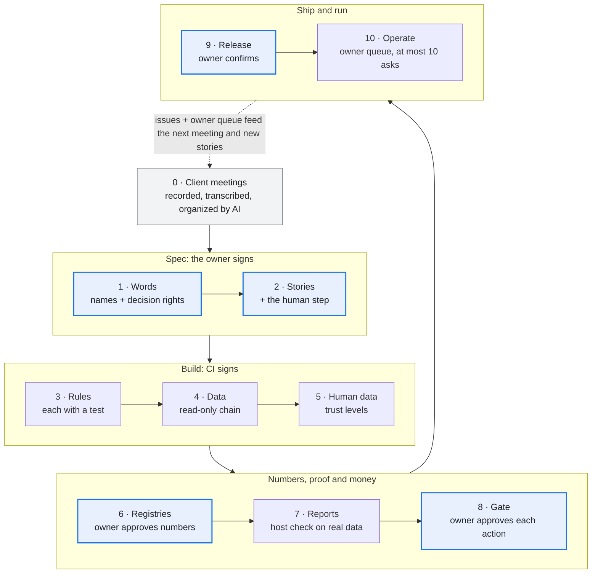

What runs in production feeds back as issues and at most ten owner asks, which shape the next meeting.

---

## Stage 0: client meetings are the first input

Every project starts from what the client actually said, not from what the agent imagines.

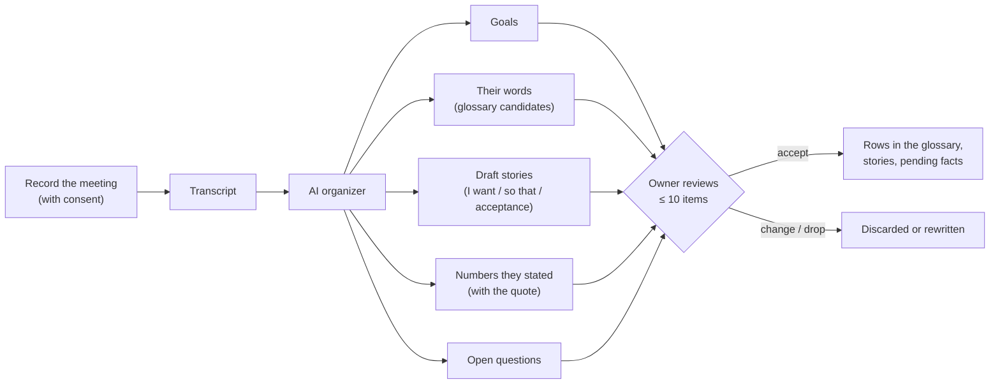

1. **Record and transcribe** each client meeting, with the client's consent. Recordings and transcripts stay in the client's own data folder, never in the code repository.
2. **The AI organizes the transcript into five buckets:** goals, the client's own words for things, draft user stories, numbers they stated (costs, lead times, budgets, limits), and open questions.
3. **Every item cites its source:** meeting date and the timestamp of the quote. A number with no quote is not written down.
4. **Numbers enter as pending values** with the meeting as their source; they drive nothing until a human confirms them.
5. **The owner reviews at most 10 items per meeting:** accept, change or drop. Accepted words and stories become rows in stages 1 and 2.
6. **Later meetings feed the same buckets.** A changed number or goal becomes a pending change with the old and new quotes side by side, never a silent overwrite.

The prompt and output shape for the organizer: [`templates/meeting-intake.md`](templates/meeting-intake.md).

---

## Who decides what

Write these three lanes into the repository on day one, not into an agent's memory.

**Always the owner:** meaning · numbers · money · the client contract · risky merges · release.

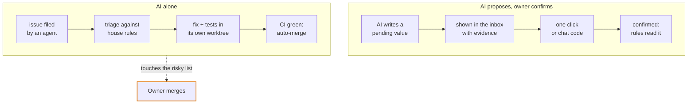

**The risky list:** the human gate, the write path, contract removals or renames, owner files, threshold values and human-data tables. A fix that touches it waits for the owner's merge. Paid data calls and widening what may be written count only when the owner types them in chat. Template: [`templates/decision-rights.md`](templates/decision-rights.md).

---

## Trust lives in the data, not in the prompt

Every value carries its **state**, pending or confirmed, and apart from it its **source**: the AI, the client's form, the owner (a meeting, once intake runs). Only a human raises trust, and the proof is bound to exactly what was shown.

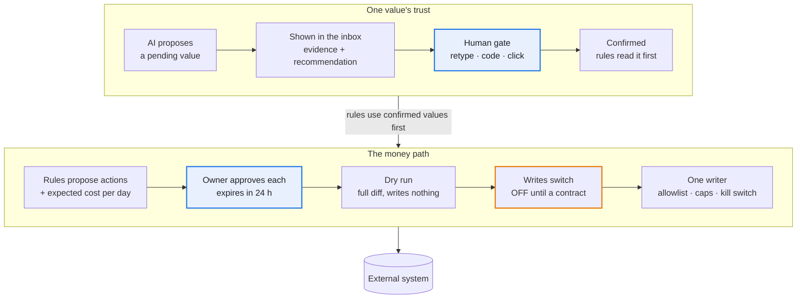

Anyone may lower a value's trust again; only a human raises it.

Approve is the last human act before money moves. There is no second confirm at execute: it would only train rubber-stamping. Say plainly that the gate guards against accidents; the login is the real security boundary.

---

## Data layers and their guards

The first bugs in the source project were silent data loss with green tests, so every layer gets its guard test on day one.

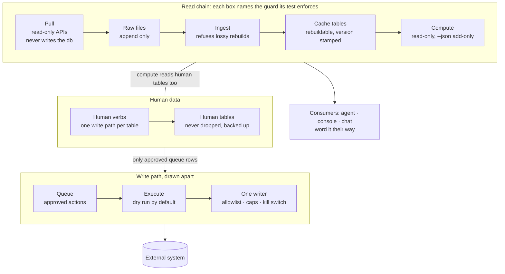

Cache tables can always be rebuilt from raw; human tables never can, so they are kept apart, backed up before each ingest and written by one verb each.

The guards are code the kit holds: [`kit/db.py`](kit/db.py) (human tables, rebuilds, the version stamp) and [`kit/pull.py`](kit/pull.py), [`kit/atomic.py`](kit/atomic.py), [`kit/single_instance.py`](kit/single_instance.py), [`kit/retry.py`](kit/retry.py) (raw that only grows, atomic writes, one run at a time, throttling recorded as gaps). Each of their tests was shown failing on a broken copy of its guard.

*Paid for:* a rolling window moved between a schema change and the ingest, so raw held as many days as the table, but later ones. The count matched and the rebuild dropped the oldest days. Compare the set of days, not the count.

**The CLI is the only door.** Every capability the harness owns, each paid or live API call included, is a CLI verb with `--json`, a cost estimate where money is spent, and a `source` on what it writes. An agent may read through MCP or UI tools, but the result enters a workspace only through a `pull` or `import` verb. Hand-written raw files and direct API writes are violations. Otherwise the cost guard, the source tags and the network-free tests cover only the calls that happened to use the verb. *Example:* an SEO harness lets the agent read Search Console through an MCP, then lands the reply with its `import` verb, so the read is recorded like any pull.

**Teach the agent from `--help` and one first call.** End every verb's `--help` with two or three example calls (minimal, typical, one with a cost or gate flag) and the top-level keys of its `--json` output, and test both. Give the agent one status verb to call first in every session: the next step, what waits on a human, how old the last ingest is, and what has been spent. Anthropic's engineering post on advanced tool use reports that worked examples raised accuracy on complex parameters from 72% to 90%, and its post on effective harnesses for long-running agents has each session begin by reading the state left behind. *Built in the kit (0.6.1):* a verb declares `examples` and `keys` in its verb table row, its `--help` ends with them and `verbs --json` lists them, and doctor names the verbs that have none ([code](kit/verbs.py)); the KOL harness fills them for every verb and runs each read verb's examples in a test. *Not yet proven here:* no accuracy gain has been measured, and the one status verb is built only in that harness, not in the kit.
---

## Stage 0 and the ten stages, one line each

Each stage ends at a gate someone signs; the lesson column is what the source project paid for learning it late.

| # | Stage | Produces | Gate (who signs) | Lesson |
| --- | --- | --- | --- | --- |
| 0 | Client meetings | Transcripts organized into goals, words, draft stories, quoted numbers, open questions | Owner accepts at most 10 items per meeting | Costs and lead times started as agent estimates and had to be re-asked; there was no meeting record to check them against |
| 1 | Words and rights | Registry index, a glossary in the client's own words, three decision lanes | Lint passes; one name per idea (owner) | The index came on day 4, after 8 files; catching up cost a 213-row review. The client's word for a core concept replaced the engineers' word only after a test enforced it |
| 2 | Stories | I want / so that / acceptance items / human step, plus a runnable proof per item | Owner accepts at most 10 rows at a time | Two branches reused the same story ids and one story was lost; proofs written as prose never ran |
| 3 | Rules and tests | An agent instructions file of invariants only; a test runner that fails without its RESULT line | Every rule names its test (CI) | Test files that never ran counted as passes until the RESULT gate |
| 4 | Read-only data | pull → raw that only grows → ingest → database; a required data root, no defaults | Rows in = rows out; ingest twice = same rows (CI) | 3,072 rows were stored as 329 with green tests; raw was once overwritten while the source API kept only 65–95 days |
| 5 | Human data | Human tables apart from the cache; pending vs confirmed with a source tag; backups, triggers | Human tables survive every rebuild (CI); owner signs which keys exist | Client facts were wiped once; a pending value outranked a confirmed one |
| 6 | Registries and contract | Thresholds stored once; rules name thresholds; message codes; one `--json` contract with `meta` and one error document | Contract test both ways (CI); owner approves each rule and number | Message codes let any agent word results in the client's language |
| 7 | Reports | One read-only report per story | The story's proof runs green on the client host after install | Reports took ~15 hours; their proofs stayed prose until they became story checks |
| 8 | Gate and money | One confirm function behind terminal, chat code and inbox; approve → dry run → switch → one writer | Replay and swap tests; no bypass flag (owner approves each action) | The write path was ready on day 2 and still off on day 7: no client agreement yet |
| 9 | Release | `git archive` of a tag, internal files excluded; host install with backups and a checklist | CI green; owner types "confirm vX"; host report | 21 tags in five days; two parallel release sessions left main untagged: one release owner at a time |
| 10 | Operate and learn | Scheduled pulls with freshness checks, alerts, triaged issues, an owner queue of at most 10 asks | Risky merges wait for the owner; refactors pass a golden diff | "Closed" is not "on main"; a squash forked the history once |

---

## Human-in-the-loop rules

The owner decides less, but every decision is real.

1. **Decision rights live in the repo**, enforced by protected paths, not by an agent's memory.
2. **Trust lives in the data.** Values are pending or confirmed with a source; anyone may lower trust, only a human raises it; every rule reads confirmed first.
3. **Each story names its human step** (none / confirm / approve). Anything that can spend money is never "none".
4. **One gate for every channel**, bound to exactly what was shown, single use, logged, no bypass flag ([code](kit/human.py)). Who signed is derived from the process's OS account (its passwd entry), never from `LOGNAME` or `USER`, which whatever launched the process can set to anything; a third party confirming their own value (`--for-client`) has its own name in the code's subject, so neither side's code passes for the other's. *Paid for:* two rounds. The first guard only checked that stdin was a terminal, so an agent wrapped the call in a pseudo-terminal, confirmed live values and signed them as the owner with a free-text source; then a relayed code approved a different pair of items than the one shown, confirmed another entity's value, and worked twice inside its window.
5. **Approve is the last human act before money moves.** A second confirm at execute only trains rubber-stamping.
6. **Business "not yet" beats technically ready.** Client writes and paid calls stay off until the owner says so in writing, with a cap.
7. **Budget the owner's attention:** at most 10 asks, each with evidence, a recommendation and what "no" means. Inputs are picked from a list; the one thing typed is a value the harness validates.
8. **Agree in advance which channel counts.** Widening what may be written counts only when typed in chat, not clicked on a page.
9. **Remote agents never act for the owner.** They install only on the owner's own "confirm vX" and end with a checklist report.
10. **Two refusals mean stop.** After two consecutive refusals from the gate or the cost cap, the verb answers with an `escalate` code; the agent stops and asks the owner and never looks for another door. Anthropic's engineering post on Claude Code auto mode found users approved 93% of prompts, so approvals are scarce and an agent that routes around a denial is the failure to design out. *Not yet proven:* no harness here counts refusals yet.
11. *Not yet proven:* **measure whether the gate is real.** Track how often the owner overrides each kind of ask. The console records with every answer whether it took the suggestion, but no override rate per kind of ask is computed yet. An eval counts only if it fails when its rule is removed: cut once, 5 of 9 failed as they should, and the other 4 stay only as regression guards. The offline half now ships: `kit/guards/evals.py` holds each case to a rule of SKILL.md, the forbidden-verbs pattern generated from the verb table, and an ablation row ([templates/evals/](templates/evals/)).

---

## The owner console: where the asks go

Rule 7 needs a place to live. [`console/`](console/) is that place: the agent posts asks, the owner answers on one page, the answers come back as JSON.

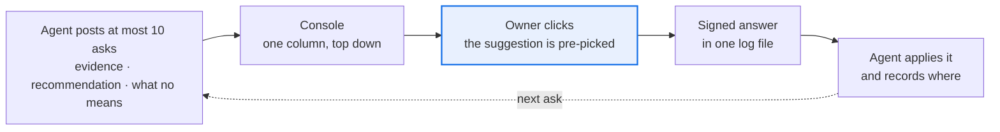

- One append-only file is the whole store; the agent side and the human side meet only there. Stdlib-only Python, no database, no chat app.
- An ask missing evidence, what "no" means or a recommendation (a typed value may go without one) is refused, and an eleventh open ask too.
- Every answer records whether the owner took the suggestion: the override log rule 11 asks for, for free.
- A click can pass through a harness's own gate, so the proof stays where the rules live. It never widens what may be written: an ask that would widen an allowlist, a cap or a write switch is answered in chat (rule 8), not clicked. The agent's side is [`console/AGENT.md`](console/AGENT.md).
- No login of its own: by default whoever can reach the port answers as one named user, so it binds to loopback and refuses the network unless a login proxy names the user. macOS or Linux only.
- `ask.py digest` is the decision record to forward.

---

## Day-one checklist

Install these before the first feature; each costs an hour now and saved days in the source project.

- [ ] Meeting intake: consent, recording, transcript in the client's data folder, the organizer prompt ([template](templates/meeting-intake.md))
- [ ] A review page before the first paid batch: the owner decides per item and the next session reads the decisions back ([loop](templates/owner-review-loop.md)); paid vendor APIs pinned down cheaply first and every request preflighted against the vendor's published schema ([discovery](templates/vendor-api-discovery.md))
- [ ] `docs/ROADMAP.md` with a session start and end checklist from day one ([handoff](templates/session-handoff.md))
- [ ] The test kit before the first feature: a runner that fails a missing RESULT line, a reported failure, `0 passed` or a leaked temp file; one clock; layering rules; a release-archive test ([kit](templates/tests/)). Every rule in the agent instructions names its test ([template](templates/AGENT_INSTRUCTIONS.md))
- [ ] An empty registry index with its lint test; ids are never reused; owner files linted for engineering words ([template](templates/ssot/))
- [ ] CI from the first commit: one pipeline per change with every job in the MR pipeline, the story-id check on every MR title, the offline suite, a secret scan ([fuller template](templates/ci/gitlab-ci.yml); its short form, [templates/gitlab-ci.yml](templates/gitlab-ci.yml), is what the scaffolder renders into every harness), plus a few guarantee stories for refactors to name
- [ ] A story-check registry and a read-only runner: pass, fail, or skip when the data is missing ([template](templates/ssot/story_checks.tsv))
- [ ] "Declare it or refuse": a required data root, one init command to declare scope, a doctor, no defaults ([doctor checks](templates/doctor-checks.md))
- [ ] Raw that only grows, fixtures copied from real API responses, tests for ingesting twice and for row counts ([`kit/pull.py`](kit/pull.py))
- [ ] One fixture test per data bug class before the first report: zero vs missing, sparse days, matched windows, stable picks, validated raw, units and ids ([table](templates/bug-classes.md)); the triage line's `Class:` counts repeats
- [ ] Human tables apart from the cache: triggers, a backup before rebuilds, refusal of lossy rebuilds, a version stamp ([`kit/db.py`](kit/db.py))
- [ ] The `--json` contract from the first report: `meta`, one error document, message codes on every verb, tested both ways ([template](templates/ssot/message_codes.tsv))
- [ ] Vendor [`kit/`](kit/) (`scaffold/new_harness.py` does it): the human gate, message codes with their contract test pointed at your own verb table, and the runner that starts a child verb in its own PEP 723 environment
- [ ] Typed keys: every key a human or agent can set has a unit, bounds or a domain; a fact always needs a human confirm, a decision key says whether it does ([facts](templates/ssot/fact_keys.tsv), [decisions](templates/ssot/decision_keys.tsv))
- [ ] Boundary and layering tests before the first adapter or console exists ([template](templates/tests/test_layering.py)); the console's UI rules as an owner file with its lint ([template](templates/console/ui_rules.tsv))
- [ ] A golden-diff tool committed before the first refactor: every `--json` read and every page, BASE vs HEAD, its self-checks run once ([spec](templates/AGENT_INSTRUCTIONS.md#golden-diff), [engine](templates/tests/golden/))
- [ ] The owner's inbox before the first ask: one log, at most 10 open asks, answers signed ([`console/`](console/))
- [ ] Writes and paid calls off: dry run, allowlist, kill switch, no retries, caps
- [ ] Protected paths for the risky list ([template](templates/CODEOWNERS)) and one release owner
- [ ] Git rules: never squash; one "Fixes #N" per line; every commit names its story; the forge chosen by three questions and every token proved on day 1 ([below](#forge-and-access))
- [ ] Releases are a `git archive` of the tag with an archive test; install messages written from the version the host runs ([install checklist](templates/install-checklist.md))
- [ ] Before the first hosted client: decide where the logic and the keys live

### Forge and access

Settle where the code lives, and who holds which token, before the first commit. Moving later means migrating issues, rewriting CI, living with two issue-numbering schemes and rebuilding the host's install path.

Ask three questions of the forge:

1. **Can a CI quota or spending limit stop builds mid-project?** If so, raise it or pick another forge now.
2. **Can the hosting platform install a private release from it?** Some install by repo name from one forge only; anywhere else, the install becomes deploy token → clone → archive.
3. **Can every agent reach it from the network it runs on?** SSH is often blocked behind a proxy where HTTPS works.

| Role | Token | Scopes | Day-one proof call |
| --- | --- | --- | --- |
| Builder agent, forge CLI | Its own access token, stored by the CLI | Issues, merge requests, pipelines, job logs (read), tags, labels | Open a merge request from a scratch branch, read a failed job's log, add and remove a label |
| Builder agent, git | HTTPS push, with the OS keychain as credential helper | Repository write | Push a scratch branch and delete it |
| Host | A read-only deploy token | Repository read | Clone a release tag and `git archive` it; a push with the token is refused |
| Owner | The owner's own token | All | None: it never passes through an agent. The owner's merges on the risky list are clicks in the forge |
| Public repo | A repo-local commit identity (`git config user.name` and `user.email` inside the clone) | None | `git log -1 --format='%an <%ae>'` shows the public identity, not a work address |

*Paid for:* CI stopped on a spending limit on day 5 and forced a forge move: 39 issues migrated, and the agent instructions still explain two numbering schemes. The CLI token could not read job logs, so seven failed pipelines were debugged blind. Jobs with no rules ran only in branch pipelines, so a merge request pipeline could turn green with no test run ([CI template](templates/ci/gitlab-ci.yml)).

---

## Build the next harness faster

The checklist above, already built: a new harness starts from these instead of from a blank folder. [BUILD.md](BUILD.md) says which step uses which.

- [`kit/`](kit/): the shared harness modules (the gate, human tables, the write guard, message codes, the `--json` contract, the verb table and dispatcher, doctor, the guards), vendored into each harness as `scripts/kit/`; each module has a tier ([the admission rule](#the-admission-rule), [`kit-tiers.tsv`](kit-tiers.tsv)). *Test:* `python3 kit/tests/run.py`, with `kit/tests/test_e2e_shop.py` proving the gate together with the console.
- [`hosts/zylos/`](hosts/zylos/): the worked example of a host adapter (write one per host), driven by one manifest: install, configure, scheduled tasks and the console as a service. *Test:* `python3 hosts/zylos/tests/run.py`.
- [`scaffold/`](scaffold/): `scaffold/new_harness.py` renders the templates, writes the skeleton, vendors the kit and the console, and generates the ten day-one tests; the result is green before its first feature. *Test:* `python3 scaffold/tests/run.py` (`scaffold/tests/test_new_harness.py`).
- [`build/`](build/): the build-time tools: check meeting intakes, turn items into console asks, apply the answers. *Test:* `python3 build/tests/run.py`.
- [BUILD.md](BUILD.md): the step-by-step workflow, B0 to B10: what each step produces, what fans out, who signs which gate. *Test:* `python3 tests/run.py` (`tests/test_docs_build.py`).
- [`skills/build-harness/`](skills/build-harness/SKILL.md): the skill an agent loads to follow BUILD.md from the files alone. *Test:* `tests/test_docs_build.py` holds it to the same steps.

**Check the whole playbook with one command.** [`run_all.py`](run_all.py) runs every test suite in the repository (the ones above, the console's, the templates' self-test, the workflow templates' and the golden-diff tool's), one line each, and ends with one `RESULT:` line; it exits 1 if any suite fails. A suite that prints no `RESULT:` line, has gone missing or lacks its tool (`node` for the Zylos adapter, `git`) fails and is never skipped; every `run.py` in the tree is a suite or is listed as a template, so a new one cannot be left out. `python3 run_all.py --list` names the suites and `python3 run_all.py kit console` runs some. [CI](.github/workflows/ci.yml) runs `python3 run_all.py` on every push and pull request. *Test:* `python3 tests/run.py` (`tests/test_run_all.py`).

### The admission rule

Every module in [`kit/`](kit/) has a tier. **It is core only when at least two independent harnesses use it in production.** A new module is added as extra; when a second harness needs the same thing, its row in [`kit-tiers.tsv`](kit-tiers.tsv) gets that second consumer and the module moves up. Nothing keeps an extra module out of `kit/` or out of the copy every harness vendors (see "What this does not do yet"). [`kit/tests/test_tiers.py`](kit/tests/test_tiers.py) refuses a core row with fewer than two harnesses using the module in production, an extra row with more than one consumer, a consumer name or kind outside the lists below, evidence that names a file of this repository that does not use the module, a module with no row, a row for a module that is gone, and a core or stack module that imports a tier above its own (by the import graph, lazy imports included).

- **core**: two or more independent consumers, and imports only core. Here "core" is this tier alone: the "Core" of [the reuse map](#reusing-the-harness-for-other-channels) is everything that names no channel, which takes in the stack and extra modules and the two folders outside `kit/` (the console and the Zylos adapter).
- **stack**: the human-table stack: what only a harness with protected human tables and a write path needs (the database, the gate, facts, decisions, the queue, the write guard, the registry reader, the raw store). Defined by what it is, not by a count: several of them (for example `db`, `registry` and `raw`) meet the core count and stay stack. Imports core and stack only.
- **extra**: everything else, one consumer or none, and the test kit (`guards/`, `testing/`). May import anything.

**One core row rests on an unmerged branch.** `copylint` is core because the video-ads harness and the KOL harness both import it, but the two KOL files that import it are on KOL's pushed, unmerged branch claims-and-workspace, not on KOL's main (kit 0.2.0, which does not import it), and KOL's copy of the module there is a locally changed fork. The registry counts `prod` from each consumer's checked-out tree, so the row stays core and its note says FRAGILE; [`kit/tests/test_tiers.py`](kit/tests/test_tiers.py) trusts that label and cannot tell merged use from unmerged use, and it requires this paragraph for every core row whose note says so. If that branch is dropped, `copylint` is extra again; counting only use merged to a consumer's main would make it extra today.

Reading the registry: one row per module with its tier, its consumers as `who:kind`, the evidence (a path in the consumer; the video-ads harness's package folder is written `pkg/` whatever it is called there, and "(uncommitted)" marks a use that only one of its two checkouts holds and no commit does), the kit version it first appeared in, and a note. `who` is `video-ads`, `kol` or `rednote` (the three harnesses that vendor the kit), `skeleton` (`scaffold/skeleton/`), `seo`, `outreach` or `source` (other projects that wrote their own version of a job), or `zylos` or `playbook` (this repository). Only `prod` (the production code of `video-ads`, `kol` or `rednote`; no other `who` has it) counts toward core, which needs two of them. The `skeleton` (counted once however many harnesses inherit its files) counts toward the cap on extra, never toward core: the harnesses built from it are not independent of it. `test`, `tool` (a generator, an eval script, a runner) and `fork` (a need, not a use) are shown, never counted. A `skeleton`, `zylos` or `playbook` consumer (files in this repository) is held to its evidence: every file of this repository that the evidence names exists and imports the module (a `(via X)` says which module it imports to reach it; a twin is only a file that exists), and some such file sits under `scaffold/skeleton/` for the skeleton, under `hosts/zylos/` for `zylos`, and elsewhere for `playbook`. The counts come from each consumer's checked-out tree, so a row says when a use is uncommitted or on an unmerged branch, and when it is a use of a copy of the module that the consumer changed locally (the KOL harness's kit copy on its unmerged branch claims-and-workspace, labeled 0.3.1, is a version this playbook never had; its main holds 0.2.0). Extra does not mean safe to delete: several extra modules are reached by every generated harness or by the console integration test, and two are kept for the Zylos adapter. A row that says "no consumer" is a removal candidate for a later decision; nothing has been removed.

**What this does not do yet.** Every harness still receives every tier: `kit/tools/vendor.py` copies all of `kit/`, and tier-selective vendoring does not exist. The tiers are a label and a guard, not a split. A real split takes physical subpackages (`kit.core.dates` for `kit.dates`) or a `vendor.py --tiers` option, and moves what lands in `scripts/kit/`: a breaking change for the three harnesses that vendor the kit (one has uncommitted work), to be scheduled with them under a new major kit version. The data would follow: `kit/message_codes.tsv` still holds rows of modules outside core (raw, human, env), and `kit/messages.py` reads every `message_codes.d/` fragment.

**Why the registry is outside `kit/`.** `kit/` is what harnesses vendor and `kit/MANIFEST.sha256` fingerprints: a change inside it is a new kit version and a re-vendor everywhere. The registry and its test are not vendored, so retiering costs no harness a re-vendor. The price: the module table in [kit/README.md](kit/README.md) does not show the tier; read the registry.

---

## Stories that prove themselves

The owner can't read code, so "approved" and "done" must rest on checks a machine already ran.

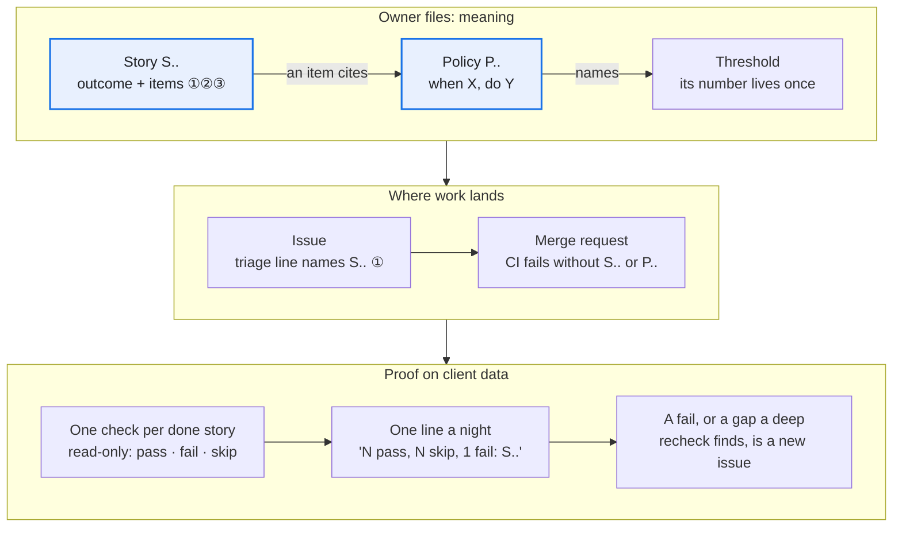

1. **Stories and rules are separate owner files** ([how](templates/ssot/README.md#stories-and-policies)). *Paid for:* an audit found four rules the code applied that nobody had approved; the owner approved them one by one.
2. **Acceptance items are numbered invariants a machine can check:** children sum to the parent, missing input means "unknown", a zero row never disappears. Issues and MRs cite the item (S.. ①). Such items let a read-only agent find a headline ratio dividing 30 days of spend by 23 days of sales.
3. **The story id is enforced in CI, not in instructions** ([template](templates/ci/gitlab-ci.yml)). *Paid for:* 17 of the first 105 MRs named no story, 15 of them refactors; after a 15-line CI job on the title, none of the next 77. Give refactors a guarantee story to name.
4. **One read-only check per done story; missing data skips, never passes** ([template](templates/ssot/story_checks.tsv)). *Paid for:* a "nothing sent without approval" check first passed on a client that had never sent anything. *Built* (its own story still awaits the owner); the nightly run on the host is not yet seen.
5. *Seen once:* **nightly checks prove presence; deep rechecks prove behaviour.** Read-only agents walked the stories item by item on a sandbox copy: 8 pass, 21 partial, 9 blocked of 38 judged. The worst: a code shown for items A and B approved A and C, unit tests green. No nightly row checks that binding.
6. *Seen once:* **audit the map both ways, then test its links.** Story → code and code → story found 17 unstoried features, 9 stale stories and 4 rules only the code knew, each put to the owner. Later, 4 of 5 partial stories named a closed blocker.

---

## Registries: one place per value

A value lives in one registry row with one reader, so every agent, page and check gets the same answer, in the client's language.

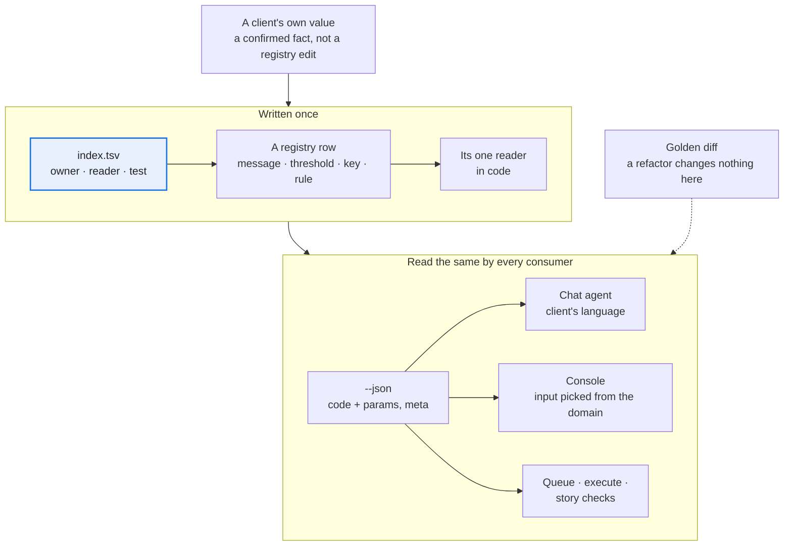

1. **Code every message and close the registry both ways, on every verb** ([how](templates/ssot/README.md#message-codes)). *Paid for:* the gate and write verbs sat outside the test, so their refusals reached the owner's page as "unclassified" until about 40 were coded. The reader and the checks are [`kit/messages.py`](kit/messages.py) and `check_verbs` in [`kit/guards/json_contract.py`](kit/guards/json_contract.py).
2. **A threshold enters only with a reader and is renamed only through a map** ([how](templates/ssot/README.md#thresholds)). *Paid for:* one owner audit merged 4 duplicates, dropped 3 that nothing read and renamed 3; no client folder needed a migration.
3. **Type every key a human or agent can set** ([how](templates/ssot/README.md#facts-and-decisions)). *Paid for:* a percentage typed as 15, .15 or 150 silently changed every margin. Bounds now refuse 150 on a 0–100 percentage and 80 on a 0–1 ratio; 15 and .15 both still pass, so state the unit where it is typed.
4. **`meta` is the truth label, scoped to exactly what the report covers:** window asked vs found, missing days per source, stale sources, what-if values in effect. Queue and execute read it to refuse.
5. **Preview with a what-if flag, not a UI field.** A proposed threshold runs through any report, stored nowhere and echoed in `meta`; the queue refuses a what-if snapshot, and the console's "what confirming changes" comes from it alone.
6. **Alert rules are rows, and each new rule still needs code** ([how](templates/ssot/README.md#alert-rules)). *Paid for:* the registry grew from 5 to 12 rules in six days, each with code for its grain, metric or comparison; the row is what makes a rule visible, named and tunable.
7. **Every number names its source, and a report takes one source per entity.** Each cache row carries `source`; a fixed preference order picks one source per entity and metric, and the report says which it used. A third-party estimate is never shown as the platform's own number, and two sources are never blended into one figure ([bug class](templates/bug-classes.md#pulls-and-platform-facts): `blended-sources`). *Seen twice:* both source harnesses do this by design: an ads harness never treats a seller-tool estimate as the marketplace's truth; an SEO harness ranks the search engine's own clicks above any tool's traffic estimate.
8. **A graded rule cites the platform's own documentation; a convention is marked and capped** ([how](templates/ssot/README.md#cited-rules)). Each check row names the page that makes it a rule (`basis=authority`); an industry habit is `basis=heuristic` and a test keeps it at the lowest severity. Re-check the citations against the live pages from time to time: they rot. *Paid for:* five days after an SEO harness wrote its check registry, a re-check of its 30 cited pages found 8 rows to fix: 5 pages had moved to a new docs tree (and a test that pinned the old prefix failed), 3 cited pages did not say what the row claimed, and one end date was a day off.

---

## The client console is where clients answer

Humans answer in two places: the [owner console](#the-owner-console-where-the-asks-go), where the builder-owner answers the agent about the harness itself, and the client console, tested in the harness repo, which collects the values and approvals the harness's rules read.

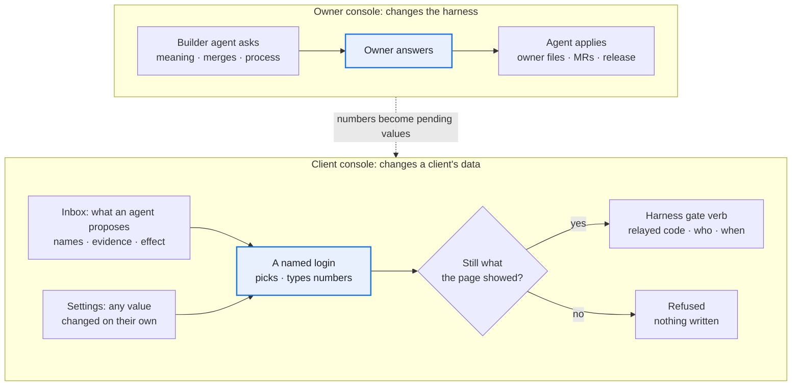

1. **The console has no write path of its own.** From a click it runs only the harness's gate verbs, relaying the one-time code with the logged-in name, and only while the subject still matches what the page showed. It never opens the database; a test checks the boundary both ways.
2. **Put names, evidence and the effect on the row:** money rounded, old → new with a coded reason, who proposed a value apart from whether it is confirmed. *Paid for:* dozens of pending actions showed as id triples and 16-decimal floats, so approving would have been blind; money is now rounded, names are still open.
3. **Pick from closed sets; type only numbers.** Inputs come from the registry's domain column; a typed number is validated like any write and is what the code binds. Mechanical items confirm in one click; a lifecycle decision (a stage change) goes one at a time, and the server refuses a batch of stages, typed values or thresholds.
4. **One render path, one dictionary, and the UI rules linted on every page** ([owner file](templates/console/ui_rules.tsv)). The browser writes no words, so the lint and the golden diff reach them all. *Paid for:* pages drawn three ways in two days, and a template-only lint let a raw command-line refusal onto a banner.
5. **Read top down; test at phone width on real data.** One column, what waits first, list then detail, no grids of cards holding tables. *Paid for:* one invented client run through the real chain found five console bugs the fixture tests missed.
6. **Two doors to one gate: the inbox for what an agent proposes, settings for what a human changes unasked.** *Paid for:* the owner could not find where to enter a value, so every count of waiting items now links to its inbox section; later the owner asked for an edit place in settings. The gate already took a human's own value with nothing pending, so that was a page, not a new write path.

---

## When agents file the issues

Most issues came from agents: those operating the harness, the client's own agent, demo runs and golden diffs. Most MRs merged on green CI; the owner's time went to meaning changes and risky merges.

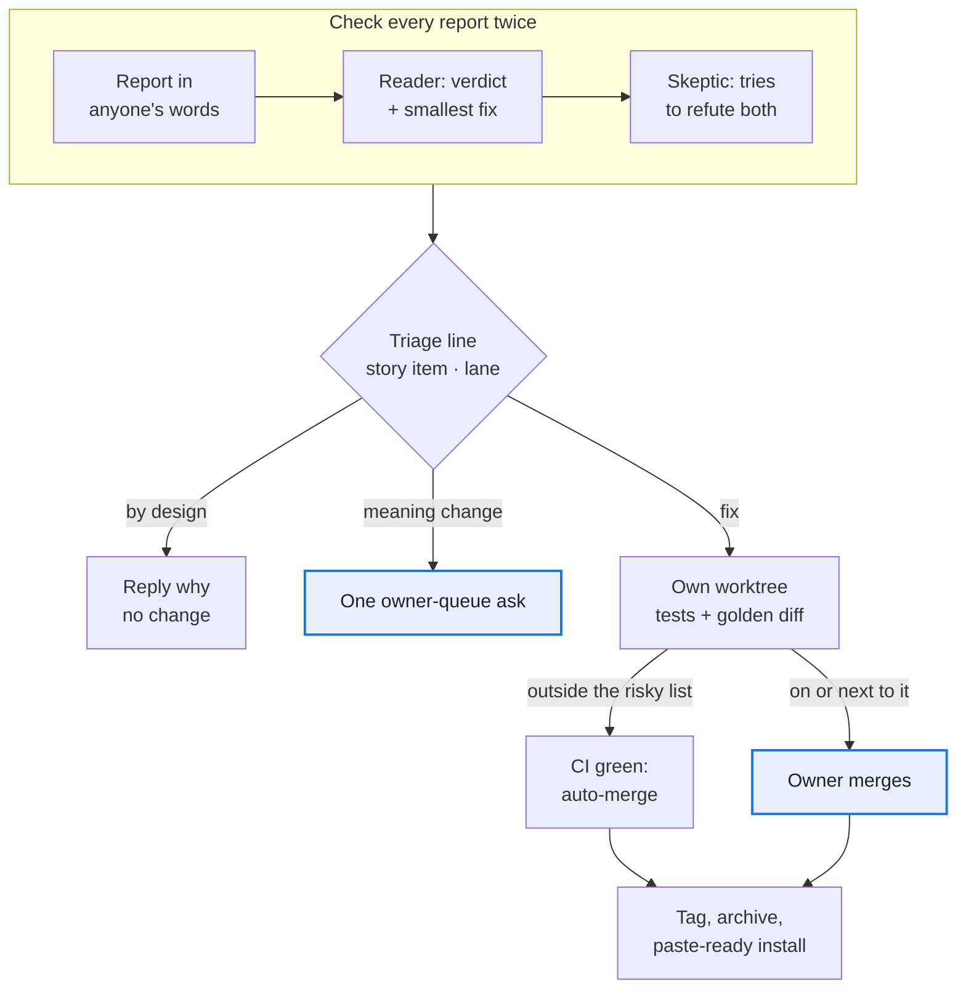

1. **The triager, not the reporter, writes the first line:** the story item, the lane and how it was found ([checklist](templates/triage-checklist.md)). Ship what changes no meaning now; queue the rule change as one question.
2. *Seen once:* **check every outside report twice: a reader, then a skeptic** ([prompts](templates/verify-challenge.md)). Of the client's agent's 6 points, 2 were by design; the skeptic corrected 2 verdicts, and probing plus the golden diff found 3 more bugs. All 7 fixes merged the same day, one by the owner because it sat next to the gate relay.
3. **A batch that breaks the invariants is one owner decision, not N fixes.** *Paid for:* an outside team proposed a parallel app with its own config and data files in 20 issues, several writing values back around the gate. The owner closed all 20 as superseded: confirm-from-the-page already existed, built with one additive harness change.
4. **Auto-merge on green CI, except the risky list** ([protected paths](templates/CODEOWNERS)). On the forge's free tier nothing blocks the merge: the agent reads the list before setting auto-merge. A refactor that moves risky code adds the new file to the list in the same MR; this was missed once.
5. **Refactors pass a committed golden diff** ([spec](templates/AGENT_INSTRUCTIONS.md#golden-diff), [engine](templates/tests/golden/)). *Paid for:* the first golden scripts lived in a session's scratch space and vanished with it; on real data the committed tool caught a report that differed in 45 places between two runs of the same code. Before its 0 could be trusted, it needed clocks pinned in the verbs' own child processes, only real noise masked, an untorn copy of a live folder, and worktrees removed on a kill.
6. **Nothing a later session needs lives only in a session** ([rules](templates/AGENT_INSTRUCTIONS.md#what-lives-here)). *Paid for:* a scratch directory was wiped once, and the queue page's database still held all 213 review rows; one session left 108 worktrees.
7. **A rule learned on one client stays proposed until a client with another business model confirms it.** Every client handoff ends with a Distil list: each insight goes to a harness issue or MR, a proposed story or policy, or is marked client-only ([handoff](templates/session-handoff.md#session-end-checklist)). *Paid for:* an SEO harness built on a B2B manufacturer shipped its page recipes with the pump's spec columns in them, and a URL-pattern order that typed 266 pages on three clients wrongly; both showed only when the first web-shop client arrived.

---

## Building with many agents

The source project built most of its changes with workflow scripts: many agents, one branch each, and one orchestrating session that pushes. About half of its runs rewrote the same script, schemas and prompt rules, and the early copies were missing rules that later cost rework. The loop, its result schemas and its rules are in [`templates/workflows/`](templates/workflows/). Copy them on day one. *(untried as copied here: the scripts are the source project's made generic, and they are tested under a simulator, not yet run live in this form.)*

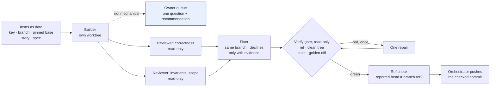

1. **Items are data, and the base is a pinned commit.** Each item names its key, branch, story and spec. Every prompt names the base SHA and an in-flight map: other branches and sessions, the files not to touch, and the one item that may bump a schema in this run. *Paid for:* two branches built at the same time both bumped the schema version to the same number.
2. **Show each new test red on the base, then green. Write each safety check both ways: the bad case refused AND the good one accepted.** *Paid for:* a reviewer found a new check that could not fail on the base, although the builder had reported that it did.
3. **Give each agent its own temp dir, port block and store, and run golden cases alone.** *Paid for:* test sandboxes leaked into the system temp dir while many agents ran the suite, and a timing check failed only while a golden compare ran beside it.
4. **A builder that meets a question of meaning stops.** It commits nothing and returns one question with its recommendation. *Paid for:* early scripts had no way to stop, so a builder guessed, and the owner's answer cost a rework.
5. **The fixer writes only where it may, and nobody trusts a reported commit.** A later agent cannot edit another agent's worktree. It enters that worktree first, or it fixes in its own detached worktree and moves the branch with a compare-and-swap, `git update-ref refs/heads/B NEW OLD`. Results carry `head_sha`, and the gate and the [ref check](templates/workflows/refcheck.py) compare it with the branch ref before any push. *Paid for:* this write-hook trap came back run after run. Once a fix was left on a detached HEAD while the branch kept the unreviewed commit, and it was reported as done.
6. **Every item ends at a read-only gate with at most one repair round.** *Paid for:* early scripts ended at the fix pass, so "green" was only the fixer's word. The gate was cheap, and in later runs it never needed its repair round.
7. **Before a clean-up round, sweep read-only and send a skeptic after each candidate** ([`sweep-skeptic-plan.js`](templates/workflows/sweep-skeptic-plan.js)). A finding nobody reproduced is not a finding. Accepted limits are listed up front, so they stop coming back. *Paid for:* in one refactor sweep the skeptics refuted several candidates before anyone built them. The survivors became small MRs with one reason each.
8. **Plan for restarts.** Copy the run's journal and script into the new session and resume. Finish a cut-off builder in its existing worktree ([how](templates/workflows/README.md#after-a-restart)). *Paid for:* the orchestrating session restarted mid-run, and the running workflows were marked stopped.

The full rules table, with what each rule prevented, is in [`templates/workflows/README.md`](templates/workflows/README.md#the-rules-pasted-into-prompts).

---

## Hosting: the agent that runs it can read it

A hosting platform runs the harness under a remote agent that clients chat with. The adapter and per-client boundaries held; keeping logic and keys away from that agent must be decided per host, before the first hosted client.

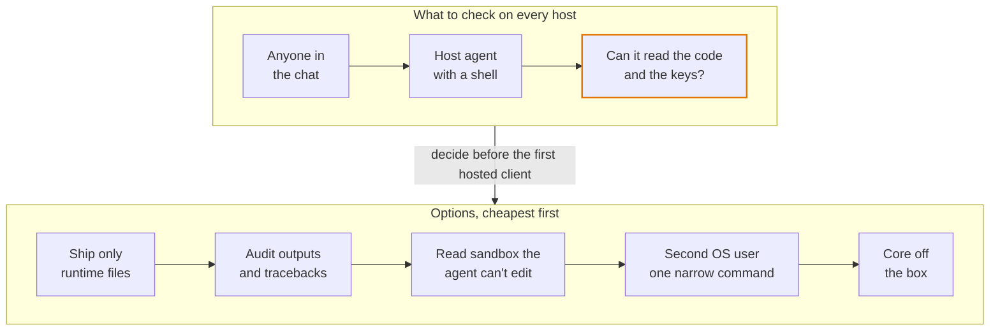

1. **The core never names its host.** All host glue lives in one adapter folder; delete it and the harness still runs, and CI smoke-tests each supported platform version. *Paid for:* applying one review by the platform's team added about 850 lines: declared config defaults were never applied, and the linked command was not on the agent's PATH.
2. **One client = one data folder = one host agent.** No fallback to the working directory; on a host, turn off any user-wide env file, and let the doctor name each value's source. *Paid for:* agent shells reset the working directory, scattering credentials, database and raw files. The platform put every chat channel into one agent session, so a second client needs a second host.
3. **Check what the agent a client chats with can read, and what the host can write.** On the first host we checked, the agent ran as the harness folder's OS user with no deny rules, so it could read the code and the secrets file. Behaviour rules and settings the agent can edit are no barrier. Ask again on every new or replaced host agent ([checklist](templates/install-checklist.md#new-host-or-a-replaced-host-agent-what-can-it-reach)), and pick a barrier above before the first hosted client.
4. **Scheduled tasks are closed prompts; long jobs run detached** ([checklist](templates/install-checklist.md#scheduled-tasks-and-long-jobs)). *Paid for:* a laptop cron job failed silently, then its replacement exited 1 every hour and nobody saw it; a 30-day pull took close to an hour against a tool-call limit of about 10 minutes.
5. *Seen once:* **the console sits behind a proxy login that strips, then sets, the user header,** trusted only from loopback. After each restart: local 200, public 401, public with a forged header 401. *Paid for:* the platform's route declaration would have published the confirm inbox with no login.
6. *Seen once:* **client data moves by snapshot, and a push queue has one reader.** Stop the old consumer, then take a checksummed snapshot with row counts: confirmed values and approvals can't be pulled again. Two readers each get a random half, so a host swap has a deadline, the queue's retention.

---

## Reusing the harness for other channels

The first harness ran paid ads on one marketplace. For Google, Meta or TikTok ads, and for SEO, GEO (generative-engine optimization: being cited in AI answers) or KOL (key opinion leader: influencer) work, the core's channel-free modules copy as they are, what names a channel is a pattern to port, and the channel pack is rebuilt from client meetings.

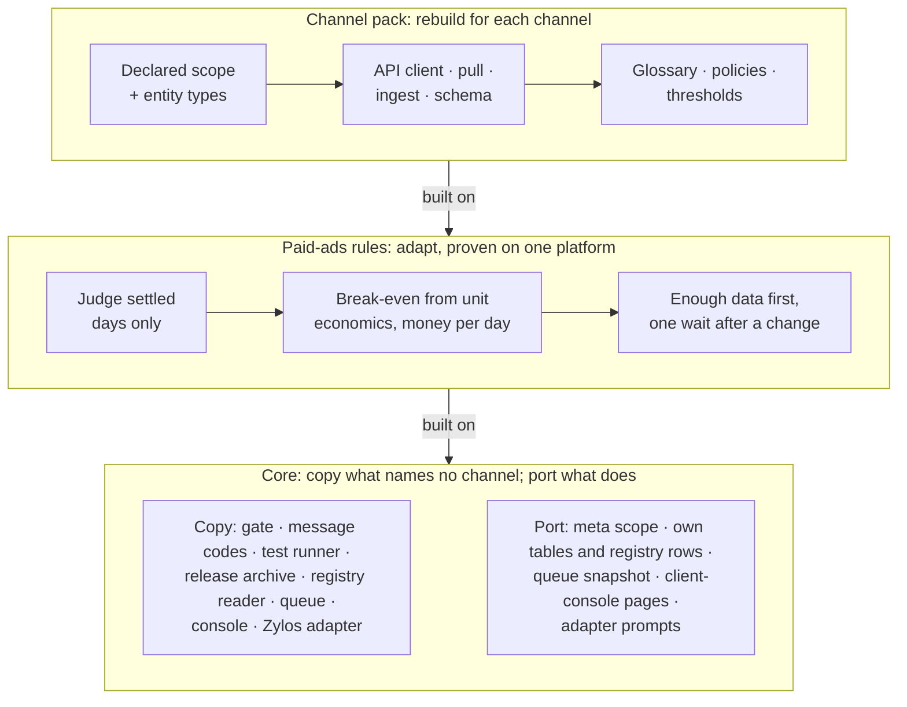

**Reuse:** copy as is · **Port:** keep the pattern, rewrite the code · **Adapt:** same rule, checked against the platform's own facts · **Rebuild:** new for the channel · **Unknown:** settle it in the first client meeting. *(untried)* marks a part the source project never ran.

| Part | Paid ads: Google · Meta · TikTok | SEO · GEO · KOL |
| --- | --- | --- |
| Gate, message codes, test runner, release archive, human-table and raw guards (`kit/db.py`, `kit/pull.py`), one clock ([`kit/`](kit/), [`templates/tests/`](templates/tests/)) | Reuse | Reuse |
| The `--json` contract, registry reader, facts and decisions, queue and execute, story-check runner, owner console, Zylos host adapter ([`kit/`](kit/), [`console/`](console/), [`hosts/zylos/`](hosts/zylos/)) | Reuse | Reuse |
| What names the channel: `meta`'s scope fields, the harness's own tables, schema and registry rows, the queue's proposal snapshot, client-console pages, adapter prompts | Port | Port |
| Process: stories and policies, owner queue, triage, golden diff, install flow | Reuse | Reuse |
| Meeting intake *(untried)* | Reuse | Reuse |
| Judge settled days only; a missing day makes a total "unknown" | Adapt | Unknown |
| Break-even from unit economics, ranked in money per day | Adapt | Unknown |
| Enough data before judging; one wait after any change | Adapt | Unknown |
| Guarded writer: allowlist, caps, kill switch | Adapt | Unknown |
| Sources ranked: platform and human data above third-party data and AI scores | Reuse | Unknown |
| Alerts: each entity's latest settled day against a multiple of its own prior 7-day mean | Adapt | Unknown |
| Channel pack: scope, entity types, API client, pull, ingest, glossary, policies, thresholds | Rebuild | Rebuild |

Proven here: the core's rules and the process; the paid-ads rules on one marketplace platform with 7- and 14-day attribution windows; the writer tested and dry-run on real data, never used on a live account. The plumbing has also carried over: three harnesses (a short-video ad harness, a KOL harness and a RedNote harness) vendor the kit under its drift guard, and the KOL and RedNote harnesses also vendor the owner console and copy the adapter files `hosts/zylos/README.md` lists unchanged (each copy is those files plus the harness's own `zylos/manifest.json`, without the adapter's tests and its two templates); the adapter itself has only run against a fake host ([`hosts/zylos/README.md`](hosts/zylos/README.md), "Known limits"). Two of the three (the short-video ad and RedNote ones) hold unmodified copies of the kit. The KOL harness's main holds kit 0.2.0, a version this playbook had; its pushed but unmerged branch claims-and-workspace holds a locally changed copy labeled 0.3.1, a version this playbook never had (seven kit modules and its console copy differ from the playbook's; one of the seven is only an older version), and that branch's drift test compares the copy with its own manifest, so it passes. Still unproven: the SEO, GEO and KOL rules, goals other than sales (leads, app installs, awareness), the paid-ads rules on a second platform, and the Zylos adapter on a real zylos-core.

1. **Vendor the channel-free modules; port the rest.** The gate, message codes, clock, data guards, test runner and release archive name no channel. The queue's proposal snapshot, `meta`'s scope fields, the client-console pages and adapter prompts name markets, campaigns, keywords and product groups: expect to rewrite them with the pack; the queue itself, the registry reader, the owner console and the Zylos adapter (with the harness's own `zylos/manifest.json`) copy as they are. A new harness runs `scaffold/new_harness.py`, which vendors [`kit/`](kit/): the human gate (`human.py`), coded messages (`messages.py`) and their contract test (`guards/json_contract.py`), the child-verb runner (`runner.py`), one clock (`dates.py`), and the database and raw guards (`db.py`, `pull.py`, `atomic.py`, `retry.py`, `single_instance.py`); [`templates/tests/`](templates/tests/) is the same test rules as a standalone copy for a repository that does not vendor the kit. The gate's subject and the human tables still say `market` (a harness with no partition writes `_`): renaming it to a neutral `scope` is an open, breaking change. *(the rules and their tests come from the source project, where the original code ran on real data; the kit has since run inside three harnesses, one of them as a locally changed copy, but not every module: `pull.py` has no consumer and has run only against its own tests, and `atomic.py`, `retry.py` and `single_instance.py` have one harness each, see [`kit-tiers.tsv`](kit-tiers.tsv))*
2. **Put every number an agent will be asked for in the harness.** *Paid for:* asked for the top actions by money per day, the host agent found no such number and invented its own formula; the formula moved into the harness so every agent returns the same number.
3. **Verify each platform's facts before trusting a number:**
   - the attribution window per ad type
   - whether past days are restated: pull the same day twice, days apart
   - the time zone of its day, report latency and how far back it reaches
   - whether change history names who made each change
   - whether the read credential can also write
   - rate limits

   *Paid for:* the settled boundary drifted with the operator's time zone until pull times were stamped in UTC, and the read token turned out to be able to write.
4. **Key freshness, windows and resume state by the full scope.** *Paid for:* three bugs let a fresh market hide a stale one; one would have let a stale market past the write path's freshness guard. One client on several channels would be the same multi-scope case (untested).
5. **For SEO, GEO and KOL, only the core and the process are known to carry over.** The first meeting settles what one result is worth and costs, which source counts as truth, and what the agent may change, publish or send; each answer is a [fact key](templates/ssot/fact_keys.tsv), and a test keeps the client's form in step with them. *Paid for:* nothing ran before the scope was declared, and until unit cost and a monthly cap existed every profit verdict rested on an assumed break-even, marked as such.

### Generated creative and real people (video, image, voice, copy)

*Seen once:* a short-video ad harness built on this playbook. An agent writes a storyboard; the harness generates AI presenter and voice takes, then composites them with client footage and code-drawn layers (subtitles, the legal bar, the AI label) into a finished ad. Later it added an authorised real person as presenter. The gate, message codes and test rules carried over unchanged. What was new, and is now in the kit or the templates:

1. **Paid generation is the money path.** Each AI call is a take: planned, priced, capped, approved at the gate with the exact plan as its subject, then made and kept ([`kit/takes.py`](kit/takes.py)).
2. **Raw only grows, for media.** A take is keyed by its request and written once. A re-roll is a new request, never an overwrite, so an approved take can't be lost and the same request is never paid for twice.
3. **Never cache a broken take.** *Paid for:* a TTS voice that wasn't installed wrote a 0.01 s file and exited 0. Every build then reused that empty take. A sanity hook now runs before a result is kept.
4. **Lint the copy before spending.** Banned ad words per category, category rules and product facts run before any paid call ([`kit/copylint.py`](kit/copylint.py)). A rule nobody has confirmed says so. *Paid for:* the client's own reference ad gave the dosage two ways; a list of banned words alone missed it.
5. **Preflight every paid request against the vendor's own schema** ([`kit/preflight.py`](kit/preflight.py)). *Paid for:* two refusals on the first live day, both visible in the vendor's published input rules.
6. **A real person is consent data, confirmed at the gate** ([`kit/consent.py`](kit/consent.py), [template](templates/third-party-consent.md)). Their face, voice, words or clip are used only under a record a person confirmed through the gate. The confirmation is bound to the record's content hash; revoking is free. *Paid for:* the first version accepted a hand-set `status: confirmed`, and an agent set it on the owner's chat word.
7. **Regulated copy says only what the approved document allows** ([`kit/claimscope.py`](kit/claimscope.py), [`kit/phrasebook.py`](kit/phrasebook.py), [template](templates/claim-scope.md)). A claims record holds the approved wording (a drug's indication, a fund's prospectus) and the claims it allows; a person confirms it at the gate. Every line is checked against it at script, asset and render. A phrase the platform refused is remembered and refused inside any later line. Every rejection's quoted phrases are a recall test, and every approved creative a false-alarm test. *Paid for:* 20 creatives of one OTC product were refused in one afternoon for naming symptoms outside its indication. The words were ordinary, so no banned list could see them. The checker then caught 10 of 10 quoted phrases while the approved wording passed. Later, 26 rejected creatives turned out to be 5 scripts rearranged.
8. **The agent runtime has its own gate. Hand the step over; don't work around it.** Uploading a real person's biometrics was refused by the agent's personal-data check even with the owner's go-ahead. The harness prints the exact command, the owner runs it, and the agent carries on locally.
9. **Show a real sample, not a mock.** A free draft path (a stock voice, the real client footage) lets the agent time and lint a whole piece. The owner, though, judges a real 4-scene sample for about ¥1, not placeholders. *Paid for:* labelled placeholder presenters read as the product and were rejected ([review loop](templates/owner-review-loop.md)).
10. **An IR with two compilers.** A frame-exact timeline JSON is the contract. One compiler renders it headlessly; a second writes an editor draft for human polish. The render stays the source of truth.
11. **Close the outer loop.** Measure the same factors on winning and non-winning outputs; the differences become pending rules that variants confirm ([outcome learning](templates/outcome-learning.md)).

| Part | Generated creative |
| --- | --- |
| Gate, message codes, test runner, clock, `takes.py`, `preflight.py`, `consent.py`, `copylint.py`, `claimscope.py`, `phrasebook.py` | Reuse |
| The `--json` contract, registry reader, story-check runner, owner console | Reuse |
| `meta`'s scope fields, the harness's own tables and registry rows, client-console pages, the review page | Port |
| Raw and database guards | Rarely needed: takes replace raw pulls |
| Channel pack: providers, the IR and its renderer, category rules, the claims lexicon, platform safe zones, the consent letter's jurisdiction | Rebuild |

---

## Templates

| File | Stage | What it is |
| --- | --- | --- |
| [`templates/meeting-intake.md`](templates/meeting-intake.md) | 0 | The organizer prompt and its output shape |
| [`templates/decision-rights.md`](templates/decision-rights.md) | 1 | The three lanes and the risky list |
| [`templates/CODEOWNERS`](templates/CODEOWNERS) | 1, 10 | Protected paths for the risky list |
| [`templates/ssot/`](templates/ssot/) | 1–2, 5–7 | Registry index, glossary, user stories and policies (owner file + agent sibling), thresholds, message codes, fact and decision keys, alert rules, story checks |
| [`templates/ci/gitlab-ci.yml`](templates/ci/gitlab-ci.yml) | 2–3, 10 | The fuller CI to grow into: one pipeline per change, every job with its rules, story id (with a note for GitHub Actions), offline tests with a cache, a check of the Zylos adapter, adapter smoke, secret scan with a placeholder convention; `templates/gitlab-ci.yml` is its short form |
| [`templates/AGENT_INSTRUCTIONS.md`](templates/AGENT_INSTRUCTIONS.md) | 3 | Invariants-only instructions for the coding agent (a `CLAUDE.md`) |
| [`kit/`](kit/) | 3, 6, 8 | A module, not a template: the human gate, message codes with their contract test, the child-verb runner, one clock, and the raw and database guards, vendored into a harness by `scaffold/new_harness.py` *(the rules and their tests come from the source project, where the original code ran on real data; the kit has since run inside three harnesses, one of them as a locally changed copy; `pull.py` has no consumer and has run only against its own tests)* |
| [`templates/ROADMAP.md`](templates/ROADMAP.md) | all | The one roadmap format every project shares, so a session on a new machine starts from the file: dated rows with ids, what waits on the owner, the owner's decisions in their own words; `kit/guards/roadmap.py` checks it |
| [`templates/evals/`](templates/evals/) | 8 | Agent-behaviour evals: the case layout (`case.yaml`, `prompt.md`, graders), the ablation table, the offline rules `kit/guards/evals.py` holds (the forbidden-verbs pattern is generated from the verb table), and a fixture builder that refuses a checkout holding client data *(untried as copied here: seen on one harness, run only against the toy harness)* |
| [`templates/tests/`](templates/tests/) | 3, 9 | The test kit: a runner with a temp-leak gate, a one-clock lint, an import-graph layering engine with rules in a table, and a release-archive test; `selftest/` breaks each gate on the case it exists to catch *(untried as copied here)* |
| [`templates/tests/golden/`](templates/tests/golden/) | 3, 10 | A module to copy: the golden-diff engine, the cases hook your harness fills from its verb table, and the tests that prove it can say 1 *(untried as copied here)* |
| [`templates/workflows/`](templates/workflows/) | 3–10 | Workflow scripts for building with many agents (build → review → fix → verify; sweep → skeptic → plan), the ref check to run before any push, and the prompt rules with what each one prevented |
| [`templates/bug-classes.md`](templates/bug-classes.md) | 4, 7, 10 | Data bug classes, each with the fixture test that pins it; the ids for the triage line's `Class:` |
| [`templates/doctor-checks.md`](templates/doctor-checks.md) | 4–5, 9 | What the doctor checks: when each warns, the fix it names, the bug it caught |
| [`templates/console/ui_rules.tsv`](templates/console/ui_rules.tsv) | 8 | UI rules as an owner file, each checked by name |
| [`templates/gitattributes`](templates/gitattributes) | 9 | Copied to the root as `.gitattributes`: the internal files every release leaves out |
| [`templates/install-checklist.md`](templates/install-checklist.md) | 9 | The install message, the host report, and what a host agent can read |
| [`templates/owner-queue-item.md`](templates/owner-queue-item.md) | 10 | The shape of one owner ask |
| [`console/`](console/) | 10 | A module, not a template: the agent's ask CLI and the owner's one-page console |
| [`templates/triage-checklist.md`](templates/triage-checklist.md) | 10 | Judging an agent-filed issue; the triage line |
| [`templates/verify-challenge.md`](templates/verify-challenge.md) | 10 | Reader and skeptic prompts for an outside report |
| [`templates/intake.schema.json`](templates/intake.schema.json) | 0 | The shape of one meeting's intake; `build/check_intake.py` reads it |
| [`templates/prior-art-scan.md`](templates/prior-art-scan.md) | 0, 4, 8 | When and how to scan what already exists, each claim with its link and date |
| [`templates/vendor-api-discovery.md`](templates/vendor-api-discovery.md) | 0, 4, 8 | Pinning down a paid vendor API cheaply, and preflighting every request against its published schema |
| [`templates/third-party-consent.md`](templates/third-party-consent.md) | 5, 8 | A real person in a marketing output: the record, confirmed only through the gate, bound to its content |
| [`templates/claim-scope.md`](templates/claim-scope.md) | 5, 7, 10 | Regulated copy names only what the approved document allows: the claims record at the gate, the lexicon, waivers, the phrase library, rejections as recall tests |
| [`templates/owner-review-loop.md`](templates/owner-review-loop.md) | 7, 10 | One published page the owner decides on per item, read back by the next session |
| [`templates/outcome-learning.md`](templates/outcome-learning.md) | 10 | Winners against the rest on one factor catalog; rules stay pending until a variant confirms them |
| [`templates/session-handoff.md`](templates/session-handoff.md) | all | Each session closes one turn and leaves the next one ready |
| [`templates/harness.toml`](templates/harness.toml) | 3 | The harness declares itself once: names, languages, scopes, layers, what a release ships |
| [`templates/gitlab-ci.yml`](templates/gitlab-ci.yml) | 3, 9 | The short form of that CI, the one the scaffolder renders into every harness: secret scan, story id in the title, the RESULT-gated test job, each with its rules |
| [`templates/gitignore`](templates/gitignore) | 3 | Secrets, the console's log and client data never enter the repository |
| [`templates/SKILL.md`](templates/SKILL.md) | 9 | The agent's rules and the skill's scope: read, pending writes, out of scope |
| [`templates/README-operator.md`](templates/README-operator.md) | 9 | The operator guide: install, configure, the daily loop, what needs a human |
| [`templates/workflows.md`](templates/workflows.md) | 9, 10 | Recipes: the daily check, why a number moved, a client meeting |
| [`templates/README.md`](templates/README.md) | all | Every template, the step that uses it and its target in a harness; the ten tests a new harness starts with |
