# Agent Harness Playbook

How to build an **agent harness** — a small, tested tool an AI agent operates for a business owner — from the first client meeting to a system running in production, with the human in the loop at the right places and nowhere else.

Distilled from an eight-day build of an advertising harness (read-only data pulls, reports, a guarded write path, a web console and a remote host agent): about 850 commits, and about 180 merge requests in the last four days. Every lesson below is something that project paid for; a lesson seen only once says so. Building for another channel? Start at [the reuse map](#reusing-the-harness-for-other-channels).

---

## The pipeline at a glance

A new harness starts from recorded client meetings and goes through ten stages. The owner signs only five gates: **meaning, stories, numbers, money, release**. Everything else is signed by a machine: CI tests, or a host check after install.

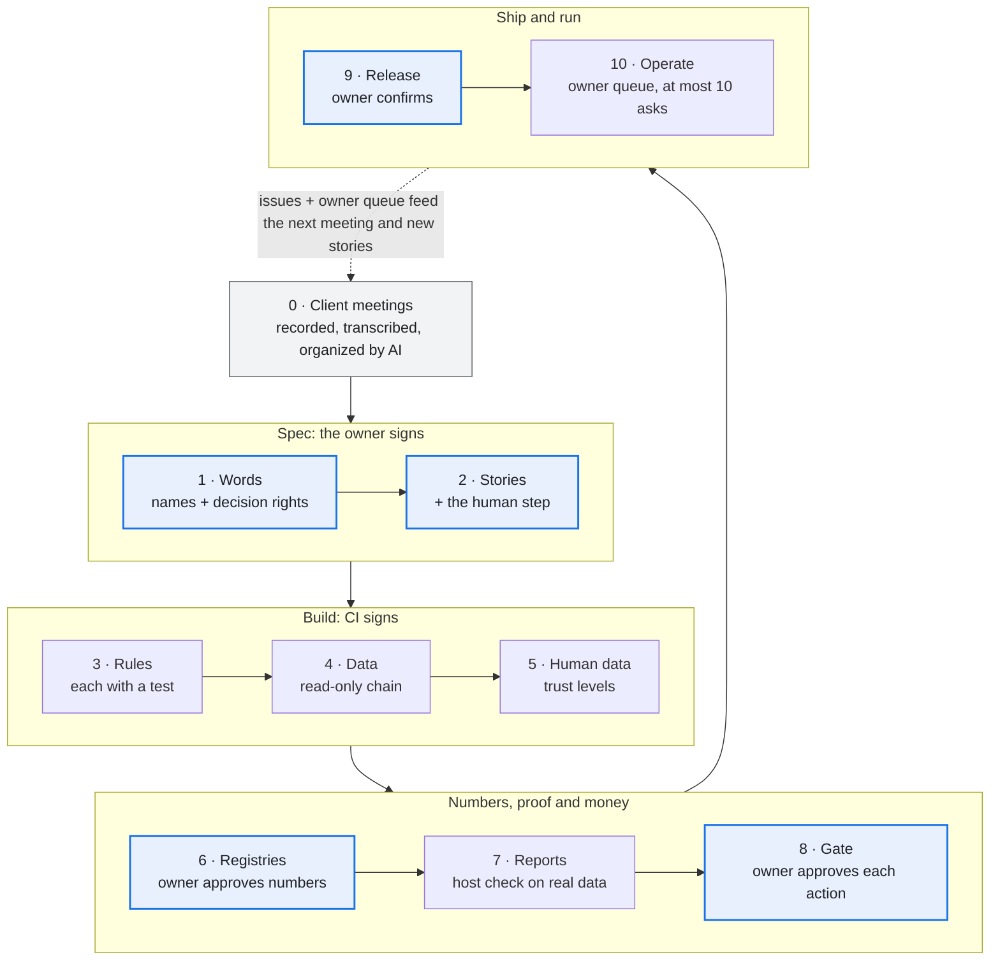

What runs in production feeds back as issues and at most ten owner asks, which shape the next meeting.

---

## Stage 0: client meetings are the first input

Every project starts from what the client actually said, not from what the agent imagines.

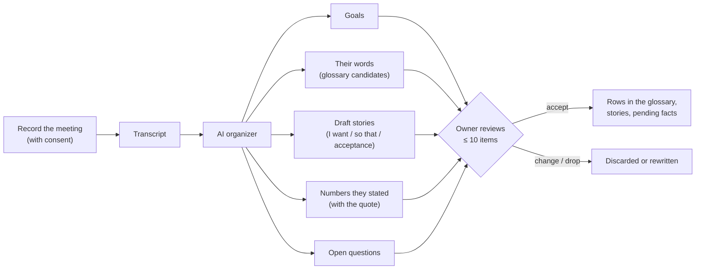

1. **Record and transcribe** each client meeting, with the client's consent. Recordings and transcripts stay in the client's own data folder, never in the code repository.
2. **The AI organizes the transcript into five buckets:** goals, the client's own words for things, draft user stories, numbers they stated (costs, lead times, budgets, limits), and open questions.
3. **Every item cites its source:** meeting date and the timestamp of the quote. A number with no quote is not written down.
4. **Numbers enter as pending values** with the meeting as their source; they drive nothing until a human confirms them.
5. **The owner reviews at most 10 items per meeting:** accept, change or drop. Accepted words and stories become rows in stages 1 and 2.
6. **Later meetings feed the same buckets.** A changed number or goal becomes a pending change with the old and new quotes side by side, never a silent overwrite.

The prompt and output shape for the organizer: [`templates/meeting-intake.md`](templates/meeting-intake.md).

---

## Who decides what

Write these three lanes into the repository on day one, not into an agent's memory.

**Always the owner:** meaning · numbers · money · the client contract · risky merges · release.

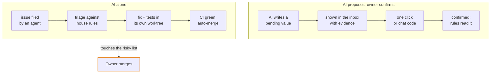

**The risky list:** the human gate, the write path, contract removals or renames, owner files, threshold values and human-data tables. A fix that touches it waits for the owner's merge. Paid data calls and widening what may be written count only when the owner types them in chat. Template: [`templates/decision-rights.md`](templates/decision-rights.md).

---

## Trust lives in the data, not in the prompt

Every value carries its **state**, pending or confirmed, and apart from it its **source**: the AI, the client's form, the owner (a meeting, once intake runs). Only a human raises trust, and the proof is bound to exactly what was shown.

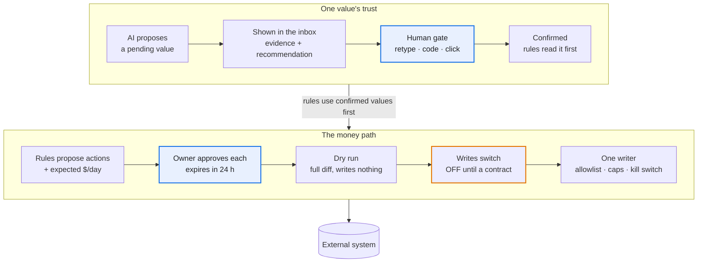

Anyone may lower a value's trust again; only a human raises it.

Approve is the last human act before money moves. There is no second confirm at execute: it would only train rubber-stamping. Say plainly that the gate guards against accidents; the login is the real security boundary.

---

## Data layers and their guards

The first bugs in the source project were silent data loss with green tests, so every layer gets its guard test on day one.

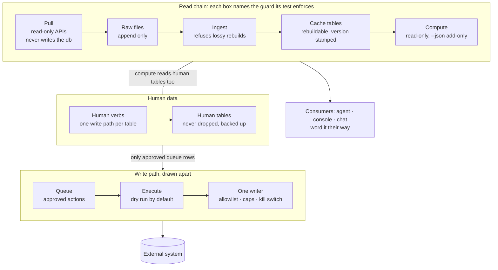

Cache tables can always be rebuilt from raw; human tables never can, so they are kept apart, backed up before each ingest and written by one verb each.

---

## Stage 0 and the ten stages, one line each

Each stage ends at a gate someone signs; the lesson column is what the source project paid for learning it late.

| # | Stage | Produces | Gate (who signs) | Lesson |
| --- | --- | --- | --- | --- |
| 0 | Client meetings | Transcripts organized into goals, words, draft stories, quoted numbers, open questions | Owner accepts at most 10 items per meeting | Costs and lead times started as agent estimates and had to be re-asked; there was no meeting record to check them against |
| 1 | Words and rights | Registry index, a glossary in the client's own words, three decision lanes | Lint passes; one name per idea (owner) | The index came on day 4, after 8 files; catching up cost a 213-row review. The client's word for a core concept replaced the engineers' word only after a test enforced it |
| 2 | Stories | I want / so that / acceptance items / human step, plus a runnable proof per item | Owner accepts at most 10 rows at a time | Two branches reused the same story ids and one story was lost; proofs written as prose never ran |
| 3 | Rules and tests | An agent instructions file of invariants only; a test runner that fails without its RESULT line | Every rule names its test (CI) | Test files that never ran counted as passes until the RESULT gate |
| 4 | Read-only data | pull → raw that only grows → ingest → database; a required data root, no defaults | Rows in = rows out; ingest twice = same rows (CI) | 3,072 rows were stored as 329 with green tests; raw was once overwritten while the source API kept only 65–95 days |
| 5 | Human data | Human tables apart from the cache; pending vs confirmed with a source tag; backups, triggers | Human tables survive every rebuild (CI); owner signs which keys exist | Client facts were wiped once; a pending value outranked a confirmed one |
| 6 | Registries and contract | Thresholds stored once; rules name thresholds; message codes; one `--json` contract with `meta` and one error document | Contract test both ways (CI); owner approves each rule and number | Message codes let any agent word results in the client's language |
| 7 | Reports | One read-only report per story | The story's proof runs green on the client host after install | Reports took ~15 hours; their proofs stayed prose until they became story checks |
| 8 | Gate and money | One confirm function behind terminal, chat code and inbox; approve → dry run → switch → one writer | Replay and swap tests; no bypass flag (owner approves each action) | The write path was ready on day 2 and still off on day 7: no client agreement yet |
| 9 | Release | `git archive` of a tag, internal files excluded; host install with backups and a checklist | CI green; owner types "confirm vX"; host report | 21 tags in five days; two parallel release sessions left main untagged: one release owner at a time |
| 10 | Operate and learn | Scheduled pulls with freshness checks, alerts, triaged issues, an owner queue of at most 10 asks | Risky merges wait for the owner; refactors pass a golden diff | "Closed" is not "on main"; a squash forked the history once |

---

## Human-in-the-loop rules

The owner decides less, but every decision is real.

1. **Decision rights live in the repo**, enforced by protected paths, not by an agent's memory.
2. **Trust lives in the data.** Values are pending or confirmed with a source; anyone may lower trust, only a human raises it; every rule reads confirmed first.
3. **Each story names its human step** (none / confirm / approve). Anything that can spend money is never "none".
4. **One gate for every channel**, bound to exactly what was shown, single use, logged, no bypass flag.
5. **Approve is the last human act before money moves.** A second confirm at execute only trains rubber-stamping.
6. **Business "not yet" beats technically ready.** Client writes and paid calls stay off until the owner says so in writing, with a cap.
7. **Budget the owner's attention:** at most 10 asks, each with evidence, a recommendation and what "no" means. Inputs are picked from a list; the one thing typed is a value the harness validates.
8. **Agree in advance which channel counts.** Widening what may be written counts only when typed in chat, not clicked on a page.
9. **Remote agents never act for the owner.** They install only on the owner's own "confirm vX" and end with a checklist report.
10. *Not yet proven:* **measure whether the gate is real.** Track how often the owner overrides each kind of ask; no override rate is computed yet. An eval counts only if it fails when its rule is removed: cut once, 5 of 9 failed as they should, and the other 4 stay only as regression guards.

---

## The owner console: where the asks go

Rule 7 needs a place to live. [`console/`](console/) is that place: the agent posts asks, the owner answers on one page, the answers come back as JSON.

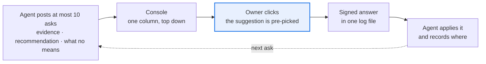

- One append-only file is the whole store; the agent side and the human side meet only there. Stdlib-only Python, no database, no chat app.
- An ask missing evidence, what "no" means or a recommendation (a typed value may go without one) is refused, and an eleventh open ask too.
- Every answer records whether the owner took the suggestion: the override log proposed under "The hardest open problem", for free.
- A click can pass through a harness's own gate, so the proof stays where the rules live. It never widens what may be written: an ask that would widen an allowlist, a cap or a write switch is answered in chat (rule 8), not clicked. The agent's side is [`console/AGENT.md`](console/AGENT.md).
- No login of its own: by default whoever can reach the port answers as one named user, so it binds to loopback and refuses the network unless a login proxy names the user. macOS or Linux only.
- Team review: behind the proxy, `--deciders` names who answers. The others who were in the meeting see every answer and say whether they agree, with a reason to disagree; a disagreement reaches the owner as a Reopen offer or a new ask, never as a changed answer. `ask.py digest` is the decision record to forward.

---

## Day-one checklist

Install these before the first feature; each costs an hour now and saved days in the source project.

- [ ] Meeting intake: consent, recording, transcript in the client's data folder, the organizer prompt ([template](templates/meeting-intake.md))
- [ ] A test runner that fails any test file without its RESULT line; every rule in the agent instructions names its test ([template](templates/AGENT_INSTRUCTIONS.md))
- [ ] An empty registry index with its lint test; ids are never reused; owner files linted for engineering words ([template](templates/ssot/))
- [ ] A CI check that every MR title names its story or policy ([template](templates/ci/story-id.yml)), plus a few guarantee stories for refactors to name
- [ ] A story-check registry and a read-only runner: pass, fail, or skip when the data is missing ([template](templates/ssot/story_checks.tsv))
- [ ] "Declare it or refuse": a required data root, one init command to declare scope, a doctor, no defaults
- [ ] Raw that only grows, fixtures copied from real API responses, tests for ingesting twice and for row counts
- [ ] Human tables apart from the cache: triggers, a backup before rebuilds, refusal of lossy rebuilds, a version stamp
- [ ] The `--json` contract from the first report: `meta`, one error document, message codes on every verb, tested both ways ([template](templates/ssot/message_codes.tsv))
- [ ] Typed keys: every key a human or agent can set has a unit, bounds or a domain; a fact always needs a human confirm, a decision key says whether it does ([facts](templates/ssot/fact_keys.tsv), [decisions](templates/ssot/decision_keys.tsv))
- [ ] Boundary and layering tests before the first adapter or console exists; the console's UI rules as an owner file with its lint ([template](templates/console/ui_rules.tsv))
- [ ] A golden-diff tool committed before the first refactor: every `--json` read and every page, BASE vs HEAD ([spec](templates/AGENT_INSTRUCTIONS.md#golden-diff))
- [ ] The owner's inbox before the first ask: one log, at most 10 open asks, answers signed ([`console/`](console/))
- [ ] Writes and paid calls off: dry run, allowlist, kill switch, no retries, caps
- [ ] Protected paths for the risky list ([template](templates/CODEOWNERS)) and one release owner
- [ ] Git rules: never squash; one "Fixes #N" per line; every commit names its story; the CI home chosen on day 1
- [ ] Releases are a `git archive` of the tag with an archive test; install messages written from the version the host runs ([install checklist](templates/install-checklist.md))
- [ ] Before the first hosted client: decide where the logic and the keys live

---

## Stories that prove themselves

The owner can't read code, so "approved" and "done" must rest on checks a machine already ran.

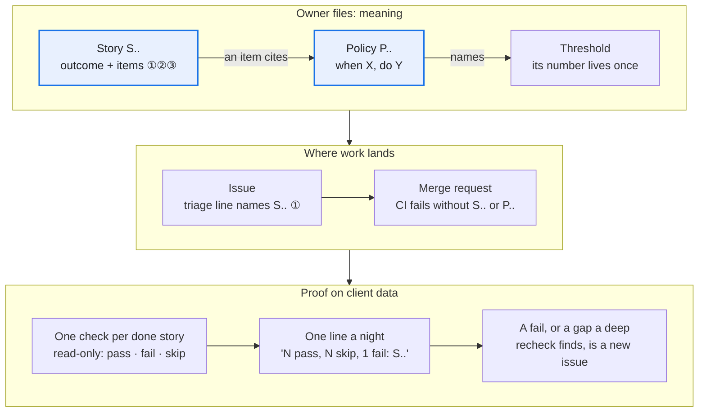

1. **Stories and rules are separate owner files** ([how](templates/ssot/README.md#stories-and-policies)). *Paid for:* an audit found four rules the code applied that nobody had approved; the owner approved them one by one.
2. **Acceptance items are numbered invariants a machine can check:** children sum to the parent, missing input means "unknown", a zero row never disappears. Issues and MRs cite the item (S.. ①). Such items let a read-only agent find a headline ratio dividing 30 days of spend by 23 days of sales.
3. **The story id is enforced in CI, not in instructions** ([template](templates/ci/story-id.yml)). *Paid for:* 17 of the first 105 MRs named no story, 15 of them refactors; after a 15-line CI job on the title, none of the next 77. Give refactors a guarantee story to name.
4. **One read-only check per done story; missing data skips, never passes** ([template](templates/ssot/story_checks.tsv)). *Paid for:* a "nothing sent without approval" check first passed on a client that had never sent anything. *Built* (its own story still awaits the owner); the nightly run on the host is not yet seen.
5. *Seen once:* **nightly checks prove presence; deep rechecks prove behaviour.** Read-only agents walked the stories item by item on a sandbox copy: 8 pass, 21 partial, 9 blocked of 38 judged. The worst: a code shown for items A and B approved A and C, unit tests green. No nightly row checks that binding.
6. *Seen once:* **audit the map both ways, then test its links.** Story → code and code → story found 17 unstoried features, 9 stale stories and 4 rules only the code knew, each put to the owner. Later, 4 of 5 partial stories named a closed blocker.

---

## Registries: one place per value

A value lives in one registry row with one reader, so every agent, page and check gets the same answer, in the client's language.

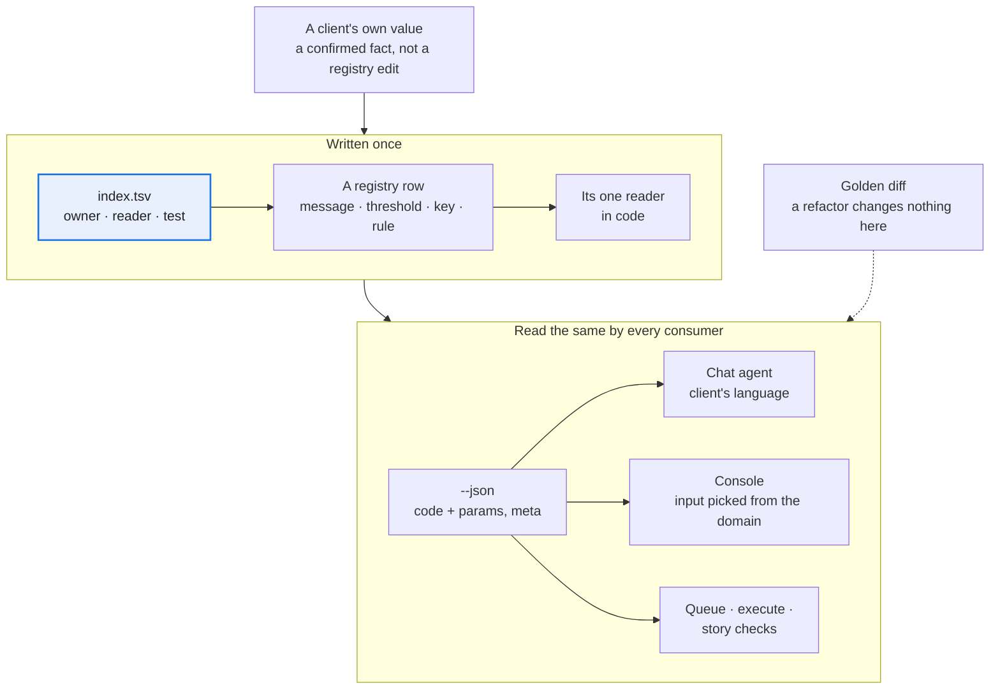

1. **Code every message and close the registry both ways, on every verb** ([how](templates/ssot/README.md#message-codes)). *Paid for:* the gate and write verbs sat outside the test, so their refusals reached the owner's page as "unclassified" until about 40 were coded.
2. **A threshold enters only with a reader and is renamed only through a map** ([how](templates/ssot/README.md#thresholds)). *Paid for:* one owner audit merged 4 duplicates, dropped 3 that nothing read and renamed 3; no client folder needed a migration.
3. **Type every key a human or agent can set** ([how](templates/ssot/README.md#facts-and-decisions)). *Paid for:* a percentage typed as 15, .15 or 150 silently changed every margin. Bounds now refuse 150 on a 0–100 percentage and 80 on a 0–1 ratio; 15 and .15 both still pass, so state the unit where it is typed.
4. **`meta` is the truth label, scoped to exactly what the report covers:** window asked vs found, missing days per source, stale sources, what-if values in effect. Queue and execute read it to refuse.
5. **Preview with a what-if flag, not a UI field.** A proposed threshold runs through any report, stored nowhere and echoed in `meta`; the queue refuses a what-if snapshot, and the console's "what confirming changes" comes from it alone.
6. **Alert rules are rows, and each new rule still needs code** ([how](templates/ssot/README.md#alert-rules)). *Paid for:* the registry grew from 5 to 12 rules in six days, each with code for its grain, metric or comparison; the row is what makes a rule visible, named and tunable.

---

## The client console is where clients answer

Humans answer in two places: the [owner console](#the-owner-console-where-the-asks-go), where the builder-owner answers the agent about the harness itself, and the client console, tested in the harness repo, which collects the values and approvals the harness's rules read.

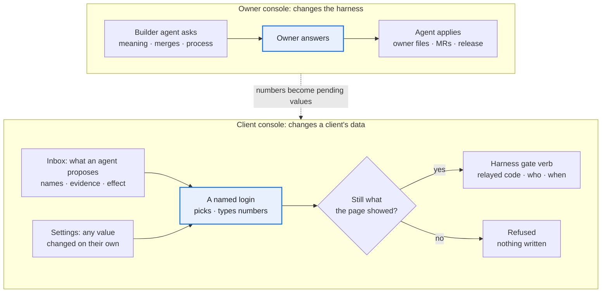

1. **The console has no write path of its own.** From a click it runs only the harness's gate verbs, relaying the one-time code with the logged-in name, and only while the subject still matches what the page showed. It never opens the database; a test checks the boundary both ways.
2. **Put names, evidence and the effect on the row:** money rounded, old → new with a coded reason, who proposed a value apart from whether it is confirmed. *Paid for:* dozens of pending actions showed as id triples and 16-decimal floats, so approving would have been blind; money is now rounded, names are still open.
3. **Pick from closed sets; type only numbers.** Inputs come from the registry's domain column; a typed number is validated like any write and is what the code binds. Mechanical items confirm in one click; a product group's stage goes one at a time, and the server refuses a batch of stages, typed values or thresholds.
4. **One render path, one dictionary, and the UI rules linted on every page** ([owner file](templates/console/ui_rules.tsv)). The browser writes no words, so the lint and the golden diff reach them all. *Paid for:* pages drawn three ways in two days, and a template-only lint let a raw command-line refusal onto a banner.
5. **Read top down; test at phone width on real data.** One column, what waits first, list then detail, no grids of cards holding tables. *Paid for:* one invented client run through the real chain found five console bugs the fixture tests missed.
6. **Two doors to one gate: the inbox for what an agent proposes, settings for what a human changes unasked.** *Paid for:* the owner could not find where to enter a value, so every count of waiting items now links to its inbox section; later the owner asked for an edit place in settings. The gate already took a human's own value with nothing pending, so that was a page, not a new write path.

---

## When agents file the issues

Most issues came from agents: those operating the harness, the client's own agent, demo runs and golden diffs. Most MRs merged on green CI; the owner's time went to meaning changes and risky merges.

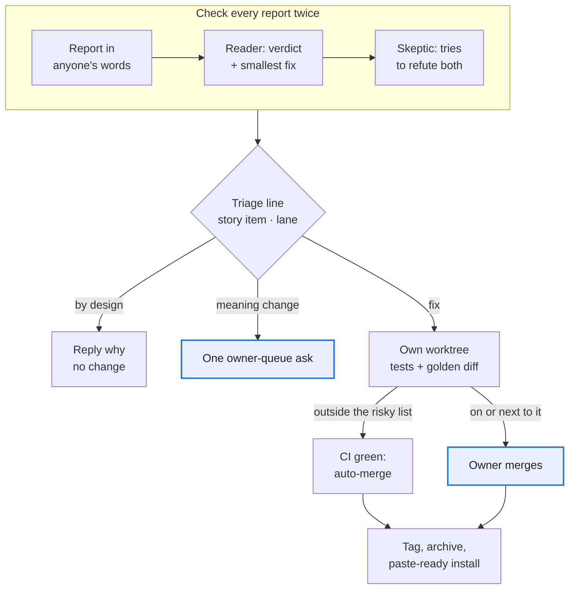

1. **The triager, not the reporter, writes the first line:** the story item, the lane and how it was found ([checklist](templates/triage-checklist.md)). Ship what changes no meaning now; queue the rule change as one question.
2. *Seen once:* **check every outside report twice: a reader, then a skeptic** ([prompts](templates/verify-challenge.md)). Of the client's agent's 6 points, 2 were by design; the skeptic corrected 2 verdicts, and probing plus the golden diff found 3 more bugs. All 7 fixes merged the same day, one by the owner because it sat next to the gate relay.
3. **A batch that breaks the invariants is one owner decision, not N fixes.** *Paid for:* an outside team proposed a parallel app with its own config and data files in 20 issues, several writing values back around the gate. The owner closed all 20 as superseded: confirm-from-the-page already existed, built with one additive harness change.
4. **Auto-merge on green CI, except the risky list** ([protected paths](templates/CODEOWNERS)). On the forge's free tier nothing blocks the merge: the agent reads the list before setting auto-merge. A refactor that moves risky code adds the new file to the list in the same MR; this was missed once.
5. **Refactors pass a committed golden diff** ([spec](templates/AGENT_INSTRUCTIONS.md#golden-diff)). *Paid for:* the first golden scripts lived in a session's scratch space and vanished with it; on real data the committed tool caught a report that differed in 45 places between two runs of the same code.
6. **Nothing a later session needs lives only in a session** ([rules](templates/AGENT_INSTRUCTIONS.md#what-lives-here)). *Paid for:* a scratch directory was wiped once, and the queue page's database still held all 213 review rows; one session left 108 worktrees.

---

## Hosting: the agent that runs it can read it

A hosting platform runs the harness under a remote agent that clients chat with. The adapter and per-client boundaries held; keeping logic and keys away from that agent must be decided per host, before the first hosted client.

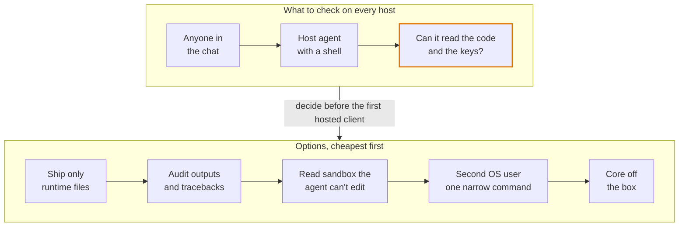

1. **The core never names its host.** All host glue lives in one adapter folder; delete it and the harness still runs, and CI smoke-tests each supported platform version. *Paid for:* applying one review by the platform's team added about 850 lines: declared config defaults were never applied, and the linked command was not on the agent's PATH.
2. **One client = one data folder = one host agent.** No fallback to the working directory; on a host, turn off any user-wide env file, and let the doctor name each value's source. *Paid for:* agent shells reset the working directory, scattering credentials, database and raw files. The platform put every chat channel into one agent session, so a second client needs a second host.
3. **Check what the agent a client chats with can read, and what the host can write.** On the first host we checked, the agent ran as the harness folder's OS user with no deny rules, so it could read the code and the secrets file. Behaviour rules and settings the agent can edit are no barrier. Ask again on every new or replaced host agent ([checklist](templates/install-checklist.md#new-host-or-a-replaced-host-agent-what-can-it-reach)), and pick a barrier above before the first hosted client.
4. **Scheduled tasks are closed prompts; long jobs run detached** ([checklist](templates/install-checklist.md#scheduled-tasks-and-long-jobs)). *Paid for:* a laptop cron job failed silently, then its replacement exited 1 every hour and nobody saw it; a 30-day pull took close to an hour against a tool-call limit of about 10 minutes.
5. *Seen once:* **the console sits behind a proxy login that strips, then sets, the user header,** trusted only from loopback. After each restart: local 200, public 401, public with a forged header 401. *Paid for:* the platform's route declaration would have published the confirm inbox with no login.
6. *Seen once:* **client data moves by snapshot, and a push queue has one reader.** Stop the old consumer, then take a checksummed snapshot with row counts: confirmed values and approvals can't be pulled again. Two readers each get a random half, so a host swap has a deadline, the queue's retention.

---

## Reusing the harness for other channels

The first harness ran paid ads on one marketplace. For Google, Meta or TikTok ads, and for SEO, GEO (generative-engine optimization: being cited in AI answers) or KOL (key opinion leader: influencer) work, a few core modules copy as they are, the rest of the core is a pattern to port, and the channel pack is rebuilt from client meetings.

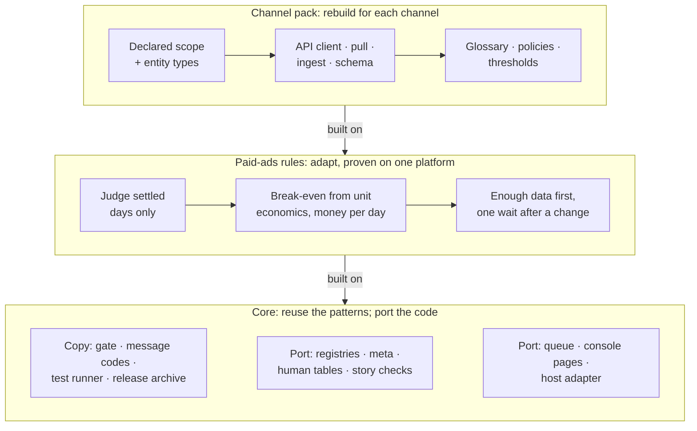

**Reuse:** copy as is · **Port:** keep the pattern, rewrite the code · **Adapt:** same rule, checked against the platform's own facts · **Rebuild:** new for the channel · **Unknown:** settle it in the first client meeting. *(untried)* marks a part the source project never ran.

| Part | Paid ads: Google · Meta · TikTok | SEO · GEO · KOL |
| --- | --- | --- |
| Gate, message codes, test runner, release archive | Reuse | Reuse |
| Registries, `--json` and `meta`, human tables, queue, story checks, console, host adapter | Port | Port |
| Process: stories and policies, owner queue, triage, golden diff, install flow | Reuse | Reuse |
| Meeting intake *(untried)* | Reuse | Reuse |
| Judge settled days only; a missing day makes a total "unknown" | Adapt | Unknown |
| Break-even from unit economics, ranked in money per day | Adapt | Unknown |
| Enough data before judging; one wait after any change | Adapt | Unknown |
| Guarded writer: allowlist, caps, kill switch | Adapt | Unknown |
| Sources ranked: platform and human data above third-party data and AI scores | Reuse | Unknown |
| Alerts: each entity's latest settled day against a multiple of its own prior 7-day mean | Adapt | Unknown |
| Channel pack: scope, entity types, API client, pull, ingest, glossary, policies, thresholds | Rebuild | Rebuild |

Proven here: the core and the process; the paid-ads rules on one marketplace platform with 7- and 14-day attribution windows; the writer tested and dry-run on real data, never used on a live account. Untried anywhere: the transfer itself, and goals other than sales (leads, app installs, awareness).

1. **Copy the channel-free modules; port the rest of the core.** The gate, message codes, test runner and release archive name no channel. The queue, `meta`, console pages and adapter prompts name markets, campaigns, keywords and product groups: expect to rewrite them with the pack. The scope word is `market` throughout, even in the gate's subject.
2. **Put every number an agent will be asked for in the harness.** *Paid for:* asked for the top actions by money per day, the host agent found no such number and invented its own formula; the formula moved into the harness so every agent returns the same number.
3. **Verify each platform's facts before trusting a number:**
   - the attribution window per ad type
   - whether past days are restated: pull the same day twice, days apart
   - the time zone of its day, report latency and how far back it reaches
   - whether change history names who made each change
   - whether the read credential can also write
   - rate limits

   *Paid for:* the settled boundary drifted with the operator's time zone until pull times were stamped in UTC, and the read token turned out to be able to write.
4. **Key freshness, windows and resume state by the full scope.** *Paid for:* three bugs let a fresh market hide a stale one; one would have let a stale market past the write path's freshness guard. One client on several channels would be the same multi-scope case (untested).
5. **For SEO, GEO and KOL, only the core and the process are known to carry over.** The first meeting settles what one result is worth and costs, which source counts as truth, and what the agent may change, publish or send; each answer is a [fact key](templates/ssot/fact_keys.tsv), and a test keeps the client's form in step with them. *Paid for:* nothing ran before the scope was declared, and until unit cost and a monthly cap existed every profit verdict rested on an assumed break-even, marked as such.

---

## Templates

| File | Stage | What it is |
| --- | --- | --- |
| [`templates/meeting-intake.md`](templates/meeting-intake.md) | 0 | The organizer prompt and its output shape |
| [`templates/decision-rights.md`](templates/decision-rights.md) | 1 | The three lanes and the risky list |
| [`templates/ssot/`](templates/ssot/) | 1–2, 5–7 | Registry index, glossary, user stories and policies (owner file + agent sibling), thresholds, message codes, fact and decision keys, alert rules, story checks |
| [`templates/ci/story-id.yml`](templates/ci/story-id.yml) | 2, 10 | CI job: every MR title names its story or policy |
| [`templates/console/ui_rules.tsv`](templates/console/ui_rules.tsv) | 8 | UI rules as an owner file, each checked by name |
| [`templates/AGENT_INSTRUCTIONS.md`](templates/AGENT_INSTRUCTIONS.md) | 3 | Invariants-only instructions for the coding agent (a `CLAUDE.md`) |
| [`templates/CODEOWNERS`](templates/CODEOWNERS) | 1, 10 | Protected paths for the risky list |
| [`templates/owner-queue-item.md`](templates/owner-queue-item.md) | 10 | The shape of one owner ask |
| [`console/`](console/) | 10 | A module, not a template: the agent's ask CLI and the owner's one-page console |
| [`templates/triage-checklist.md`](templates/triage-checklist.md) | 10 | Judging an agent-filed issue; the triage line |
| [`templates/verify-challenge.md`](templates/verify-challenge.md) | 10 | Reader and skeptic prompts for an outside report |
| [`templates/install-checklist.md`](templates/install-checklist.md) | 9 | The install message, the host report, and what a host agent can read |
