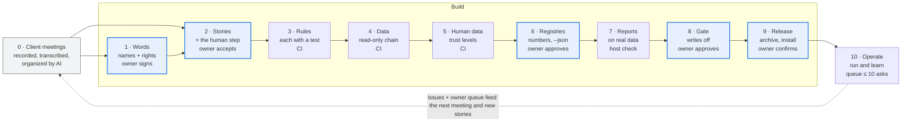
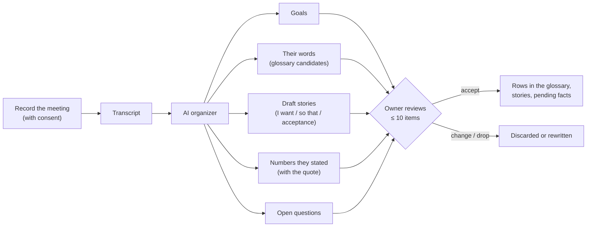
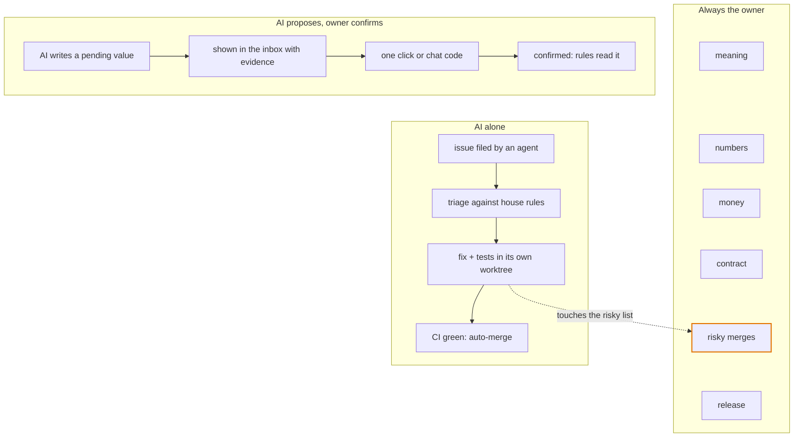
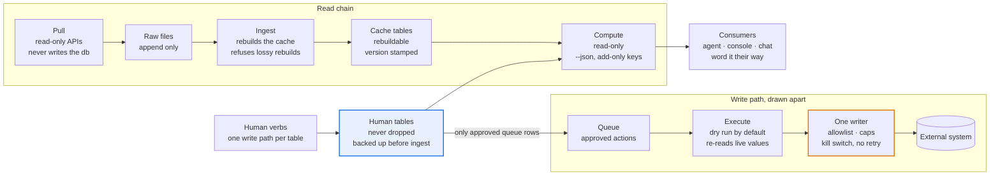
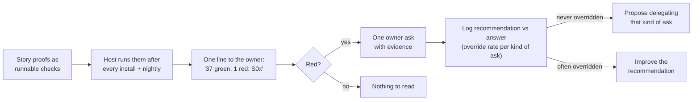

# Agent Harness Playbook

How to build an **agent harness** — a small, tested tool an AI agent operates for a business owner — from the first client meeting to a system running in production, with the human in the loop at the right places and nowhere else.

Distilled from a week-long build of an advertising harness (read-only data pulls, reports, a guarded write path, a web console and a remote host agent). Every lesson below is something that project paid for.

---

## The pipeline at a glance

A new harness starts from recorded client meetings and goes through ten stages. The owner signs only five gates: **meaning, stories, numbers, money, release**. Everything else is signed by a machine: CI tests, or a host check after install.

What runs in production feeds back as issues and at most ten owner asks, which shape the next meeting.

---

## Stage 0: client meetings are the first input

Every project starts from what the client actually said, not from what the agent imagines.

1. **Record and transcribe** each client meeting, with the client's consent. Recordings and transcripts stay in the client's own data folder, never in the code repository.
2. **The AI organizes the transcript into five buckets:** goals, the client's own words for things, draft user stories, numbers they stated (costs, lead times, budgets, limits), and open questions.
3. **Every item cites its source:** meeting date and the timestamp of the quote. A number with no quote is not written down.
4. **Numbers enter as pending values** with the meeting as their source; they drive nothing until a human confirms them.
5. **The owner reviews at most 10 items per meeting:** accept, change or drop. Accepted words and stories become rows in stages 1 and 2.
6. **Later meetings feed the same buckets.** A changed number or goal becomes a pending change with the old and new quotes side by side, never a silent overwrite.

The prompt and output shape for the organizer: [`templates/meeting-intake.md`](templates/meeting-intake.md).

---

## Who decides what

Write these three lanes into the repository on day one, not into an agent's memory.

**The risky list:** the human gate, the write path, contract removals or renames, owner files, threshold values and human-data tables. A fix that touches it waits for the owner's merge. Paid data calls and widening what may be written count only when the owner types them in chat. Template: [`templates/decision-rights.md`](templates/decision-rights.md).

---

## Trust lives in the data, not in the prompt

Every value carries its trust: **pending** (AI) or **confirmed** (a human). Only a human raises it, and the proof is bound to exactly what was shown.

```mermaid
flowchart LR
    P["AI proposes<br/>a pending value"] --> S["Shown in the inbox<br/>with evidence + a recommendation"]
    S --> H["Human gate<br/>retype · code · click"]:::owner
    H --> C["Confirmed<br/>rules read it first"]
    C -. "anyone may lower trust again" .-> P
    C --> R["Rules propose actions<br/>+ expected $/day"]
    R --> AP["Owner approves<br/>each action, expires in 24 h"]:::owner
    AP --> D["Dry run<br/>writes nothing, full diff"]
    D --> SW["Writes switch<br/>OFF until a contract"]:::off
    SW --> W["One writer<br/>allowlist · caps · kill switch"]
    W --> EXT[(External system)]
    classDef owner fill:#e8f0fe,stroke:#1a73e8,stroke-width:2px
    classDef off stroke:#e37400,stroke-width:2px
```

Approve is the last human act before money moves. There is no second confirm at execute: it would only train rubber-stamping. Say plainly that the gate guards against accidents; the login is the real security boundary.

---

## Data layers and their guards

The first bugs in the source project were silent data loss with green tests, so every layer gets its guard test on day one.

Cache tables can always be rebuilt from raw; human tables never can, so they are kept apart, backed up before each ingest and written by one verb each.

---

## Stage 0 and the ten stages, one line each

Each stage ends at a gate someone signs; the lesson column is what the source project paid for learning it late.

| # | Stage | Produces | Gate (who signs) | Lesson |
| --- | --- | --- | --- | --- |
| 0 | Client meetings | Transcripts organized into goals, words, draft stories, quoted numbers, open questions | Owner accepts at most 10 items per meeting | Costs and lead times started as agent estimates and had to be re-asked; there was no meeting record to check them against |
| 1 | Words and rights | Registry index, a glossary in the client's own words, three decision lanes | Lint passes; one name per idea (owner) | The index came on day 4, after 8 files; catching up cost a 213-row review. The client's word for a core concept replaced the engineers' word only after a test enforced it |
| 2 | Stories | I want / so that / acceptance items / human step, plus a runnable proof per item | Owner accepts at most 10 rows at a time | Two branches reused the same story ids and one story was lost; proofs written as prose never ran |
| 3 | Rules and tests | An agent instructions file of invariants only; a test runner that fails without its RESULT line | Every rule names its test (CI) | Test files that never ran counted as passes until the RESULT gate |
| 4 | Read-only data | pull → raw that only grows → ingest → database; a required data root, no defaults | Rows in = rows out; ingest twice = same rows (CI) | 3,072 rows were stored as 329 with green tests; raw was once overwritten while the source API kept only 65–95 days |
| 5 | Human data | Human tables apart from the cache; pending vs confirmed with a source tag; backups, triggers | Human tables survive every rebuild (CI); owner signs which keys exist | Client facts were wiped once; a pending value outranked a confirmed one |
| 6 | Registries and contract | Thresholds stored once; rules name thresholds; message codes; one `--json` contract with `meta` and one error document | Contract test both ways (CI); owner approves each rule and number | Message codes let any agent word results in the client's language |
| 7 | Reports | One read-only report per story | The story's proof runs green on the client host after install | Reports took ~15 hours; their proofs stayed prose |
| 8 | Gate and money | One confirm function behind terminal, chat code and inbox; approve → dry run → switch → one writer | Replay and swap tests; no bypass flag (owner approves each action) | The write path was ready on day 2 and still off on day 7: no client agreement yet |
| 9 | Release | `git archive` of a tag, internal files excluded; host install with backups and a checklist | CI green; owner types "confirm vX"; host report | 19 tags in 4 days; two parallel release sessions left main untagged: one release owner at a time |
| 10 | Operate and learn | Scheduled pulls with freshness checks, alerts, triaged issues, an owner queue of at most 10 asks | Risky merges wait for the owner; refactors pass a golden diff | "Closed" is not "on main"; a squash forked the history once |

---

## Human-in-the-loop rules

The owner decides less, but every decision is real.

1. **Decision rights live in the repo**, enforced by protected paths, not by an agent's memory.
2. **Trust lives in the data.** Values are pending or confirmed with a source; anyone may lower trust, only a human raises it; every rule reads confirmed first.
3. **Each story names its human step** (none / confirm / approve). Anything that can spend money is never "none".
4. **One gate for every channel**, bound to exactly what was shown, single use, logged, no bypass flag.
5. **Approve is the last human act before money moves.** A second confirm at execute only trains rubber-stamping.
6. **Business "not yet" beats technically ready.** Client writes and paid calls stay off until the owner says so in writing, with a cap.
7. **Budget the owner's attention:** at most 10 asks, each with evidence, a recommendation and what "no" means. Inputs are picked from a list, never typed.
8. **Agree in advance which channel counts.** Widening what may be written counts only when typed in chat, not clicked on a page.
9. **Remote agents never act for the owner.** They install only on the owner's own "confirm vX" and end with a checklist report.
10. **Measure whether the gate is real.** Track how often the owner overrides each kind of ask; an eval counts only if it fails when its rule is removed.

---

## Day-one checklist

Install these before the first feature; each costs an hour now and saved days in the source project.

- [ ] Meeting intake: consent, recording, transcript in the client's data folder, the organizer prompt ([template](templates/meeting-intake.md))
- [ ] A test runner that fails any test file without its RESULT line; every rule in the agent instructions names its test ([template](templates/AGENT_INSTRUCTIONS.md))
- [ ] An empty registry index with its lint test; ids are never reused ([template](templates/ssot/))
- [ ] "Declare it or refuse": a required data root, one init command to declare scope, a doctor, no defaults
- [ ] Raw that only grows, fixtures copied from real API responses, tests for ingesting twice and for row counts
- [ ] Human tables apart from the cache: triggers, a backup before rebuilds, refusal of lossy rebuilds, a version stamp
- [ ] The `--json` contract from the first report: `meta`, one error document, message codes, tested both ways
- [ ] Boundary and layering tests before the first adapter or console exists
- [ ] Writes and paid calls off: dry run, allowlist, kill switch, no retries, caps
- [ ] Git rules: never squash, one "Fixes #N" per line, every commit names its story, protected paths for the risky list ([template](templates/CODEOWNERS)), one release owner, the CI home chosen on day 1
- [ ] Releases are a `git archive` of the tag with an archive test; every story proof is a runnable check ([install checklist](templates/install-checklist.md))

---

## The hardest open problem: keeping "yes" and "done" real

The owner usually can't read code, so as agents get more autonomy, "approved" and "done" can quietly become rubber stamps. In the source project: story proofs were prose nobody ran, 4 of 9 agent evals passed even with their rule removed, the risky-merge list lived in agent memory, and a 127-row review could not be judged.

Proposed answer — an **evidence ledger** the owner reads as one line a day:

1. **Stories prove themselves on real data.** Each proof becomes a runnable check; the host runs all of them after every install and every night. A story is done only while its check is green.
2. **Autonomy is structural.** The risky list becomes protected paths; each widening of autonomy is one owner sentence plus a machine proof, recorded in the repo.
3. **Every ask is audited.** Log the recommendation next to the owner's answer. A kind of ask the owner never overrides is proposed for delegation; one the owner often overrides gets a better recommendation. Each week, show at most 3 items the agent was least sure about.
4. **Agent rules are proven by mutation.** An eval counts only if it fails when its rule is removed; every release records its eval result.

This turns human-in-the-loop from reading more into signing less, each item backed by evidence a machine already checked.

---

## Templates

| File | Stage | What it is |
| --- | --- | --- |
| [`templates/meeting-intake.md`](templates/meeting-intake.md) | 0 | The organizer prompt and its output shape |
| [`templates/decision-rights.md`](templates/decision-rights.md) | 1 | The three lanes and the risky list |
| [`templates/ssot/`](templates/ssot/) | 1–2, 6 | Registry index, glossary, user stories (owner file + agent sibling), thresholds |
| [`templates/AGENT_INSTRUCTIONS.md`](templates/AGENT_INSTRUCTIONS.md) | 3 | Invariants-only instructions for the coding agent (a `CLAUDE.md`) |
| [`templates/CODEOWNERS`](templates/CODEOWNERS) | 1, 10 | Protected paths for the risky list |
| [`templates/owner-queue-item.md`](templates/owner-queue-item.md) | 10 | The shape of one owner ask |
| [`templates/install-checklist.md`](templates/install-checklist.md) | 9 | What the host agent reports after every install |
