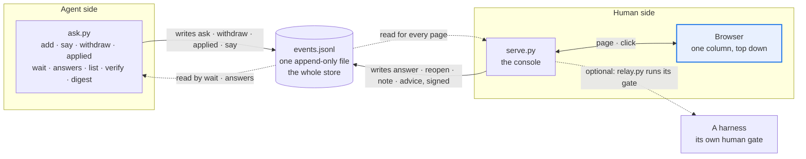
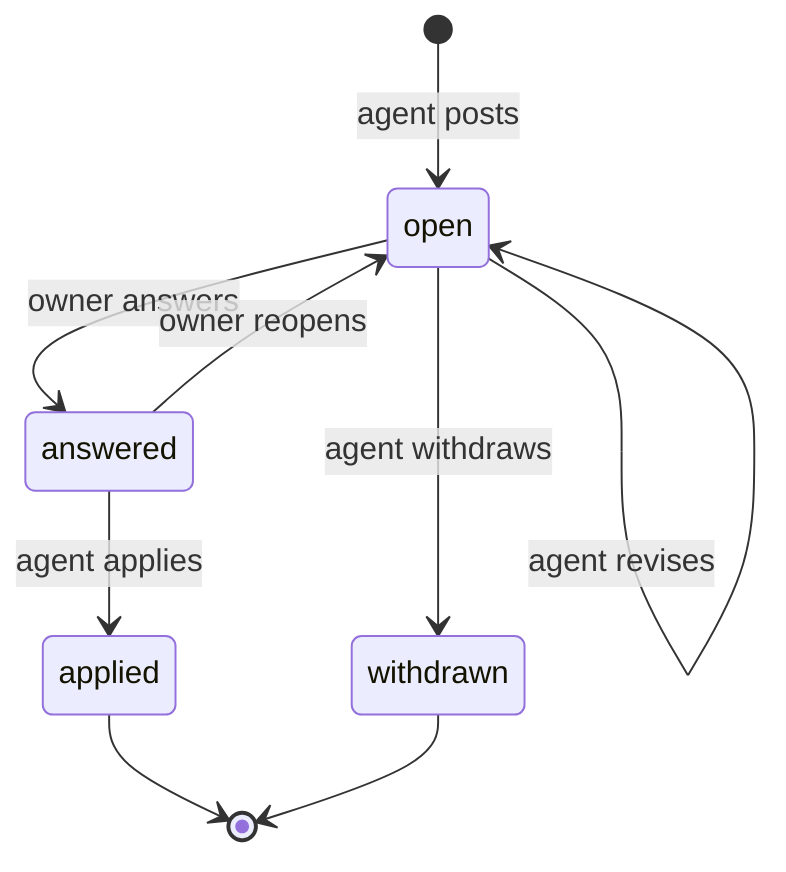
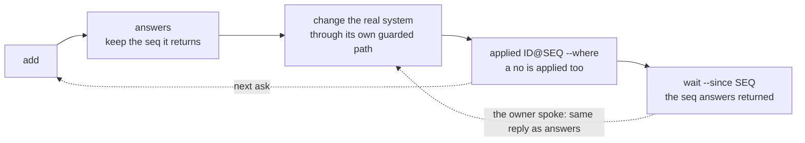
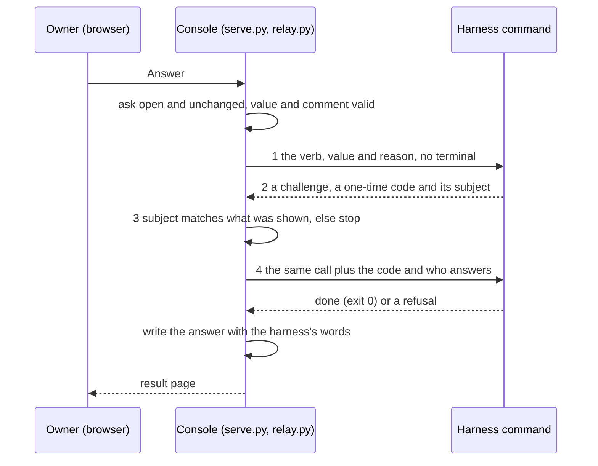

# Owner console

The place where an agent and a business owner talk: the agent posts **asks**, the owner answers by clicking on one page that reads top down, and the answers come back as JSON. One append-only file is the whole store. Stdlib-only Python 3.11+ on macOS or Linux (POSIX only: file locks, process sessions), no database, no build step.



Each side has no code path to the other's events. They meet only in the log.

## One ask, start to finish



- An answer is bound to the ask as it was shown. To revise an open ask, post the same id again: a page still showing the old one is refused (`changed`), never answered wrongly.
- The owner can reopen until the agent records `applied`, and not once a harness's gate has written the answer (`already_applied`: that is a new question). Each row of `answers` carries `apply` (`ID@SEQ`); `applied ID@SEQ` is refused (`changed`) if the owner answered again since the agent read it.
- An id is never reused: once an ask is answered or withdrawn, `add` refuses it (`id_used`). A "no" is an answer too, and is recorded with `applied`. In JSON an applied ask is `status: answered` with `applied` set.

## A clear ask

`add` refuses an ask that is not clear, and lists every problem at once. It checks that each part is there, not that it is true. At most 10 are open; an eleventh is refused (`--max-open N` can only lower that limit).

| Field | What goes in it | Limit | Why the playbook wants it |
| --- | --- | --- | --- |
| `id` | A short, stable name for the question | 64, `a-z 0-9 . _ -` | One question stays one row; an id is never reused |
| `title` | The question on one line, in the owner's words | 120 | It has to read as a list row |
| `why` | Why it is asked now, in plain facts | 400 | The owner cannot judge without the context |
| `evidence` | Facts, quotes or a table; give each a `source` (not checked; a table names it in its caption) | 1 to 12 items | A number with no source is not written down |
| `recommend` | `value` (your answer) and `because`; optional only for `provide` | 200 for `because` | The owner reviews a proposal, not a blank; the log keeps whether they took it |
| `if_no` | What "no" would change | 200 | A yes is only real if a no is a safe answer |
| by `step` | `choose`: `options` (2 to 8). `approve`: `effect`. `provide`: `input` (type, range, unit) | option label 60, `effect` 200 | Inputs are picked from a list; typing is the exception |

`step` is `confirm`, `approve`, `choose` or `provide`. `kind`, `group` and `gate` are optional. All fields, limits and one example per step: `uv run console/ask.py schema` (needs no folder); the examples live in [`examples/`](examples/).

## Quick start

Once per shell, name the folder of the log (nothing guesses it): `export CONSOLE_DIR=$HOME/console-data`. Paths below are from the repository root.

Post an ask (fictional shop, four samples in `examples/`):

```bash
uv run console/ask.py add console/examples/choose-priority.json
```

Start the console. It prints `Console: http://127.0.0.1:8770/`, the address to give the owner (`--port N` if 8770 is taken):

```bash
uv run console/serve.py --title "Northwind Tea Co."
```

Look for answers, then wait, with the `seq` that `answers` returned (here 1: nothing is answered yet):

```bash
uv run console/ask.py answers
uv run console/ask.py wait --since 1
```

The owner opens the address and clicks; `wait` returns (shortened; every ok reply also names the `dir` it used):

```json
{"ok": true, "seq": 2, "open": 0, "timed_out": false, "dir": "/data/console-data",
 "answers": [{"id": "priority-spring-push", "apply": "priority-spring-push@2",
              "value": "chai", "comment": "", "suggested": true, "revised": false,
              "gate": null, "verified": true, "applied": null}],
 "reopened": [], "notes": [], "notes_truncated": false}
```

Make the change in the real system, then record it with the answer's `apply` as it is:

```bash
uv run console/ask.py applied priority-spring-push@2 --where "spring plan, page 2"
```

The loop the agent runs (the file to give it: [`AGENT.md`](AGENT.md)):



## Gate: connect a harness

An ask may carry a `gate`, so that a click also passes through the harness's **own** human gate (a one-time code bound to exactly what will be written). The console plays the human's side of it; the harness needs no change to its gate, only to speak this:



What a harness must meet:

1. Called as `<cmd> <verb…> [--value=V] --reason=R --json`, stdin closed, in a session of its own with no terminal: a gate that reads `/dev/tty` can be satisfied only by a person at the operator's terminal, never by a click. It prints one JSON document.
2. Without `--code` it answers `{"code": "confirm_code_required", "params": {"confirm_code": "…"}, "subject": {…}}`; `subject` is what the code is bound to.
3. With `--code=C --relay-user=web:NAME --relay-at=ISO-TIME` added it accepts the code once, only for that subject, and writes; exit 0 means done, a non-zero exit with `error` or `message` in its document a refusal.
4. Every value the console adds is one `--name=value` argument, so a value or code starting with `-` is never read as a flag.
5. Its words come back in `message`, `error` or `result` (a string); the owner sees one clean line of at most 300 characters.
6. A reply that is not a challenge ends the exchange at step 1 (exit 0 = fine, e.g. already confirmed).
7. Each call gets 60 seconds, then the harness and its children are killed. After a timeout (`gate_timeout`), or a step-4 call that ends with no document carrying `error` or `message` (a crash, garbage, silence: `gate_unsure`), **the harness may have written**: the console records nothing, the ask stays open, and the owner is told to ask the agent to check first.

The ask names the verb and the payload; the operator names the command:

```json
"gate": {"verb": ["facts", "confirm", "unit_cost"], "value_arg": true,
         "expect": {"items": {"unit_cost": "$value"}}}
```

`expect` is what the owner is told will be written (`$value` = their answer). The console sends the code only if the harness's `subject` matches what `expect` names exactly: every key and value, a nested object key for key, so an extra item is refused. Only the top level of `subject` may say more (its envelope: verb, market, version). `expect` holds no empty `{}` or `[]`. `value_arg` adds `--value=<answer>`; a `choose` or `provide` gate must set it and put `"$value"` in `expect`, so the answer is what the code is bound to. A "no" never goes through the gate.

```bash
uv run console/serve.py --relay-cmd "uv run my_harness.py" --relay-verbs "facts confirm,queue approve"
```

| Flag | Meaning |
| --- | --- |
| `--relay-cmd` | The harness command. It is the operator's; an ask file cannot change it |
| `--relay-verbs` | Comma-separated verb prefixes that may run; anything else is refused. Both flags, or neither |
| `--default-reason` | The `--reason` when the owner wrote no comment (default `console`) |

An ask whose gate verb is not allowed, or any gated ask when there is no relay, draws no form: it tells the owner to confirm another way, before a click can fail. Such an ask also keeps its group from having an **Answer all as suggested** button, and that button is never drawn for a group holding an `approve` ask: approving is read one ask at a time.

## Safety

| What is checked | Test |
| --- | --- |
| Only the human side writes answer, reopen, note, advice; only the agent side writes the rest | `test_boundary.py`, `test_core.py` |
| With `--deciders`, an adviser gets no form that answers, reopens or notes, and such a POST is refused (403); a view is signed, bound to the ask or answer as shown, and a disagreement needs its reason | `test_serve.py`, `test_pages.py`, `test_core.py` |
| Every human event is signed; `verify` finds an edited or unsigned one, and is refused where there is no secret | `test_core.py`, `test_ask_cli.py` |
| An answer is bound to the ask as shown; a stale page gets `changed`, and `applied ID@SEQ` refuses an answer the agent never read | `test_core.py`, `test_serve.py`, `test_ask_cli.py` |
| Binds to loopback; any other `--host` needs `--user-header`; a Host that is not ours is refused (421) | `test_serve.py` |
| Every POST: the page token (from the folder's secret, so a page open across a restart still answers, and rotating the secret ends every open page), `Origin` equal to the request's `Host`, at most 64 KB, a plain form | `test_serve.py` |
| A saved note, reopen or view answers 303, so a reload cannot write twice; one click per ask at a time | `test_serve.py` |
| No inline script or style; CSP, no-store, no framing; static files by exact name | `test_serve.py`, `test_pages.py` |
| Everything the agent wrote is shown as text; only http(s) links | `test_pages.py` |
| The harness call: no shell, no terminal, allowed verbs only, `=` arguments, code sent only for a subject that matches what was shown, never logged, console secret withheld, killed with its children on a timeout | `test_relay.py`, `test_serve.py` |
| The log keeps every line: each write is flushed to disk, a torn write is cut off, a corrupt line refuses, writers queue on a lock | `test_core.py` |
| Core and pages import no network or process code; only `relay.py` starts a process | `test_boundary.py` |
| These docs name only real files, flags, verbs and diagrams; the quick start prints what is shown here; nothing that must not be public is in the files a commit would publish | `test_docs.py` |

**What the gate is and is not.** The signature and the gate are an **accident guard**: an agent that edits the log or runs the wrong verb cannot pass for the owner. They are not a wall. **By default there is no login: anyone who can reach the port answers as `--user`**, an agent on the same machine included, by opening the page and posting a form like a browser; that is why it binds to loopback. An agent that can read the folder's `secret` file can also sign. **The login is the boundary.** For more: put the console behind a login proxy (below), give only the console process `CONSOLE_SECRET` (16 or more characters; a shorter one is refused, and `serve.py` exits 2) so no `secret` file exists, and keep that and the port out of the agent's reach. The agent's `verified` then reads `null`, and the operator runs `ask.py verify` (refused, `no_secret`, where there is no secret to check with).

## Behind a login proxy

```bash
uv run console/serve.py --user-header X-Forwarded-User --allow-host console.example.com
```

- The proxy is the login. It sets the header itself (overwriting any copy from the browser) and passes the public `Host` through unchanged: `Origin` is compared with the `Host` the console sees, so a proxy that rewrites it gets every POST refused (403). A browser's `Origin: null` (a proxy adding `Referrer-Policy: no-referrer`) counts only with `Sec-Fetch-Site: same-origin`.
- The header is believed only from a loopback peer and only if it is a plain name; otherwise nobody is logged in: read-only, every POST refused. A `--host` that is not loopback is refused without `--user-header` (exit 2); `--user` and `--user-header` exclude each other.
- All links are relative, so it can sit under a path prefix (`/console/`, trailing slash; strip the prefix before forwarding). The language link (`?lang=zh`) is kept in a cookie named for the port, without a `Path`, so it stays under the prefix.
- `serve.py` prints its own loopback address; the owner opens the proxy's.
- **Team review.** The people who were in the meeting can see every answer and disagree without answering. `--deciders alice,bob` names who answers, reopens and writes notes; anyone else the proxy lets in is an **adviser**, who sees every ask and answer and, in place of each form, says Agree or Disagree (a reason is required to disagree, at most 400 characters). Without the flag everyone logged in answers, as before; with `--user` it must name that user.
- A view (`advice`) is a signed human event about the ask or the answer as the page showed it (`changed` otherwise). It never answers, reopens or counts toward the 10. The one who decides reads each view under its ask, the waiting page counts the disagreements, and an answer not yet applied that someone disagrees with opens in History with Reopen at its top.
- The agent gets every view in `advice[]` from `answers` and `wait`, and turns a disagreement into a new ask. `ask.py digest` renders the decision record a team lead forwards (each ask, its evidence and suggestion, the answer with who and when, the views, where it was applied): Markdown in `text`, or data with `--format json`.

## Tests

```bash
python3 console/tests/run.py          # every tests/test_*.py, 4 at a time
python3 console/tests/run.py serve    # only the files with "serve" in the name
```

A file passes only if it exits 0 and prints `RESULT: N passed`; a test file that never ran is a failure.

**Not covered by the tests: a real browser.** They fetch the pages and read the HTML; none runs `console.js` or draws the CSS. Before a release, `add` two examples with the same `group`, start the console and open it 375 px wide:

1. One column, no sideways scroll, the first ask open; dark mode and `?lang=zh` both read well.
2. `add` another ask: an untouched page reloads itself within 4 s and the tab title counts the open asks.
3. Type a comment, then `add` one more: a banner offers the reload and the text stays.
4. Double-click an answer button: one answer, a notice over the page, and the page stays where it was: the row is gone, and a comment typed in another row is still there.
5. Stop the console for 12 s: a bar says it cannot be reached. Start it: the bar goes and a page opened before still answers.
6. Change one of the two rows: **Answer all 2 as suggested** turns off and says why.

## What this deliberately is not

- **No domain pages.** The agent presents what is asked in its own words; a harness may keep its own pages beside this one.
- **No chat app.** Nothing here knows any messenger; the agent tells the owner in chat that asks wait.
- **No database.** One file you can read, back up and `grep`.
- **No accounts, no login of its own.** One named user per console, or the login proxy's header; `--deciders` only says which of them answer.
- **No widening.** A click confirms or approves inside what the harness already allows; typing is for a `provide` value the harness validates. An ask that would widen an allowlist, a cap or a write switch is answered in chat.
