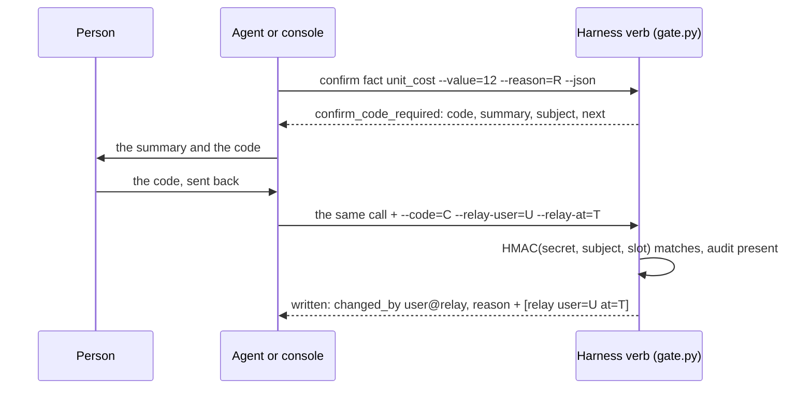

# core/: copy as is

The harness modules that name no channel. A new harness copies this folder next to its `ssot/` and gets a human gate, coded messages and a safe way to run one verb from another, each already through the rounds of bugs that shaped it. Stdlib only, Python 3.11+, macOS or Linux (the gate reads `/dev/tty`; the toy harness locks files).

| Module | What it guarantees | *Paid for* |
| --- | --- | --- |
| [`gate.py`](gate.py) | A confirm, an approval or a rollback needs a person, bound to exactly what they were shown, once. At a terminal the person retypes the value at `/dev/tty`; off one, an opt-in one-time code the agent relays and the person sends back. Who wrote a row is derived, never typed. | Three rounds. The retype first read stdin, so a pipe could answer. Then a code shown for two queued items approved a different pair, a code for one entity's stage confirmed another's, and a code could be used twice inside its window. |
| [`messages.py`](messages.py) | Every sentence in a `--json` document is a `Msg`: its English text (a `str`, so no key changes) plus a registered code and params, so the agent can word it in the client's language. One placement rule, one failure shape. | Codes were added to a live harness in one change without removing a key: about 70 at once. |
| [`contract.py`](contract.py) | The registry is closed both ways over your sources, and every verb in your dispatcher's table keeps it: a new verb fails until it has a case. | The gate and write verbs sat outside the test, so about 40 of their refusals reached the owner's page as "unclassified". |
| [`runner.py`](runner.py) | A verb that reads another verb's `--json` runs it with `uv run` in the child's own PEP 723 environment, and reads the child's reason, fix commands and code from its one document on stdout. | A child run with the parent's interpreter failed on a missing module only on the host. Three write verbs reported "no output" because they read stderr, while the reason was on stdout. |
| [`message_codes.tsv`](message_codes.tsv) | Core's own codes: the gate's refusals and `unclassified_error`. Your harness's codes live in `ssot/message_codes.tsv`; a code in both files is refused. | |

Another module added to core/ gets a row in this table.

## Wire it into a harness

1. Copy `core/` to the harness root, beside `ssot/`. Start `ssot/message_codes.tsv` from [the template](../templates/ssot/message_codes.tsv). `messages.use_registry(path)` names another file.
2. Every sentence a verb puts in `--json` is `msg("code", "English text", **params)`, placed with `coded("reason", m)` (adds `reason_code`) or `coded("warnings", ms)` (adds `warning_codes`).
3. Every verb catches everything at the top and prints one document. A refusal is `gate.json_refusal(e, argv)`: `{error, next, code, params}`, and `subject` when it is a challenge.
4. Every human verb does this, under one lock so nothing changes between the check and the write:

```python
reason = gate.why(args.reason)                       # required, non-blank
values = {i: pending[i] for i in ids}                # what will be written, per id
version = {i: rev[i] for i in ids}                   # moved by every write to these rows
passed = gate.confirm(
    f"confirm {entity_type}", summary, expected,     # expected: the value, or "confirm" for several
    subj=gate.subject("confirm", scope, entity_type, values, version),
    code=args.code, relay_user=args.relay_user, relay_at=args.relay_at)
write(values, changed_by=passed.changed_by, reason=reason + passed.audit)
```

5. One contract test, three calls, on your own sources, registry files and verb table:

```python
assert contract.lint_registry(messages.registry_files()) == []
assert contract.closed(core_sources + harness_sources, messages.registry()) == []
assert contract.check_verbs(VERBS, cases, run, messages.registry()) == []
```

6. A verb that snapshots another verb calls `runner.run_json(script, [..., "--json"])`. On `ChildFailed` it passes the child's words on with `messages.relayed(e.code, f"... failed: {e}")`, so the code survives the hop.

[`tests/toy_harness.py`](tests/toy_harness.py) is the smallest harness wired this way. Read it before your own.

## The gate, off a terminal

Codes are off until the operator sets `CONFIRM_CODE_SECRET`. Without it, a human verb run with no terminal is refused (`confirm_needs_human`).



- **The subject** is canonical JSON of the verb, the scope, the entity type, every id (sorted) with the value confirmed for it, and a version. A code for items A,B refuses A,C, a subset or a superset, another value, scope, entity type or verb.
- **The version** is whatever the confirmed write itself moves: a revision per row, the last history id. After the write lands the same code no longer matches, so it is single use and the gate stores nothing.
- **Time**: 5-minute slots. A code is accepted in its own slot and the two after it, never before it was issued: it lives 10 to 15 minutes.
- **The audit**: `--code` without `--relay-user` (one token) and `--relay-at` (ISO 8601 with its zone) is refused. `changed_by` is `<OS user>@relay`, `@tty` at a terminal, `@cli` for a write nothing gated.

**What the gate is not.** It guards against an agent confirming by accident or by habit. It is not a security boundary: an agent running as the same OS user can drive a terminal, and the agent that relays a code sees it. The guard is the binding and the audit. There is no bypass flag.

## The console talks to it as it is

[`console/relay.py`](../console/relay.py) runs a harness's gate from a click. `gate.py` meets each point of [What a harness must meet](../console/README.md#gate-connect-a-harness):

| The console needs | gate.py and a verb wired as above |
| --- | --- |
| No terminal, stdin closed: only a person at the operator's terminal can retype | The retype is read at `/dev/tty`, never stdin |
| A challenge: `code: confirm_code_required`, `params.confirm_code`, `subject` | `json_refusal()` of `CodeRequired` |
| `--code`, `--relay-user=web:NAME`, `--relay-at=ISO` accepted once, for that subject only | `confirm()` checks the code against the subject; the write moves the version |
| The harness's words in `message` or `error` | A verb's `coded("message", …)`; a refusal's `error` |

`tests/test_gate.py` runs the real `console/relay.py` against the toy harness: a click confirms and the audit is kept, a value changed after the page showed it stops the relay, and with no secret the refusal comes back in the harness's words.

## Tests

```bash
python3 core/tests/run.py            # every tests/test_*.py, 4 at a time
python3 core/tests/run.py gate       # only the files with "gate" in the name
```

A file passes only if it exits 0 and prints `RESULT: N passed`.

| What is checked | Test |
| --- | --- |
| A pipe cannot answer; a terminal on stdin with the answer already typed cannot either; a person at a real terminal can | `test_gate.py` |
| A code is refused for other ids, a subset or superset, another value, scope, entity type or verb, and after its write | `test_gate.py` |
| A code lives in its slot and the two after it, never before; anything but six ASCII digits is no code | `test_gate.py` |
| A code needs who sent it back and when; `changed_by` is derived | `test_gate.py` |
| The real `console/relay.py` confirms through the gate | `test_gate.py` |
| The registry is well formed and closed both ways; a new verb fails until it has a case; uncoded prose, wrong params and an unclassified refusal are found | `test_messages_contract.py` |
| A child runs with `uv run`; its failure is read from its document, a crash from stderr | `test_runner.py` |

Each row was checked by breaking the code on purpose: reading the retype from stdin, dropping the values, the scope, the entity type or the version from the subject, accepting a future slot, skipping the audit, reporting nothing for an unemitted code, running the child with the parent's interpreter, reading stderr first. Every one of these made its test fail.
