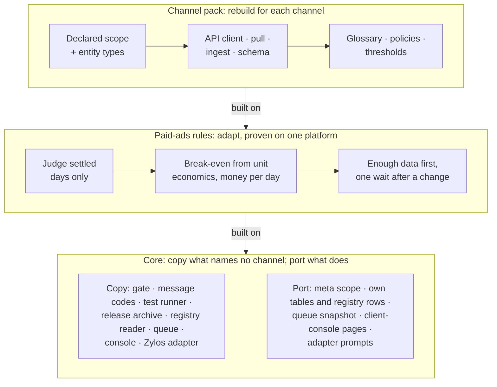

# Other channels

Moved from the playbook's [README](../README.md) unchanged; the README keeps the overview.

## Reusing the harness for other channels

The first harness ran paid ads on one marketplace. For Google, Meta or TikTok ads, and for SEO, GEO (generative-engine optimization: being cited in AI answers) or KOL (key opinion leader: influencer) work, the core's channel-free modules copy as they are, what names a channel is a pattern to port, and the channel pack is rebuilt from client meetings.

**Reuse:** copy as is · **Port:** keep the pattern, rewrite the code · **Adapt:** same rule, checked against the platform's own facts · **Rebuild:** new for the channel · **Unknown:** settle it in the first client meeting. *(untried)* marks a part the source project never ran.

| Part | Paid ads: Google · Meta · TikTok | SEO · GEO · KOL |
| --- | --- | --- |
| Gate, message codes, test runner, release archive, human-table and raw guards (`kit/db.py`, `kit/raw.py`), one clock ([`kit/`](../kit/), [`templates/tests/`](../templates/tests/)) | Reuse | Reuse |
| The `--json` contract, registry reader, facts and decisions, queue and execute, story-check runner, owner console, Zylos host adapter ([`kit/`](../kit/), [`console/`](../console/), [`hosts/zylos/`](../hosts/zylos/)) | Reuse | Reuse |
| What names the channel: `meta`'s scope fields, the harness's own tables, schema and registry rows, the queue's proposal snapshot, client-console pages, adapter prompts | Port | Port |
| Process: stories and policies, owner queue, triage, golden diff, install flow | Reuse | Reuse |
| Meeting intake *(untried)* | Reuse | Reuse |
| Judge settled days only; a missing day makes a total "unknown" | Adapt | Unknown |
| Break-even from unit economics, ranked in money per day | Adapt | Unknown |
| Enough data before judging; one wait after any change | Adapt | Unknown |
| Guarded writer: allowlist, caps, kill switch | Adapt | Unknown |
| Sources ranked: platform and human data above third-party data and AI scores | Reuse | Unknown |
| Alerts: each entity's latest settled day against a multiple of its own prior 7-day mean | Adapt | Unknown |
| Channel pack: scope, entity types, API client, pull, ingest, glossary, policies, thresholds | Rebuild | Rebuild |

Proven here: the core's rules and the process; the paid-ads rules on one marketplace platform with 7- and 14-day attribution windows; the writer tested and dry-run on real data, never used on a live account. The plumbing has also carried over: three harnesses (a short-video ad harness, a KOL harness and a RedNote harness) vendor the kit under its drift guard, and the KOL and RedNote harnesses also vendor the owner console and copy the adapter files `hosts/zylos/README.md` lists unchanged (each copy is those files plus the harness's own `zylos/manifest.json`, without the adapter's tests and its two templates); the adapter itself has only run against a fake host ([`hosts/zylos/README.md`](../hosts/zylos/README.md), "Known limits"). Two of the three (the short-video ad and RedNote ones) hold unmodified copies of the kit. The KOL harness's main holds kit 0.2.0, a version this playbook had; its pushed but unmerged branch claims-and-workspace holds a locally changed copy labeled 0.3.1, a version this playbook never had (seven kit modules and its console copy differ from the playbook's; one of the seven is only an older version), and that branch's drift test compares the copy with its own manifest, so it passes. Still unproven: the SEO, GEO and KOL rules, goals other than sales (leads, app installs, awareness), the paid-ads rules on a second platform, and the Zylos adapter on a real zylos-core.

1. **Vendor the channel-free modules; port the rest.** The gate, message codes, clock, data guards, test runner and release archive name no channel. The queue's proposal snapshot, `meta`'s scope fields, the client-console pages and adapter prompts name markets, campaigns, keywords and product groups: expect to rewrite them with the pack; the queue itself, the registry reader, the owner console and the Zylos adapter (with the harness's own `zylos/manifest.json`) copy as they are. A new harness runs `scaffold/new_harness.py`, which vendors [`kit/`](../kit/): the human gate (`human.py`), coded messages (`messages.py`) and their contract test (`guards/json_contract.py`), the child-verb runner (`runner.py`), one clock (`dates.py`), and the database and raw guards (`db.py`, `raw.py`, `atomic.py`, `retry.py`, `single_instance.py`); [`templates/tests/`](../templates/tests/) is the same test rules as a standalone copy for a repository that does not vendor the kit. The gate's subject and the human tables still say `market` (a harness with no partition writes `_`): renaming it to a neutral `scope` is an open, breaking change. *(the rules and their tests come from the source project, where the original code ran on real data; the kit has since run inside three harnesses, one of them as a locally changed copy, but not every module: `atomic.py`, `retry.py` and `single_instance.py` have one harness each, see [`kit-tiers.tsv`](../kit-tiers.tsv))*
2. **Put every number an agent will be asked for in the harness.** *Paid for:* asked for the top actions by money per day, the host agent found no such number and invented its own formula; the formula moved into the harness so every agent returns the same number.
3. **Verify each platform's facts before trusting a number:**
   - the attribution window per ad type
   - whether past days are restated: pull the same day twice, days apart
   - the time zone of its day, report latency and how far back it reaches
   - whether change history names who made each change
   - whether the read credential can also write
   - rate limits

   *Paid for:* the settled boundary drifted with the operator's time zone until pull times were stamped in UTC, and the read token turned out to be able to write.
4. **Key freshness, windows and resume state by the full scope.** *Paid for:* three bugs let a fresh market hide a stale one; one would have let a stale market past the write path's freshness guard. One client on several channels would be the same multi-scope case (untested).
5. **For SEO, GEO and KOL, only the core and the process are known to carry over.** The first meeting settles what one result is worth and costs, which source counts as truth, and what the agent may change, publish or send; each answer is a [fact key](../templates/ssot/fact_keys.tsv), and a test keeps the client's form in step with them. *Paid for:* nothing ran before the scope was declared, and until unit cost and a monthly cap existed every profit verdict rested on an assumed break-even, marked as such.

### Generated creative and real people (video, image, voice, copy)

*Seen once:* a short-video ad harness built on this playbook. An agent writes a storyboard; the harness generates AI presenter and voice takes, then composites them with client footage and code-drawn layers (subtitles, the legal bar, the AI label) into a finished ad. Later it added an authorised real person as presenter. The gate, message codes and test rules carried over unchanged. What was new, and is now in the kit or the templates:

1. **Paid generation is the money path.** Each AI call is a take: planned, priced, capped, approved at the gate with the exact plan as its subject, then made and kept ([`kit/takes.py`](../kit/takes.py)).
2. **Raw only grows, for media.** A take is keyed by its request and written once. A re-roll is a new request, never an overwrite, so an approved take can't be lost and the same request is never paid for twice.
3. **Never cache a broken take.** *Paid for:* a TTS voice that wasn't installed wrote a 0.01 s file and exited 0. Every build then reused that empty take. A sanity hook now runs before a result is kept.
4. **Lint the copy before spending.** Banned ad words per category, category rules and product facts run before any paid call ([`kit/copylint.py`](../kit/copylint.py)). A rule nobody has confirmed says so. *Paid for:* the client's own reference ad gave the dosage two ways; a list of banned words alone missed it.
5. **Preflight every paid request against the vendor's own schema** ([`kit/preflight.py`](../kit/preflight.py)). *Paid for:* two refusals on the first live day, both visible in the vendor's published input rules.
6. **A real person is consent data, confirmed at the gate** ([`kit/consent.py`](../kit/consent.py), [template](../templates/third-party-consent.md)). Their face, voice, words or clip are used only under a record a person confirmed through the gate. The confirmation is bound to the record's content hash; revoking is free. *Paid for:* the first version accepted a hand-set `status: confirmed`, and an agent set it on the owner's chat word.
7. **Regulated copy says only what the approved document allows** ([`kit/claimscope.py`](../kit/claimscope.py), [`kit/phrasebook.py`](../kit/phrasebook.py), [template](../templates/claim-scope.md)). A claims record holds the approved wording (a drug's indication, a fund's prospectus) and the claims it allows; a person confirms it at the gate. Every line is checked against it at script, asset and render. A phrase the platform refused is remembered and refused inside any later line. Every rejection's quoted phrases are a recall test, and every approved creative a false-alarm test. *Paid for:* 20 creatives of one OTC product were refused in one afternoon for naming symptoms outside its indication. The words were ordinary, so no banned list could see them. The checker then caught 10 of 10 quoted phrases while the approved wording passed. Later, 26 rejected creatives turned out to be 5 scripts rearranged.
8. **The agent runtime has its own gate. Hand the step over; don't work around it.** Uploading a real person's biometrics was refused by the agent's personal-data check even with the owner's go-ahead. The harness prints the exact command, the owner runs it, and the agent carries on locally.
9. **Show a real sample, not a mock.** A free draft path (a stock voice, the real client footage) lets the agent time and lint a whole piece. The owner, though, judges a real 4-scene sample for about ¥1, not placeholders. *Paid for:* labelled placeholder presenters read as the product and were rejected ([review loop](../templates/owner-review-loop.md)).
10. **An IR with two compilers.** A frame-exact timeline JSON is the contract. One compiler renders it headlessly; a second writes an editor draft for human polish. The render stays the source of truth.
11. **Close the outer loop.** Measure the same factors on winning and non-winning outputs; the differences become pending rules that variants confirm ([outcome learning](../templates/outcome-learning.md)).

| Part | Generated creative |
| --- | --- |
| Gate, message codes, test runner, clock, `takes.py`, `preflight.py`, `consent.py`, `copylint.py`, `claimscope.py`, `phrasebook.py` | Reuse |
| The `--json` contract, registry reader, story-check runner, owner console | Reuse |
| `meta`'s scope fields, the harness's own tables and registry rows, client-console pages, the review page | Port |
| Raw and database guards | Rarely needed: takes replace raw pulls |
| Channel pack: providers, the IR and its renderer, category rules, the claims lexicon, platform safe zones, the consent letter's jurisdiction | Rebuild |
