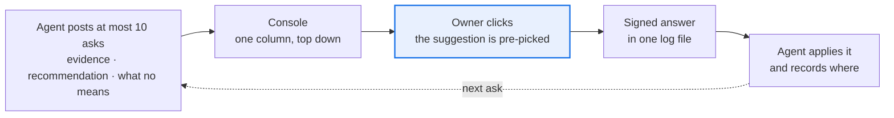
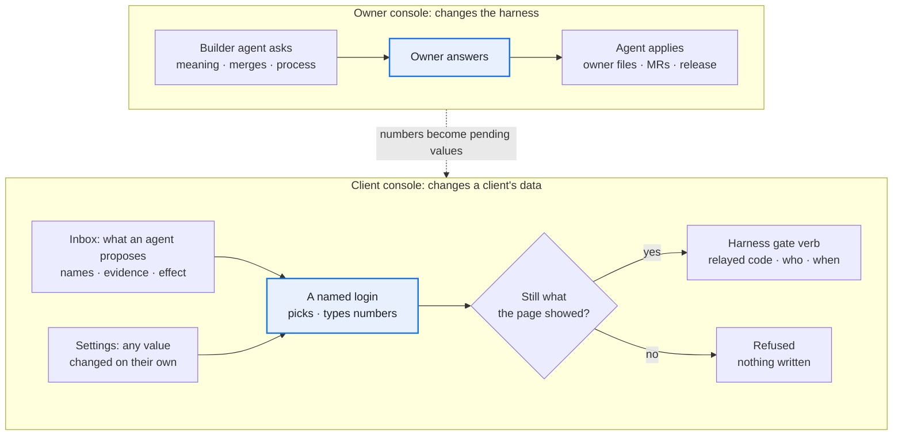

# Consoles and client workspaces

Moved from the playbook's [README](../README.md) unchanged; the README keeps the overview.

## The owner console: where the asks go

Rule 7 needs a place to live. [`console/`](../console/) is that place: the agent posts asks, the owner answers on one page, the answers come back as JSON.

- One append-only file is the whole store; the agent side and the human side meet only there. Stdlib-only Python, no database, no chat app.
- An ask missing evidence, what "no" means or a recommendation (a typed value may go without one) is refused, and an eleventh open ask too.
- Every answer records whether the owner took the suggestion: the override log rule 11 asks for, for free.
- A click can pass through a harness's own gate, so the proof stays where the rules live. It never widens what may be written: an ask that would widen an allowlist, a cap or a write switch is answered in chat (rule 8), not clicked. The agent's side is [`console/AGENT.md`](../console/AGENT.md).
- No login of its own: by default whoever can reach the port answers as one named user, so it binds to loopback and refuses the network unless a login proxy names the user. macOS or Linux only.
- `ask.py digest` is the decision record to forward.

## The client console is where clients answer

Humans answer in two places: the [owner console](#the-owner-console-where-the-asks-go), where the builder-owner answers the agent about the harness itself, and the client console, tested in the harness repo, which collects the values and approvals the harness's rules read.

1. **The console has no write path of its own.** From a click it runs only the harness's gate verbs, relaying the one-time code with the logged-in name, and only while the subject still matches what the page showed. It never opens the database; a test checks the boundary both ways.
2. **Put names, evidence and the effect on the row:** money rounded, old → new with a coded reason, who proposed a value apart from whether it is confirmed. *Paid for:* dozens of pending actions showed as id triples and 16-decimal floats, so approving would have been blind; money is now rounded, names are still open.
3. **Pick from closed sets; type only numbers.** Inputs come from the registry's domain column; a typed number is validated like any write and is what the code binds. Mechanical items confirm in one click; a lifecycle decision (a stage change) goes one at a time, and the server refuses a batch of stages, typed values or thresholds.
4. **One render path, one dictionary, and the UI rules linted on every page** ([owner file](../templates/console/ui_rules.tsv)). The browser writes no words, so the lint and the golden diff reach them all. *Paid for:* pages drawn three ways in two days, and a template-only lint let a raw command-line refusal onto a banner.
5. **Read top down; test at phone width on real data.** One column, what waits first, list then detail, no grids of cards holding tables. *Paid for:* one invented client run through the real chain found five console bugs the fixture tests missed.
6. **Two doors to one gate: the inbox for what an agent proposes, settings for what a human changes unasked.** *Paid for:* the owner could not find where to enter a value, so every count of waiting items now links to its inbox section; later the owner asked for an edit place in settings. The gate already took a human's own value with nothing pending, so that was a page, not a new write path.

## One client, one workspace

A harness serves many clients; each client is one folder in a clients repository, never inside the harness checkout. *Seen twice:* the SEO harness's `seo-researches` (three sites and a `_method` folder) and the KOL harness's `kol-clients`. `python3 scaffold/new_client.py --harness H --clients C --client ID --title T` writes it:

- `bin/<cli>` pins the data root to `./workspace` (git-ignored: database, raw, backups, the console log, `.env`, and `intake/`, the drop folder for whatever a person collected from the client). One wrapper per client means no session runs against another client's data.
- `bin/console` is that client's owner console with the harness's gate verbs relayed; `bin/ask` is the agent's side.
- `CLAUDE.md` is the agent's brief ([template](../templates/client/CLAUDE.md)); `reports/` is for people, with one `handoff-YYYY-MM-DD.md` per session ([template](../templates/client-handoff.md)).
- `.claude/settings.json` denies every `gated` verb through the wrapper and hand edits under `workspace/`. Claude Code applies deny rules in every permission mode, so they stop the agent asking; the harness's gate still decides.

**Client work is how the harness learns.** Every client handoff ends with a Distil list: each insight goes to a harness MR, a proposed story or policy, a method question in a `_method` workspace (the harness owner's console, no client data), or is marked client-only. A rule learned on one client stays proposed until a second client confirms it.
