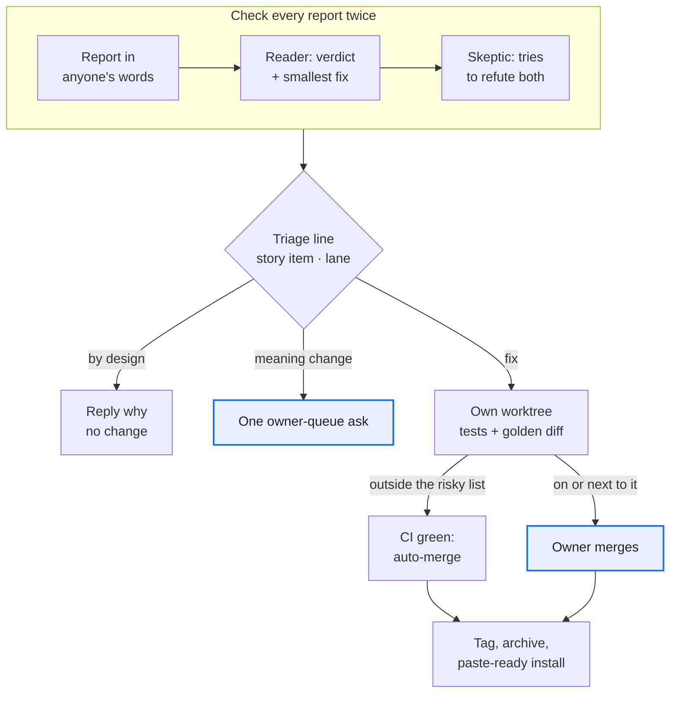
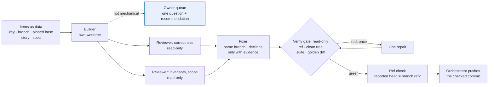
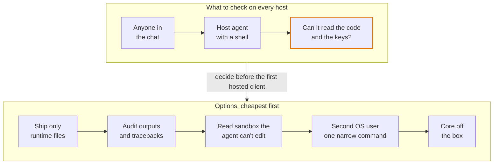

# Building and running with agents

Moved from the playbook's [README](../README.md) unchanged; the README keeps the overview.

## When agents file the issues

Most issues came from agents: those operating the harness, the client's own agent, demo runs and golden diffs. Most MRs merged on green CI; the owner's time went to meaning changes and risky merges.

1. **The triager, not the reporter, writes the first line:** the story item, the lane and how it was found ([checklist](../templates/triage-checklist.md)). Ship what changes no meaning now; queue the rule change as one question.
2. *Seen once:* **check every outside report twice: a reader, then a skeptic** ([prompts](../templates/verify-challenge.md)). Of the client's agent's 6 points, 2 were by design; the skeptic corrected 2 verdicts, and probing plus the golden diff found 3 more bugs. All 7 fixes merged the same day, one by the owner because it sat next to the gate relay.
3. **A batch that breaks the invariants is one owner decision, not N fixes.** *Paid for:* an outside team proposed a parallel app with its own config and data files in 20 issues, several writing values back around the gate. The owner closed all 20 as superseded: confirm-from-the-page already existed, built with one additive harness change.
4. **Auto-merge on green CI, except the risky list** ([protected paths](../templates/CODEOWNERS)). On the forge's free tier nothing blocks the merge: the agent reads the list before setting auto-merge. A refactor that moves risky code adds the new file to the list in the same MR; this was missed once.
5. **Refactors pass a committed golden diff** ([spec](../templates/AGENT_INSTRUCTIONS.md#golden-diff), [engine](../templates/tests/golden/)). *Paid for:* the first golden scripts lived in a session's scratch space and vanished with it; on real data the committed tool caught a report that differed in 45 places between two runs of the same code. Before its 0 could be trusted, it needed clocks pinned in the verbs' own child processes, only real noise masked, an untorn copy of a live folder, and worktrees removed on a kill.
6. **Nothing a later session needs lives only in a session** ([rules](../templates/AGENT_INSTRUCTIONS.md#what-lives-here)). *Paid for:* a scratch directory was wiped once, and the queue page's database still held all 213 review rows; one session left 108 worktrees.
7. **A rule learned on one client stays proposed until a client with another business model confirms it.** Every client handoff ends with a Distil list: each insight goes to a harness issue or MR, a proposed story or policy, or is marked client-only ([handoff](../templates/session-handoff.md#session-end-checklist)). *Paid for:* an SEO harness built on a B2B manufacturer shipped its page recipes with the pump's spec columns in them, and a URL-pattern order that typed 266 pages on three clients wrongly; both showed only when the first web-shop client arrived.

## Building with many agents

The source project built most of its changes with workflow scripts: many agents, one branch each, and one orchestrating session that pushes. About half of its runs rewrote the same script, schemas and prompt rules, and the early copies were missing rules that later cost rework. The loop, its result schemas and its rules are in [`templates/workflows/`](../templates/workflows/). Copy them on day one. *(untried as copied here: the scripts are the source project's made generic, and they are tested under a simulator, not yet run live in this form.)*

1. **Items are data, and the base is a pinned commit.** Each item names its key, branch, story and spec. Every prompt names the base SHA and an in-flight map: other branches and sessions, the files not to touch, and the one item that may bump a schema in this run. *Paid for:* two branches built at the same time both bumped the schema version to the same number.
2. **Show each new test red on the base, then green. Write each safety check both ways: the bad case refused AND the good one accepted.** *Paid for:* a reviewer found a new check that could not fail on the base, although the builder had reported that it did.
3. **Give each agent its own temp dir, port block and store, and run golden cases alone.** *Paid for:* test sandboxes leaked into the system temp dir while many agents ran the suite, and a timing check failed only while a golden compare ran beside it.
4. **A builder that meets a question of meaning stops.** It commits nothing and returns one question with its recommendation. *Paid for:* early scripts had no way to stop, so a builder guessed, and the owner's answer cost a rework.
5. **The fixer writes only where it may, and nobody trusts a reported commit.** A later agent cannot edit another agent's worktree. It enters that worktree first, or it fixes in its own detached worktree and moves the branch with a compare-and-swap, `git update-ref refs/heads/B NEW OLD`. Results carry `head_sha`, and the gate and the [ref check](../templates/workflows/refcheck.py) compare it with the branch ref before any push. *Paid for:* this write-hook trap came back run after run. Once a fix was left on a detached HEAD while the branch kept the unreviewed commit, and it was reported as done.
6. **Every item ends at a read-only gate with at most one repair round.** *Paid for:* early scripts ended at the fix pass, so "green" was only the fixer's word. The gate was cheap, and in later runs it never needed its repair round.
7. **Before a clean-up round, sweep read-only and send a skeptic after each candidate** ([`sweep-skeptic-plan.js`](../templates/workflows/sweep-skeptic-plan.js)). A finding nobody reproduced is not a finding. Accepted limits are listed up front, so they stop coming back. *Paid for:* in one refactor sweep the skeptics refuted several candidates before anyone built them. The survivors became small MRs with one reason each.
8. **Plan for restarts.** Copy the run's journal and script into the new session and resume. Finish a cut-off builder in its existing worktree ([how](../templates/workflows/README.md#after-a-restart)). *Paid for:* the orchestrating session restarted mid-run, and the running workflows were marked stopped.

The full rules table, with what each rule prevented, is in [`templates/workflows/README.md`](../templates/workflows/README.md#the-rules-pasted-into-prompts).

## Hosting: the agent that runs it can read it

A hosting platform runs the harness under a remote agent that clients chat with. The adapter and per-client boundaries held; keeping logic and keys away from that agent must be decided per host, before the first hosted client.

1. **The core never names its host.** All host glue lives in one adapter folder; delete it and the harness still runs, and CI smoke-tests each supported platform version. *Paid for:* applying one review by the platform's team added about 850 lines: declared config defaults were never applied, and the linked command was not on the agent's PATH.
2. **One client = one data folder = one host agent.** No fallback to the working directory; on a host, turn off any user-wide env file, and let the doctor name each value's source. *Paid for:* agent shells reset the working directory, scattering credentials, database and raw files. The platform put every chat channel into one agent session, so a second client needs a second host.
3. **Check what the agent a client chats with can read, and what the host can write.** On the first host we checked, the agent ran as the harness folder's OS user with no deny rules, so it could read the code and the secrets file. Behaviour rules and settings the agent can edit are no barrier. Ask again on every new or replaced host agent ([checklist](../templates/install-checklist.md#new-host-or-a-replaced-host-agent-what-can-it-reach)), and pick a barrier above before the first hosted client.
4. **Scheduled tasks are closed prompts; long jobs run detached** ([checklist](../templates/install-checklist.md#scheduled-tasks-and-long-jobs)). *Paid for:* a laptop cron job failed silently, then its replacement exited 1 every hour and nobody saw it; a 30-day pull took close to an hour against a tool-call limit of about 10 minutes.
5. *Seen once:* **the console sits behind a proxy login that strips, then sets, the user header,** trusted only from loopback. After each restart: local 200, public 401, public with a forged header 401. *Paid for:* the platform's route declaration would have published the confirm inbox with no login.
6. *Seen once:* **client data moves by snapshot, and a push queue has one reader.** Stop the old consumer, then take a checksummed snapshot with row counts: confirmed values and approvals can't be pulled again. Two readers each get a random half, so a host swap has a deadline, the queue's retention.
