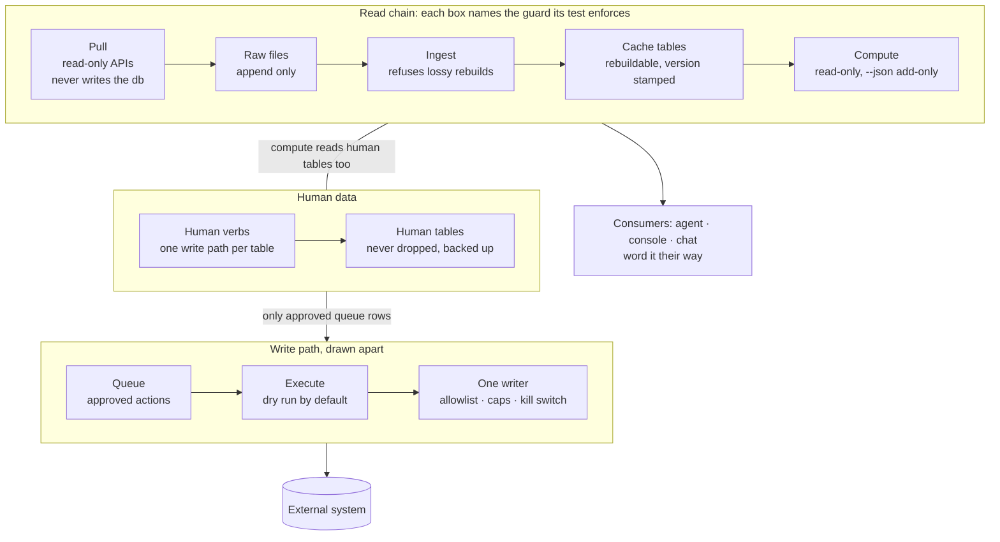
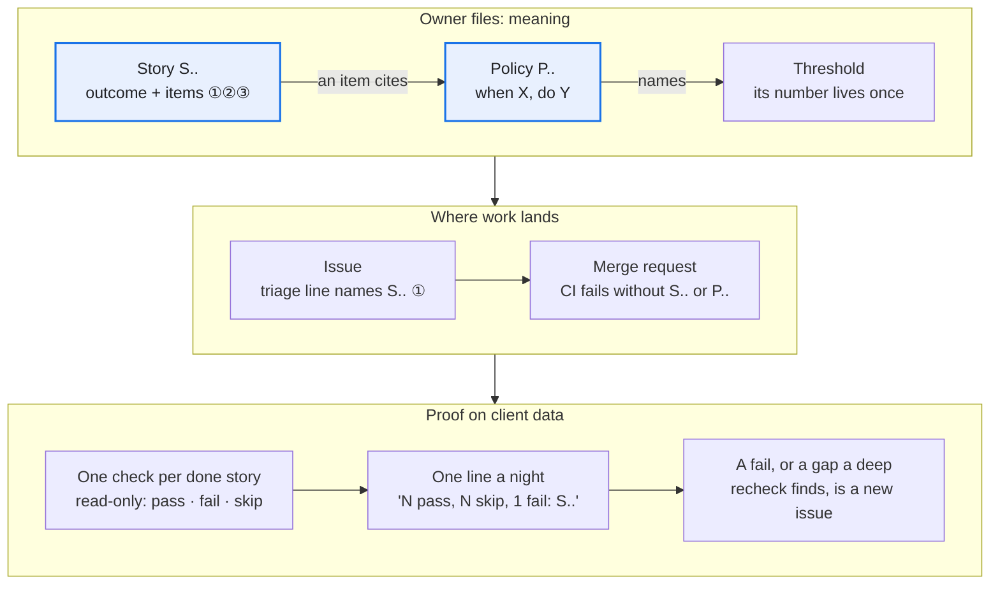
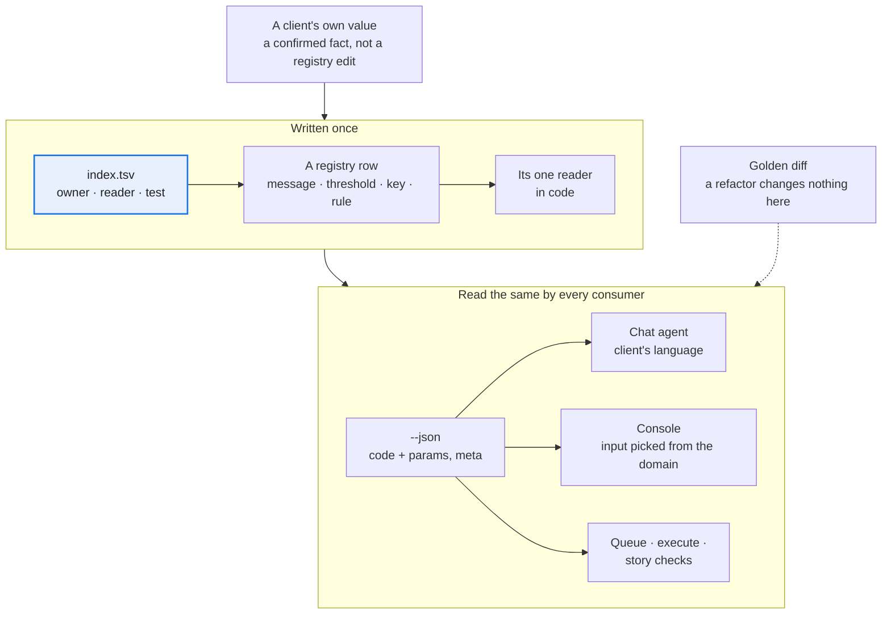

# Rules a harness holds

Moved from the playbook's [README](../README.md) unchanged; the README keeps the overview.

## Data layers and their guards

The first bugs in the source project were silent data loss with green tests, so every layer gets its guard test on day one.

Cache tables can always be rebuilt from raw; human tables never can, so they are kept apart, backed up before each ingest and written by one verb each.

The guards are code the kit holds: [`kit/db.py`](../kit/db.py) (human tables, rebuilds, the version stamp) and [`kit/raw.py`](../kit/raw.py), [`kit/atomic.py`](../kit/atomic.py), [`kit/single_instance.py`](../kit/single_instance.py), [`kit/retry.py`](../kit/retry.py) (raw that only grows, atomic writes, one run at a time, throttling recorded as gaps). How a pull merges into raw is in [docs/lessons.md](../docs/lessons.md). Each of their tests was shown failing on a broken copy of its guard.

*Paid for:* a rolling window moved between a schema change and the ingest, so raw held as many days as the table, but later ones. The count matched and the rebuild dropped the oldest days. Compare the set of days, not the count.

**The CLI is the only door.** Every capability the harness owns, each paid or live API call included, is a CLI verb with `--json`, a cost estimate where money is spent, and a `source` on what it writes. An agent may read through MCP or UI tools, but the result enters a workspace only through a `pull` or `import` verb. Hand-written raw files and direct API writes are violations. Otherwise the cost guard, the source tags and the network-free tests cover only the calls that happened to use the verb. *Example:* an SEO harness lets the agent read Search Console through an MCP, then lands the reply with its `import` verb, so the read is recorded like any pull.

**Teach the agent from `--help` and one first call.** End every verb's `--help` with two or three example calls (minimal, typical, one with a cost or gate flag) and the top-level keys of its `--json` output, and test both. Give the agent one status verb to call first in every session: the next step, what waits on a human, how old the last ingest is, and what has been spent. Anthropic's engineering post on advanced tool use reports that worked examples raised accuracy on complex parameters from 72% to 90%, and its post on effective harnesses for long-running agents has each session begin by reading the state left behind. *Built in the kit (0.6.1):* a verb declares `examples` and `keys` in its verb table row, its `--help` ends with them and `verbs --json` lists them, and doctor names the verbs that have none ([code](../kit/verbs.py)); the KOL harness fills them for every verb and runs each read verb's examples in a test. *Not yet proven here:* no accuracy gain has been measured, and the one status verb is built only in that harness, not in the kit.

## Human-in-the-loop rules

The owner decides less, but every decision is real.

1. **Decision rights live in the repo**, enforced by protected paths, not by an agent's memory.
2. **Trust lives in the data.** Values are pending or confirmed with a source; anyone may lower trust, only a human raises it; every rule reads confirmed first.
3. **Each story names its human step** (none / confirm / approve). Anything that can spend money is never "none".
4. **One gate for every channel**, bound to exactly what was shown, single use, logged, no bypass flag ([code](../kit/human.py)). Who signed is derived from the process's OS account (its passwd entry), never from `LOGNAME` or `USER`, which whatever launched the process can set to anything; a third party confirming their own value (`--for-client`) has its own name in the code's subject, so neither side's code passes for the other's. *Paid for:* two rounds. The first guard only checked that stdin was a terminal, so an agent wrapped the call in a pseudo-terminal, confirmed live values and signed them as the owner with a free-text source; then a relayed code approved a different pair of items than the one shown, confirmed another entity's value, and worked twice inside its window.
5. **Approve is the last human act before money moves.** A second confirm at execute only trains rubber-stamping.
6. **Business "not yet" beats technically ready.** Client writes and paid calls stay off until the owner says so in writing, with a cap.
7. **Budget the owner's attention:** at most 10 asks, each with evidence, a recommendation and what "no" means. Inputs are picked from a list; the one thing typed is a value the harness validates.
8. **Agree in advance which channel counts.** Widening what may be written counts only when typed in chat, not clicked on a page.
9. **Remote agents never act for the owner.** They install only on the owner's own "confirm vX" and end with a checklist report.
10. **Two refusals mean stop.** After two consecutive refusals from the gate or the cost cap, the verb answers with an `escalate` code; the agent stops and asks the owner and never looks for another door. Anthropic's engineering post on Claude Code auto mode found users approved 93% of prompts, so approvals are scarce and an agent that routes around a denial is the failure to design out. *Not yet proven:* no harness here counts refusals yet.
11. *Not yet proven:* **measure whether the gate is real.** Track how often the owner overrides each kind of ask. The console records with every answer whether it took the suggestion, but no override rate per kind of ask is computed yet. An eval counts only if it fails when its rule is removed: cut once, 5 of 9 failed as they should, and the other 4 stay only as regression guards. The offline half now ships: `kit/guards/evals.py` holds each case to a rule of SKILL.md, the forbidden-verbs pattern generated from the verb table, and an ablation row ([templates/evals/](../templates/evals/)).

## Stories that prove themselves

The owner can't read code, so "approved" and "done" must rest on checks a machine already ran.

1. **Stories and rules are separate owner files** ([how](../templates/ssot/README.md#stories-and-policies)). *Paid for:* an audit found four rules the code applied that nobody had approved; the owner approved them one by one.
2. **Acceptance items are numbered invariants a machine can check:** children sum to the parent, missing input means "unknown", a zero row never disappears. Issues and MRs cite the item (S.. ①). Such items let a read-only agent find a headline ratio dividing 30 days of spend by 23 days of sales.
3. **The story id is enforced in CI, not in instructions** ([template](../templates/ci/gitlab-ci.yml)). *Paid for:* 17 of the first 105 MRs named no story, 15 of them refactors; after a 15-line CI job on the title, none of the next 77. Give refactors a guarantee story to name.
4. **One read-only check per done story; missing data skips, never passes** ([template](../templates/ssot/story_checks.tsv)). *Paid for:* a "nothing sent without approval" check first passed on a client that had never sent anything. *Built* (its own story still awaits the owner); the nightly run on the host is not yet seen.
5. *Seen once:* **nightly checks prove presence; deep rechecks prove behaviour.** Read-only agents walked the stories item by item on a sandbox copy: 8 pass, 21 partial, 9 blocked of 38 judged. The worst: a code shown for items A and B approved A and C, unit tests green. No nightly row checks that binding.
6. *Seen once:* **audit the map both ways, then test its links.** Story → code and code → story found 17 unstoried features, 9 stale stories and 4 rules only the code knew, each put to the owner. Later, 4 of 5 partial stories named a closed blocker.

## Registries: one place per value

A value lives in one registry row with one reader, so every agent, page and check gets the same answer, in the client's language.

1. **Code every message and close the registry both ways, on every verb** ([how](../templates/ssot/README.md#message-codes)). *Paid for:* the gate and write verbs sat outside the test, so their refusals reached the owner's page as "unclassified" until about 40 were coded. The reader and the checks are [`kit/messages.py`](../kit/messages.py) and `check_verbs` in [`kit/guards/json_contract.py`](../kit/guards/json_contract.py).
2. **A threshold enters only with a reader and is renamed only through a map** ([how](../templates/ssot/README.md#thresholds)). *Paid for:* one owner audit merged 4 duplicates, dropped 3 that nothing read and renamed 3; no client folder needed a migration.
3. **Type every key a human or agent can set** ([how](../templates/ssot/README.md#facts-and-decisions)). *Paid for:* a percentage typed as 15, .15 or 150 silently changed every margin. Bounds now refuse 150 on a 0–100 percentage and 80 on a 0–1 ratio; 15 and .15 both still pass, so state the unit where it is typed.
4. **`meta` is the truth label, scoped to exactly what the report covers:** window asked vs found, missing days per source, stale sources, what-if values in effect. Queue and execute read it to refuse.
5. **Preview with a what-if flag, not a UI field.** A proposed threshold runs through any report, stored nowhere and echoed in `meta`; the queue refuses a what-if snapshot, and the console's "what confirming changes" comes from it alone.
6. **Alert rules are rows, and each new rule still needs code** ([how](../templates/ssot/README.md#alert-rules)). *Paid for:* the registry grew from 5 to 12 rules in six days, each with code for its grain, metric or comparison; the row is what makes a rule visible, named and tunable.
7. **Every number names its source, and a report takes one source per entity.** Each cache row carries `source`; a fixed preference order picks one source per entity and metric, and the report says which it used. A third-party estimate is never shown as the platform's own number, and two sources are never blended into one figure ([bug class](../templates/bug-classes.md#pulls-and-platform-facts): `blended-sources`). *Seen twice:* both source harnesses do this by design: an ads harness never treats a seller-tool estimate as the marketplace's truth; an SEO harness ranks the search engine's own clicks above any tool's traffic estimate.
8. **A graded rule cites the platform's own documentation; a convention is marked and capped** ([how](../templates/ssot/README.md#cited-rules)). Each check row names the page that makes it a rule (`basis=authority`); an industry habit is `basis=heuristic` and a test keeps it at the lowest severity. Re-check the citations against the live pages from time to time: they rot. *Paid for:* five days after an SEO harness wrote its check registry, a re-check of its 30 cited pages found 8 rows to fix: 5 pages had moved to a new docs tree (and a test that pinned the old prefix failed), 3 cited pages did not say what the row claimed, and one end date was a day off.
