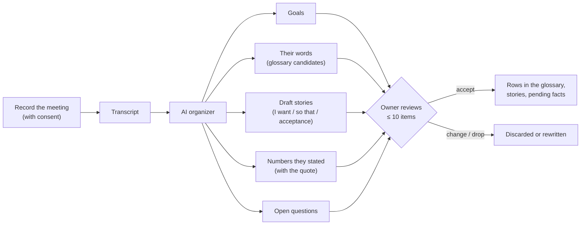

# Stages: from the first meeting to day one

Moved from the playbook's [README](../README.md) unchanged; the README keeps the overview.

## Stage 0: client meetings are the first input

Every project starts from what the client actually said, not from what the agent imagines.

1. **Record and transcribe** each client meeting, with the client's consent. Recordings and transcripts stay in the client's own data folder, never in the code repository.
2. **The AI organizes the transcript into five buckets:** goals, the client's own words for things, draft user stories, numbers they stated (costs, lead times, budgets, limits), and open questions.
3. **Every item cites its source:** meeting date and the timestamp of the quote. A number with no quote is not written down.
4. **Numbers enter as pending values** with the meeting as their source; they drive nothing until a human confirms them.
5. **The owner reviews at most 10 items per meeting:** accept, change or drop. Accepted words and stories become rows in stages 1 and 2.
6. **Later meetings feed the same buckets.** A changed number or goal becomes a pending change with the old and new quotes side by side, never a silent overwrite.

The prompt and output shape for the organizer: [`templates/meeting-intake.md`](../templates/meeting-intake.md).

## Stage 0 and the ten stages, one line each

Each stage ends at a gate someone signs; the lesson column is what the source project paid for learning it late.

| # | Stage | Produces | Gate (who signs) | Lesson |
| --- | --- | --- | --- | --- |
| 0 | Client meetings | Transcripts organized into goals, words, draft stories, quoted numbers, open questions | Owner accepts at most 10 items per meeting | Costs and lead times started as agent estimates and had to be re-asked; there was no meeting record to check them against |
| 1 | Words and rights | Registry index, a glossary in the client's own words, three decision lanes | Lint passes; one name per idea (owner) | The index came on day 4, after 8 files; catching up cost a 213-row review. The client's word for a core concept replaced the engineers' word only after a test enforced it |
| 2 | Stories | I want / so that / acceptance items / human step, plus a runnable proof per item | Owner accepts at most 10 rows at a time | Two branches reused the same story ids and one story was lost; proofs written as prose never ran |
| 3 | Rules and tests | An agent instructions file of invariants only; a test runner that fails without its RESULT line | Every rule names its test (CI) | Test files that never ran counted as passes until the RESULT gate |
| 4 | Read-only data | pull → raw that only grows → ingest → database; a required data root, no defaults | Rows in = rows out; ingest twice = same rows (CI) | 3,072 rows were stored as 329 with green tests; raw was once overwritten while the source API kept only 65–95 days |
| 5 | Human data | Human tables apart from the cache; pending vs confirmed with a source tag; backups, triggers | Human tables survive every rebuild (CI); owner signs which keys exist | Client facts were wiped once; a pending value outranked a confirmed one |
| 6 | Registries and contract | Thresholds stored once; rules name thresholds; message codes; one `--json` contract with `meta` and one error document | Contract test both ways (CI); owner approves each rule and number | Message codes let any agent word results in the client's language |
| 7 | Reports | One read-only report per story | The story's proof runs green on the client host after install | Reports took ~15 hours; their proofs stayed prose until they became story checks |
| 8 | Gate and money | One confirm function behind terminal, chat code and inbox; approve → dry run → switch → one writer | Replay and swap tests; no bypass flag (owner approves each action) | The write path was ready on day 2 and still off on day 7: no client agreement yet |
| 9 | Release | `git archive` of a tag, internal files excluded; host install with backups and a checklist | CI green; owner types "confirm vX"; host report | 21 tags in five days; two parallel release sessions left main untagged: one release owner at a time |
| 10 | Operate and learn | Scheduled pulls with freshness checks, alerts, triaged issues, an owner queue of at most 10 asks | Risky merges wait for the owner; refactors pass a golden diff | "Closed" is not "on main"; a squash forked the history once |

## Day-one checklist

Install these before the first feature; each costs an hour now and saved days in the source project.

- [ ] Meeting intake: consent, recording, transcript in the client's data folder, the organizer prompt ([template](../templates/meeting-intake.md))
- [ ] A review page before the first paid batch: the owner decides per item and the next session reads the decisions back ([loop](../templates/owner-review-loop.md)); paid vendor APIs pinned down cheaply first and every request preflighted against the vendor's published schema ([discovery](../templates/vendor-api-discovery.md))
- [ ] `docs/ROADMAP.md` with a session start and end checklist from day one ([handoff](../templates/session-handoff.md))
- [ ] The test kit before the first feature: a runner that fails a missing RESULT line, a reported failure, `0 passed` or a leaked temp file; one clock; layering rules; a release-archive test ([kit](../templates/tests/)). Every rule in the agent instructions names its test ([template](../templates/AGENT_INSTRUCTIONS.md))
- [ ] An empty registry index with its lint test; ids are never reused; owner files linted for engineering words ([template](../templates/ssot/))
- [ ] CI from the first commit: one pipeline per change with every job in the MR pipeline, the story-id check on every MR title, the offline suite, a secret scan ([fuller template](../templates/ci/gitlab-ci.yml); its short form, [templates/gitlab-ci.yml](../templates/gitlab-ci.yml), is what the scaffolder renders into every harness), plus a few guarantee stories for refactors to name
- [ ] A story-check registry and a read-only runner: pass, fail, or skip when the data is missing ([template](../templates/ssot/story_checks.tsv))
- [ ] "Declare it or refuse": a required data root, one init command to declare scope, a doctor, no defaults ([doctor checks](../templates/doctor-checks.md))
- [ ] Raw that only grows, fixtures copied from real API responses, tests for ingesting twice and for row counts ([`kit/raw.py`](../kit/raw.py), [docs/lessons.md](../docs/lessons.md))
- [ ] One fixture test per data bug class before the first report: zero vs missing, sparse days, matched windows, stable picks, validated raw, units and ids ([table](../templates/bug-classes.md)); the triage line's `Class:` counts repeats
- [ ] Human tables apart from the cache: triggers, a backup before rebuilds, refusal of lossy rebuilds, a version stamp ([`kit/db.py`](../kit/db.py))
- [ ] The `--json` contract from the first report: `meta`, one error document, message codes on every verb, tested both ways ([template](../templates/ssot/message_codes.tsv))
- [ ] Vendor [`kit/`](../kit/) (`scaffold/new_harness.py` does it): the human gate, message codes with their contract test pointed at your own verb table, and the runner that starts a child verb in its own PEP 723 environment
- [ ] Typed keys: every key a human or agent can set has a unit, bounds or a domain; a fact always needs a human confirm, a decision key says whether it does ([facts](../templates/ssot/fact_keys.tsv), [decisions](../templates/ssot/decision_keys.tsv))
- [ ] Boundary and layering tests before the first adapter or console exists ([template](../templates/tests/test_layering.py)); the console's UI rules as an owner file with its lint ([template](../templates/console/ui_rules.tsv))
- [ ] A golden-diff tool committed before the first refactor: every `--json` read and every page, BASE vs HEAD, its self-checks run once ([spec](../templates/AGENT_INSTRUCTIONS.md#golden-diff), [engine](../templates/tests/golden/))
- [ ] The owner's inbox before the first ask: one log, at most 10 open asks, answers signed ([`console/`](../console/))
- [ ] Writes and paid calls off: dry run, allowlist, kill switch, no retries, caps
- [ ] Protected paths for the risky list ([template](../templates/CODEOWNERS)) and one release owner
- [ ] Git rules: never squash; one "Fixes #N" per line; every commit names its story; the forge chosen by three questions and every token proved on day 1 ([below](#forge-and-access))
- [ ] Releases are a `git archive` of the tag with an archive test; install messages written from the version the host runs ([install checklist](../templates/install-checklist.md))
- [ ] Before the first hosted client: decide where the logic and the keys live

### Forge and access

Settle where the code lives, and who holds which token, before the first commit. Moving later means migrating issues, rewriting CI, living with two issue-numbering schemes and rebuilding the host's install path.

Ask three questions of the forge:

1. **Can a CI quota or spending limit stop builds mid-project?** If so, raise it or pick another forge now.
2. **Can the hosting platform install a private release from it?** Some install by repo name from one forge only; anywhere else, the install becomes deploy token → clone → archive.
3. **Can every agent reach it from the network it runs on?** SSH is often blocked behind a proxy where HTTPS works.

| Role | Token | Scopes | Day-one proof call |
| --- | --- | --- | --- |
| Builder agent, forge CLI | Its own access token, stored by the CLI | Issues, merge requests, pipelines, job logs (read), tags, labels | Open a merge request from a scratch branch, read a failed job's log, add and remove a label |
| Builder agent, git | HTTPS push, with the OS keychain as credential helper | Repository write | Push a scratch branch and delete it |
| Host | A read-only deploy token | Repository read | Clone a release tag and `git archive` it; a push with the token is refused |
| Owner | The owner's own token | All | None: it never passes through an agent. The owner's merges on the risky list are clicks in the forge |
| Public repo | A repo-local commit identity (`git config user.name` and `user.email` inside the clone) | None | `git log -1 --format='%an <%ae>'` shows the public identity, not a work address |

*Paid for:* CI stopped on a spending limit on day 5 and forced a forge move: 39 issues migrated, and the agent instructions still explain two numbering schemes. The CLI token could not read job logs, so seven failed pipelines were debugged blind. Jobs with no rules ran only in branch pipelines, so a merge request pipeline could turn green with no test run ([CI template](../templates/ci/gitlab-ci.yml)).
