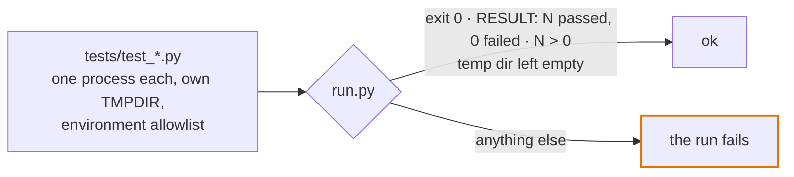

# Test kit

The standalone test kit: the day-one tests as files to copy, for a repository that does not vendor the playbook's `kit/`. A harness the scaffolder generates does not use these files. It gets the same rules as ten thin tests that call the vendored kit (`kit.testing.suites`), listed in [the templates README](../README.md#the-tests-a-new-harness-starts-with); `kit.guards.clock` is the clock rule below, `kit.guards.layering` the layering engine, `kit.guards.release` the release-archive test. Both hold the rules, so a change to one rule is made in both. What only this page carries, and the kit cannot check in a test, is [Rules the kit cannot check](#rules-the-kit-cannot-check).

Each gate was a separate incident in the source project. Stdlib-only Python 3.11+, macOS or Linux. *(untried as copied here: the rules and their tests come from the source project, where the original code ran on real data; these files have run only against their own tests and a toy harness)*



## Install

1. Copy `templates/tests/*.py` into the harness's `tests/`. `selftest/` stays here: it is the kit's own proof.
2. The example tables expect the one clock at `common/dates.py`, beside `src/`: [`selftest/sample/dates.py`](selftest/sample/dates.py) is a minimal one that passes `test_clock.py`, and [`kit/dates.py`](../../kit/dates.py) is the fuller one. Copy [`templates/gitattributes`](../gitattributes) to the repository root as `.gitattributes`.
3. Set the constants at the top of `test_layering.py` (`RULES`, `SCANS`), `test_clock.py` (`CODE`, `CLOCK`) and `test_release_archive.py` (`INTERNAL`, `MUST_SHIP`, `RUNTIME`) to your layout. A path that finds nothing fails, so a wrong path is never a pass.
4. Run `python3 tests/run.py`, or `python3 tests/run.py clock` for the files with "clock" in the name.

## What fails

| File | Fails when |
| --- | --- |
| `run.py`, `_check.py` | A test file exits non-zero, prints no `RESULT: N passed` line, reports a failure or `0 passed` on it, or leaves anything in its temp dir. Each file and each child gets an empty HOME of its own |
| `test_run_tests.py` | The runner or `_check.py` stops catching any of those, or lets a file under the operator's HOME reach a test |
| `test_clock.py`, with `common/dates.py` | Code reads the calendar anywhere but `dates.now()`, or binds `now` at import; an `ALLOWED` row names a read that has moved |
| `archtest.py`, `test_layering.py` | A module reaches what its layer may not (eager, lazy, relative or re-exported imports), `src/` and `common/` read as one graph; a rule's layer matches nothing; `common/` imports the harness; `common/` or `src/` names the console or the adapter; the console runs a write verb, as shell text or as argv; a text rule's pattern misses its own samples |
| `test_release_archive.py`, `gitattributes` | An internal file would ship; an export-ignore entry or `INTERNAL` path names nothing; a registry the index or the code needs is left out; runtime code is left out |

- **Runner.** *Paid for:* a test file with no entry point ran none of its checks and exited 0, so the guard of a recovery path was green without running; the runner then stopped trusting exit 0 over a file's own failed count. Later, every full run left hundreds of sandboxes in the temp dir, and a day of unattended agent work filled the host's disk to 99%.
- **One clock.** *Paid for:* retrofitting one clock took four merge requests; until then no single patch could pin a test or a golden diff to one instant.
- **Layering.** *Seen once:* the import-graph test went in before a refactor moved code between modules, and the moves added two rules to it.
- **Release archive.** *Paid for:* before it, a host install copied the whole repository, agent instructions and the owner's files included.

## Rules the kit cannot check

1. **A wall-clock check keeps at least 2x headroom and still fails when the work runs serially.** `test_run_tests.py`: 8 one-second files, about 2 s on 4 workers, a 6 s limit; serially they take 8 s. *Paid for:* seven merge-request pipelines started together and all failed on thin margins; one or two at a time, all passed unchanged.
2. **An idempotency test pins two different instants.** *Paid for:* an ingest-twice test passed only because both runs fell in the same second, while real re-ingests doubled every row.
3. **Hold one database connection open across checks that compare files byte for byte.** *Paid for:* SQLite rewrote its write-ahead log when an earlier, unclosed connection was garbage-collected mid-loop, so such a check failed now and then.
4. **A child process gets `_check.child_env()`, never `os.environ`.** With the operator's environment a child can read real credentials or a real data folder (a home-level env file among them: HOME is a sandbox too), and it writes its temp files where the leak check cannot see them.
5. **Test data uses synthetic ids only, and a guard test fails any id-shaped token outside the synthetic shape.** *Paid for:* real client identifiers reached the test files and had to be replaced. In a public repository that cannot be taken back.

## The kit tests itself

```bash
python3 templates/tests/selftest/run.py
```

It installs the kit in a sample harness (`selftest/_sample.py`, with a small `common/` package from `selftest/sample/`: a clock, a runner, a raw and a database guard) and runs every test there, then breaks one thing at a time and expects the named failure: a forbidden import through a chain, a pull reaching `common.store`, `common/` importing a harness helper, a lazy spawn, a second importer of the writer, a renamed layer, a console write verb, a `common/` or `src/` file naming the console, a pattern that misses its samples, a stray clock read in `src/` or `common/`, a bound `now`, a stale `ALLOWED` row, a renamed clock, a leaked internal file, a stale export-ignore entry or `INTERNAL` path, a registry left out, runtime code left out, and a test that leaks a temp dir. `selftest/test_archtest.py` covers the engine's import resolution on its own.
