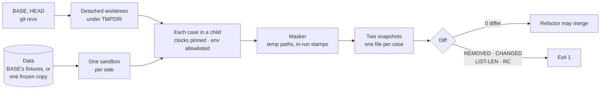

# Golden diff

A refactor must leave every `--json` document and every page exactly as it was. This tool proves it: it runs every case of your harness on BASE and on HEAD, on the same data under the same clock, and diffs the two. Two files you copy into your harness: `engine.py` (generic, you do not edit it) and `cases.py` (the hook you fill once). Stdlib-only Python 3.11+ on macOS or Linux, plus git.



Worktrees and temp folders are removed afterwards, also on a failure or a SIGTERM, with every process a case started.

## Adopt it

1. Copy `engine.py` and `cases.py` to `tests/golden/` in your harness. It is a tool, not a test: keep it out of your test runner's glob and out of every release.
2. Give your harness the four seams `cases.py`'s docstring lists: one dispatcher with a verb table (a dict keyed by tuples of words), every clock read through one function, every child script started through one function, and the data folder named by one env variable.
3. Fill `cases.py`: the names at its top, then `seed`, `plan`, `learn` and `pages`. Every value there fits the fake harness in `tests/fake_harness.py`; replace each with yours. List your harness's dependencies in `engine.py`'s PEP 723 header: every case runs in its interpreter.
4. Run the self-checks below, then commit it, before the first refactor.

## Run it

```bash
uv run tests/golden/engine.py compare main HEAD --strict             # fixtures
uv run tests/golden/engine.py compare main HEAD --strict --data DIR  # a copy of real data
uv run tests/golden/engine.py compare main HEAD --keep ~/golden-out  # keep both snapshots
```

A refactor runs `--strict` (an added key fails too) and shows `0 differ` on fixtures and on a copy of real data. A feature may add keys and cases; it may not remove or change one.

| Verdict | Means |
| --- | --- |
| `REMOVED` | A case or key BASE had is gone |
| `CHANGED` | A value or its type differs (`1` and `1.0` differ) |
| `LIST-LEN` | A list has another length |
| `RC` | An exit code differs |
| `NOT-JSON` | A case printed something other than one JSON document |
| `HTML differs` | Any page difference, shown split on `><` |
| `added` | A new key or case: fails only with `--strict` |

## Self-checks before you trust it

A diff tool that says `0` proves nothing until it has said `1` when it should.

| Check | How | Must show |
| --- | --- | --- |
| Stable | `compare HEAD HEAD --strict`, twice | `0 differ` both times |
| Set order shows | the same, with `PYTHONHASHSEED` unset (the engine never passes it on) | a report whose order comes from a set differs |
| It can see | commit a throwaway change to one registry default; compare | a diff; then drop the commit |
| Pinned | `snapshot OUT --today` another day | every `today` in the documents, child verbs' too, is that day |
| Sealed | run with a credential and the write switch in your env | no case sees either |

*Paid for:* the first golden scripts lived in a session's scratch folder and were lost with it. Once committed, a HEAD-vs-HEAD run on a copy of real data found a report that differed between two runs of the same code: its order came from a set.

## What it guards

| Guard | Why | Test |
| --- | --- | --- |
| Output and `--keep` refused inside any git work tree, or when not empty | a snapshot holds data, a client's with `--data` | `test_engine.py`, `test_cleanup.py` |
| Worktrees and TMPDIR removed after a run, a failure and a SIGTERM; the case's whole process group killed | a stray case writes into a removed tree, a worktree is left behind | `test_cleanup.py` |
| `--data`: one copy taken while sizes and mtimes stood still (retried, then refused), link targets copied, never links; the folder only read, never named | a pull writing meanwhile tears the copy; a case writes through a link into live data | `test_engine.py`, `test_cleanup.py` |
| Both sides seeded from BASE's fixtures | a fixture edit would hide a behaviour change | `test_compare.py` |
| Every clock seam and the runner seam patched in the child, so a verb's own child scripts run pinned | a child verb reads the real day and both sides drift | `test_compare.py` |
| Env from an allowlist: no credential, no write switch, no confirm secret, never `PYTHONHASHSEED` | a case calls a live API, or a pinned seed hides set-order bugs | `test_engine.py`, `test_compare.py` |
| A plan carrying a write switch (`REFUSE_ARGS`) refused before any case runs | a golden run writes to a live system | `test_engine.py`, `test_cleanup.py` |
| Only temp paths and timestamps inside the run's own wall-clock span masked | masking more hides real changes | `test_engine.py` |
| Verbs read from the dispatcher with `ast`, never imported | importing it may load the operator's env files and credentials | `test_engine.py` |
| A run that crosses a UTC midnight fails | the two sides saw two different days | `test_engine.py` |

Cases run one at a time: a database opened for writing makes parallel runs flaky.

## Tests

```bash
python3 templates/tests/golden/tests/run.py          # every tests/test_*.py
python3 templates/tests/golden/tests/run.py compare  # only files with "compare" in the name
```

They build a fake harness as a git repository with a few commits and run the engine on it as an operator would: HEAD vs HEAD twice gives 0 with the hash seed unpinned, a set-order bug differs, a comment-only commit gives 0 even strict, a changed registry default is caught, output inside a work tree is refused. Each guard above was also broken, one at a time, in a copy of the module; its test failed every time.

## What this deliberately is not

- **Not a test.** It needs git, data and minutes; your test runner stays fast and never collects it.
- **Not a fuzzy diff.** Nothing is masked but temp paths and the run's own stamps. Anything else that moves is a bug to fix, not to mask.
- **Not parallel.** One case at a time, one side after the other.
