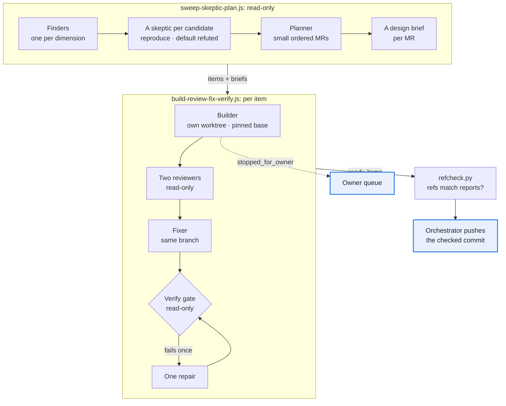

# Workflows: many agents, one branch each

Two Claude Code workflow scripts and one check to run before any push. Copy them into a project (for example `.claude/workflows/`), fill the config at the top of each script or pass it as `args`, and run them with the Workflow tool.

In the source project, about half of the workflow runs rewrote the same script, the same four result schemas and the same prompt rules, and the early copies lacked rules that later cost rework. These templates start with the rules.

## Which one when

| You have | Run | It returns |
| --- | --- | --- |
| Decided work: verified fixes, features, planned merge requests | [`build-review-fix-verify.js`](build-review-fix-verify.js) | Per item: a status, the verified head, the MR title and text, the owner questions |
| A codebase to tidy, or a backlog to check before anyone builds it | [`sweep-skeptic-plan.js`](sweep-skeptic-plan.js) | A verdict, planned items in the build script's shape, each with a design brief, and what was refuted |
| One outside report, point by point | The reader and skeptic prompts in [`../verify-challenge.md`](../verify-challenge.md) | A verdict per point |
| A run that was cut off | The same script again: [after a restart](#after-a-restart) | |

## Fill in the config and the items

Both scripts take `args: {config, items}` (the sweep takes `{config, dimensions}`); anything left out falls back to the constants at the top of the file.

| Config | What goes in it |
| --- | --- |
| `repo` | The main checkout; every worktree shares its refs |
| `scratch` | The session's scratch folder: temp dirs, reviewers' worktrees, briefs. Never the repo |
| `base` | The pinned base, a commit SHA. A branch name is refused: it moves under the builders |
| `test` | The full suite; every file prints its `RESULT: N passed` line |
| `golden` | The golden diff, `{base}` filled per item; `''` until the repo has one |
| `in_flight` | Other branches and sessions, and the files they own |
| `schema_owner` | The one item that may bump a schema or data-format version in this run |
| `risky` | The risky list: a diff that touches it waits for the owner's merge |
| `port_base` | Each agent gets its own block of 10 ports from here |

| Item field | Meaning |
| --- | --- |
| `key`, `branch` | Unique per run; the key labels agents and ports |
| `story` | The story or policy it serves (`S..`, `P..`); the MR title names it |
| `kind` | `fix`, `feature` or `refactor`. A refactor's golden diff runs `--strict`: no difference at all |
| `spec` | The task, precise enough to build without the conversation |
| `owner_merge` | Planned merge lane. The builder or a reviewer can raise it; nothing lowers it |
| `named_change` | Optional: the one behaviour change a fix may make, stated in the MR |
| `stack_on` | Optional: the key of the item it builds on ([stacks](#stacks)) |
| `brief` | Optional: a design brief the builder reads first (the sweep writes them) |
| `resume` | Optional: the existing worktree of a builder that was cut off |
| `needs_owner`, `owner_question` | Set by a brief that needs the owner: the item is not built until the answer is in its spec |

## Run it, then push

1. Run the script; save its return value as `result.json`.
2. `python3 templates/workflows/refcheck.py result.json`. For each `ready` item it checks with git that the branch points at the verified head, that the base is below it, and that the builder's worktree holds nothing uncommitted. It prints one JSON document with the push commands, which push the checked commit id rather than the branch name. Any refusal exits 2.
3. Push. Open one MR per item with its `mr_title` and `mr_description`; a stacked MR targets the branch it stacks on. Wait for any item in `waits_for` to merge first.
4. `owner_merge` items wait for the owner. `owner_question` and `queue_questions` go to the owner queue with their recommendation. `host_steps` go into the install message.

| Status | Means | Next |
| --- | --- | --- |
| `ready` | Built, reviewed, fixed, and the gate passed at the head the last writer reported | refcheck, then push |
| `not_ready` | The gate failed twice, or a pass returned nothing; `problems` says why | Read `problems`; rerun the item or fix it by hand |
| `stopped_for_owner` | A choice was not mechanical; nothing was committed | Ask the owner, put the answer in the spec, rerun |
| `no_result` / `no_commit` | The builder died, or committed nothing | Rerun the item |
| `skipped` | Stacked on an item that is not ready | Rerun after its predecessor |
| `not_run` | Never reached: a `stack_on` loop, or a step below it threw | Fix the items |

## The rules pasted into prompts

Each prompt carries only its role's rules, by id: the builder R1–R7 and R9, reviewers R1–R6 and R10, the fixer and the repair R1–R9, the verify gate R4–R6 and R10. The sweep's finders get R1, R4, R5, R10, R11 and R13, and its skeptics R1, R4, R5 and R10–R12. The ids are checked against this table by `tests/test_scripts.py`.

| Id | Rule | What it prevented |
| --- | --- | --- |
| R1 | **Pinned base and an in-flight map.** Branch from and diff against one commit SHA; name the other branches, sessions and files not to touch; one schema-bump owner per run. | Two branches built at once both bumped the schema version to the same number; one needed a merge and a second bump. |
| R2 | **Red, then green.** Every new test is run on the base and on the branch, and both results are reported. | A reviewer found a new check that could not fail on the base, so it guarded nothing, although the builder had reported that every new check failed there. |
| R3 | **Both ways.** Every safety check is a pair: the bad case refused AND the good case accepted. | A refusal-only check also passes on code that refuses everything. A guard from the start: the console's safety tests are written this way. |
| R4 | **Temp files.** Every command runs with `TMPDIR` under the scratch folder, one per agent. | The suite leaked test sandboxes into the system temp dir, which kept filling as many agents ran it. |
| R5 | **Ports and stores.** Each agent's servers use its own port block and its own store. | A guard, set before several reviewers first started servers of one module at the same time. |
| R6 | **Golden diff alone, on a copy.** Cases run one at a time, never while the suite runs in the same session, and never on original data. | A timing check failed while a golden compare ran at the same moment, then passed alone. |
| R7 | **Stop for the owner.** A choice that is not mechanical returns one question with a recommendation; nothing is committed. | Early scripts had no way to stop, so a builder facing a question of meaning could only guess, and the answer cost a rework. |
| R8 | **Write where you may.** A later fixer calls EnterWorktree on the builder's worktree, or fixes in its own detached worktree and moves the branch with a compare-and-swap `git update-ref refs/heads/B NEW OLD`. | An edit hook refuses writes in a worktree the agent did not create. Before the rule, it came back run after run: fixes committed on a detached HEAD while the branch kept the unreviewed commit, a fix on a separate branch, a shell write that had to be reverted. |
| R9 | **Heads, not pushes.** Every result carries `head_sha` from `git rev-parse`; only the orchestrator pushes, after refcheck. | The detached-HEAD fixes above were reported as done. A report is a claim until the ref shows it. |
| R10 | **Reproduce or drop.** A finding without the command that shows it is not a finding; the rest goes under `checked_and_fine`. Read-only agents work in their own detached worktree. | With it, nearly every finding of one console review held up when a skeptic re-ran it, and the few that did not were documented limits, not bugs. |
| R11 | **Known and accepted.** The brief lists the limits the owner accepted; they are not reported. | Accepted limits stopped coming back in every round. |
| R12 | **The skeptic defaults to refuted** and lists `consumers_checked`: every module, page, adapter, doc and test it opened. | In one refactor sweep, the skeptics refuted several candidates before anyone built them; the survivors became a series of small, one-reason MRs. |
| R13 | **Evidence and a proof method** per candidate; a change to the contract, a flag, a schema or the gate is out of scope for a clean-up. | A guard: each planned MR names the commands that prove it, and a refactor never carries a behaviour change. |

The gate itself: early scripts ended at the fix pass, so "green" was the fixer's word. The read-only gate re-runs the suite and the golden diff at the branch's real head. In later runs it passed every item without a repair round: cheap, and it turns a claim into a check another agent ran. Fixers applied most review findings and declined a real share of them, each with its evidence, which is why the fixer may decline.

## Stacks

- An item with `stack_on` branches from its predecessor's verified head, and its golden diff runs against that head (`--strict` for a refactor). A step that is not ready skips every step above it.
- A later review finds a defect in step k: commit the fix on step k's branch (new commits, never an amend), then carry it up with `git rebase --update-refs <branch k> <top branch>`, which replays the steps above and moves their refs. Rerun the gates from k upward. refcheck refuses a step whose base is no longer below it (`base_not_ancestor`).

## After a restart

The orchestrating session can restart in the middle of a run. *Paid for:* it restarted mid-run more than once, and the running workflows were marked stopped.

1. A resume looks for the run's journal under the new session's folder. Copy `<old session>/subagents/workflows/<runId>/` and the script from `<old session>/workflows/scripts/` into the same paths under the new session, then resume with the run id. Finished agents replay from the journal.
2. An agent whose prompt embeds an earlier agent's result may miss the cache and run again.
3. A builder cut off inside its worktree cannot create its branch again. Set the item's `resume` to that worktree: the builder gets a RESUMING prompt and finishes its own work in place.
4. When one step is left, stop the run and write a small continuation by hand.

## Tests

`python3 templates/workflows/tests/run.py` needs git and node.

- `test_flow.py` runs both scripts under node through `tests/sim.js`, with scripted agent replies.
- `test_refcheck.py` builds throw-away repos.
- `test_scripts.py` checks that each script's `meta` is a pure literal and every phase is declared, that nothing reads the clock or randomness (either would break resume), that the rules table matches the scripts, and that no file names a private path.

Every safety test states a pair, the bad case refused and the good one accepted, and each was also run against a broken copy of the line it guards (the gate trusting `ok` alone, a second repair round, a branch name pushed instead of the checked id, a dirty worktree let through, a checker that refuses everything) and failed there.
